**组合逻辑（Combinational logic）**：这类逻辑电路的输出仅取决于当前的输入状态，与之前的输入或历史状态无关。这意味着输入值的任何变化都会直接反映在输出上。

**时序逻辑（Sequential logic）**：与组合逻辑不同，时序逻辑电路的输出不仅取决于当前的输入，还取决于电路的历史状态（即之前的输入）。这种类型的电路有一个或多个反馈路径，能够存储信息，即它们的输出是当前输入和过去状态的函数。


combinational logic 例子比如decoder，只取决于当前的输入状态，与之前的输入没有联系，


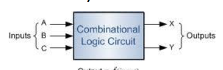

1. **逻辑**：输出仅由当前的输入决定，**不依赖于历史输入或先前的状态**，也就是说**没有记忆功能**。
2. **结构**：由纯逻辑门组成，不包含反馈路径或存储单元。
3. **常见的组合逻辑电路**：包括逻辑门、多路复用器（Multiplexer）、解码器（decoder）、编码器（encoder）和三态门（tri-state gate）。这些都是基于当前输入直接决定输出的电路类型。


## 设计组合电路

1. 传统设计

**问题的逻辑描述**：将设计问题转换成逻辑问题，明确需要达成的逻辑功能。

**逻辑最小化**：通过化简逻辑表达式，减少所需逻辑门的数量，以优化电路的复杂度和成本。

**转换**：将逻辑表达式匹配到现有的组件上，这一步通常涉及到现实世界中的制约因素，如可用组件的类型和数量。

**绘制逻辑图和工程优化**：在符合逻辑和物理限制的条件下，设计电路图，并进行工程优化以提高电路的性能和可靠性。

2. 现代电子设计自动化（EDA）

**问题的逻辑描述**：将设计问题先转换成逻辑问题，明确逻辑电路应实现的功能。

**VHDL描述**：使用VHDL（硬件描述语言）描述问题。这可以包括行为描述、数据流描述和结构描述，这些描述与具体硬件设备无关，更侧重于问题的逻辑结构。

**综合描述、仿真和测试**：将VHDL代码综合成实际的硬件逻辑，并进行仿真测试以验证设计是否满足要求。

**网表生成和程序下载到PLD**：综合过程中生成硬件网表（netlist），随后将程序下载到PLD中。这两个步骤主要通过计算机完成。


## 时序逻辑电路

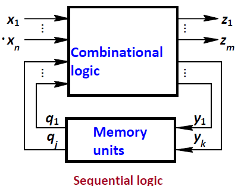

时序逻辑电路的输出不仅取决于当前的输入值，还取决于其**历史输入值**，这是通过**反馈和存储单元**实现的。这种电路结构包括：

1. **组合逻辑（Combinational logic）**：基于当前的输入值 x1,x2,…,xnx_1, x_2, \ldots, x_nx1,x2,…,xn 计算中间或最终输出 z1,z2,…,zmz_1, z_2, \ldots, z_mz1,z2,…,zm。
2. **存储单元（Memory units）**：存储电路的历史状态，这些状态通常表示为 q1,q2,…,qjq_1, q_2, \ldots, q_jq1,q2,…,qj，并且可以被下一个时间周期的逻辑决策过程读取和修改。
3. **反馈**：存储单元的输出 y1,y2,…,yky_1, y_2, \ldots, y_ky1,y2,…,yk 可以反馈到组合逻辑部分，与新的输入值一起参与到下一个输出的计算中。

时序逻辑比如flip flop，registers都是时序逻辑电路

以下是三种主要的逻辑方程：

**输出方程（Output equation）**：

- $z_m = f_m(x_1, x_2, \ldots, x_n, q_1^n, q_2^n, \ldots, q_j^n)$
- 这个方程描述了电路的输出 $z_m$ 如何依赖于当前的输入 $x_1, x_2, \ldots, x_n$ 和当前的状态 $q_1^n, q_2^n, \ldots, q_j^n$。

**激励方程（Excitation equation）**：

- $y_k = g_k(x_1, x_2, \ldots, x_n, q_1^n, q_2^n, \ldots, q_j^n)$
- 该方程描述了如何根据当前的输入和状态生成电路中某些部分（如存储单元的控制输入）的输出 yky_kyk。

**下一状态方程（Next state equation）**：

- $q_j^{n+1} = h_j(y_1, y_2, \ldots, y_k, q_1^n, q_2^n, \ldots, q_j^n)$
- 这个方程决定了存储单元的下一状态$q_j^{n+1}$，依赖于当前状态和某些输出值，这反映了存储单元如何更新其状态以响应输入变化。

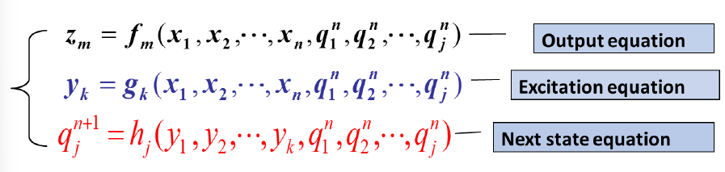

时序逻辑电路的分类，主要分为以下几种：

1. **同步时序逻辑**（Synchronous）：
   - 寄存器动作仅由时钟变化触发，与时钟信号同步。例如，触发器（Flip-Flop）就是一种同步设备，只在时钟信号的特定边缘响应。
2. **异步时序逻辑**（Asynchronous）：
   - 异步时序逻辑电路不依赖于时钟信号同步，其输出可以直接响应输入的变化。这类电路使用锁存器（Latch），在输入变化时立即改变输出。
3. **输出信号的分类**：
   - **Mealy机**：输出依赖于当前的输入和存储状态。
   - **Moore机**：输出仅依赖于存储状态。


Flip-Flop就是典型的同步时序逻辑基本单元，所有的内存单元都由时钟脉冲同步控制

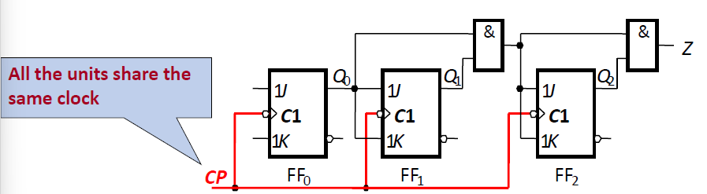

但是其也有以下的一些缺点：

1. 耗费能量：clk会被接到每一个flipflop，无论这个flipflop在每一个循环有没有被触发
2. 频率限制：整个系统的最大工作频率受限于最慢的单元。这意味着即使某些部分可以更快地工作，整个系统也必须在最慢的部件速度上同步运行。这限制了性能优化，尤其是在需要高频率操作的应用中。


对于异步sequential logic circuit：

**设计难度大**：异步电路的设计通常比同步电路更为复杂，因为它们不依赖统一的时钟信号来同步操作。

**基本存储单元**：包括D型触发器（D-FF）和锁存器（latch），其中锁存器是电平敏感的，可以在任何时候改变状态。

**电路复杂度随逻辑门数量增加**：随着设计的复杂性增加，异步电路的管理和验证变得更加困难。

**处理不可预测的问题**：异步电路能够处理一些同步电路难以应对的不确定性和时间敏感的问题。

**不如同步电路流行**：由于设计和验证的复杂性，异步电路在工业应用中不如同步电路普遍。


## basic logic gates

Combinational logic: AND, OR, NOT...

Sequential logic: Flip-flop, latch


### Multiplexer

**n-to-1 多路复用器**：意味着有 n 个数据输入线。

**m 选择线**：这里的 m 是选择线的数量，选择线的不同组合状态决定哪一个输入被选中。对于 n 输入的多路复用器，选择线的数量 m 需要满足 $2^m = n$ 的条件，以确保可以从所有输入中选择。

**一个输出线**：输出线是被选中的输入线的信号。

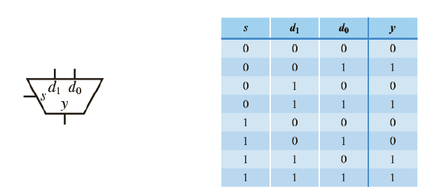

这里的s是选择线，$d_0$,$d_1$为输入的两条线，$y$为输出，这里注意，2的s的数量的幂要等于数据输入线的数量，$2^s = d_{num}$

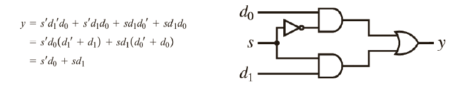

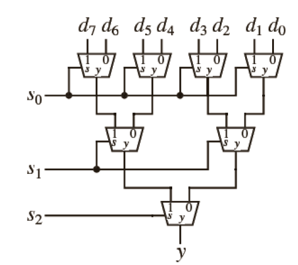


Example: Implementation of 4-1 Mux

```vhdl
Library IEEE;
USE ieee_logic_1164.all;
Entity mux4 IS
    port(input: in std_logic_vector(3 downto 0); --这里是输入数据的线
        a,b: in std_logic; -- 这里是数据选择线
        y: out std_logic) -- 这里是选择的输出的线
END mux4;
        
ARCHITECTURE behav of mux4 IS 
    signal sel : std_logic_vector(1 downto 0);
BEGIN
    sel<= b & a; --这里相当于把b和a变成了ba
    process(input, sel)
    begin
        if(sel="00") then y<=input(0);
        elsif(sel ="01") then y<=input(1);
        elsif(sel="10") then y<=input(2);
        elsif(sel="11") then y<=input(3);
        else y<='Z';
        end if;
    end process;
end behav;
        
```

`sel <= b & a`;这行代码的作用是将两个标准逻辑信号 `b` 和 `a` 连接成一个二位的标准逻辑向量 `sel`

这里的input使用std_logic_vector(3 downto 0)，即每一位代表一条线，但是这样会限制输入只有一位，如果说是长数据输入的话，可以考虑将std_logic_vector(3 downto 0)变成四个std_logic_vector，假如说要实现一个8位长度数据流的选择（并不是8选1，而是4选1但每个长度为8），可以变成四个`std_logic_vector(7 downto 0)`。


variable只能在process里声明

## Adder

### 半加器（Half Adder）

- **输入数量**：2个比特
- **输出数量**：2个（一个是和位，一个是进位位）
- **进位输入**：忽略（不考虑来自更低位的进位）

### 全加器（Full Adder）

- **输入数量**：3个比特（包括进位输入）
- **输出数量**：2个（一个是和位，一个是进位位）
- **进位输入**：考虑（会处理一个进位输入）

### 功能描述

- **半加器**：半加器用于添加两个一位二进制数，并产生一个和位和一个进位位。它不处理来自之前加法操作的进位。
- **全加器**：全加器在半加器的基础上增加了对进位输入的处理能力，它可以将两个一位二进制数和一个进位位相加，产生一个和位和一个进位位。这使得全加器可以串联在一起，以处理更长的二进制数的加法，每个全加器处理一个位的加法和来自上一个位的进位。


### Half Adder

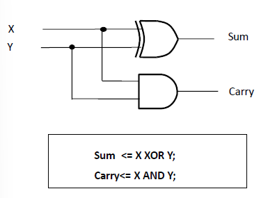

```vhdl
library ieee;
use ieee.std_logic_1164.all;

entity halfadd is
port(X,Y:IN std_logic; --两个一位的输入
Sum, Carry : out std_logic);
end halfadder;

ARCHITECTURE A of halfadder is
begin
sum<=X xor Y; --只看当前位，两个都是1或者0则为0，其余为1，用xor
Carry<=X and Y; --进位，仅二者都为1时为1，其余为0，用and
end a;
```


### full adder

```vhdl
library ieee;
use ieee.std_logic_1164.all;
entity full_add is
    port(X,Y,C in bit;
        sum,carry: out bit);
end full_add;
    
architecture a of full_add is 
    begin
        sum<= X xor Y xor C; --从刚刚的两个输入变成三个输入，但是本质上都是相加，于是都用xor
    	Carry<=(X and Y) or (C and (X xor Y));--除了看XY本身是否会带来进位以外，还要看XY相加的结果（余位）和C是否都是1，如果都是1则相加又会导致进位
    end a;
```

当完成fulladder的stru编写后，实例化操作如下：

```vhdl
LIBRARY IEEE;
USE IEEE.STD_LOGIC_1164_ALL;
PACKAGE components IS
	COMPONENT fadd IS
    Port(a,b,ci:IN std_logic;
        co,sum:OUT std_logic);
    END fadd;
END components;
```

但是上述的加法器都只是一位的，如果要实现一个多位的加法器：

这时候就会分出来两种加法器，分别是Ripple-Carry Adder(Sequential adder)和Carry-Lookahead Adder(Parallel adder)

### Ripple-Carry Adder(Sequential adder)

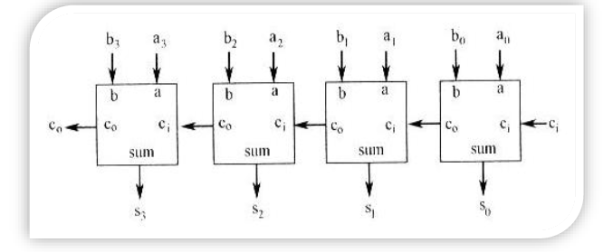

```vhdl
Library IEEE;
Use IEEE.std_logic_1164.all;
Use work.components.all;

Entity fadd4 IS
    port(a, b : in std_logic_vector(3 downto 0); -- 这里是输入数据的线
         ci: in std_logic; -- 这里是数据选择线
         co: out std_logic; -- 这里是选择的输出的线
         sum: out std_logic_vector(3 downto 0));
End fadd4;

Architecture stru of fadd4 IS 
    signal ci_ns: std_logic_vector(2 downto 0);
BEGIN
    U0: fadd port map(a(0), b(0), ci, ci_ns(0), sum(0));
    U1: fadd port map(a(1), b(1), ci_ns(0), ci_ns(1), sum(1));
    U2: fadd port map(a(2), b(2), ci_ns(1), ci_ns(2), sum(2));
    U3: fadd port map(a(3), b(3), ci_ns(2), co, sum(3));
End stru;

```

具体的思路就是上一位的进位ci_ns输出连接到本位的ci输入，这一位的得到的进位输出连接到下一位的进位输入

也有相对更简单的实现方法：

```vhdl
LIBRARY IEEE;
USE IEEE.STD_LOGIC_1164.ALL;

ENTITY Adder4 IS PORT (
    A, B : IN STD_LOGIC_VECTOR (3 DOWNTO 0);
    Sum : OUT STD_LOGIC_VECTOR (3 DOWNTO 0);
    Cout : OUT STD_LOGIC);
END Adder4;

ARCHITECTURE Behavioral OF Adder4 IS
    SIGNAL Temp : STD_LOGIC_VECTOR (4 DOWNTO 0);
BEGIN
    Temp <= ('0' & A) + ('0' & B); --直接对两个进行加法操作
    Cout <= Temp(4);
    Sum <= Temp(3 DOWNTO 0);
END Behavioral;

```

波纹进位加法器相对来说操作速度较慢，于是有Carry-Lookahead Adder(Parallel adder)

### Carry-Lookahead Adder(Parallel adder)

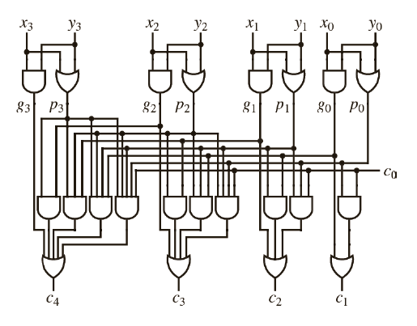

```vhdl
Library IEEE;
Use IEEE.std_logic_1164.all;
Use IEEE.std_logic_unsigned.all;

Entity fadd4 is
    port(a, b : in std_logic_vector(3 downto 0);
         ci : in std_logic;
         co : out std_logic;
         sum : out std_logic_vector(3 downto 0));
End fadd4;

Architecture behav of fadd4 is
    signal d, t, s : std_logic_vector(3 downto 0);
    signal c : std_logic_vector(4 downto 0);
Begin
    as_add: for i in 0 to 3 generate
        d(i) <= a(i) and b(i);
        t(i) <= a(i) or b(i);
        s(i) <= a(i) xor b(i) xor c(i);
    end generate;

    c(0) <= ci;
    c(1) <= (d(0) or (t(0) and c(0)));
    c(2) <= (d(1) or (t(1) and d(0)) or (t(1) and t(0) and c(0)));
    c(3) <= (d(2) or (t(2) and d(1)) or (t(2) and t(1) and d(0)) or (t(2) and t(1) and t(0) and c(0)));
    c(4) <= (d(3) or (t(3) and d(2)) or (t(3) and t(2) and d(1)) or (t(3) and t(2) and t(1) and d(0)) or (t(3) and t(2) and t(1) and t(0) and c(0)));

    sum <= s;
    co <= c(4);
End behav;

```

所有的计算逻辑都是在并行语句中执行，没有process，这样做的好处就是高速计算。

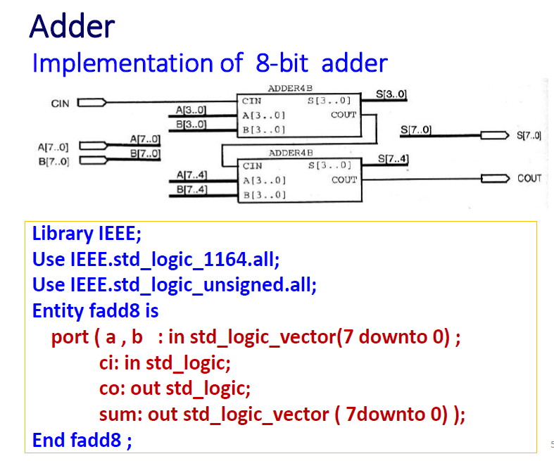

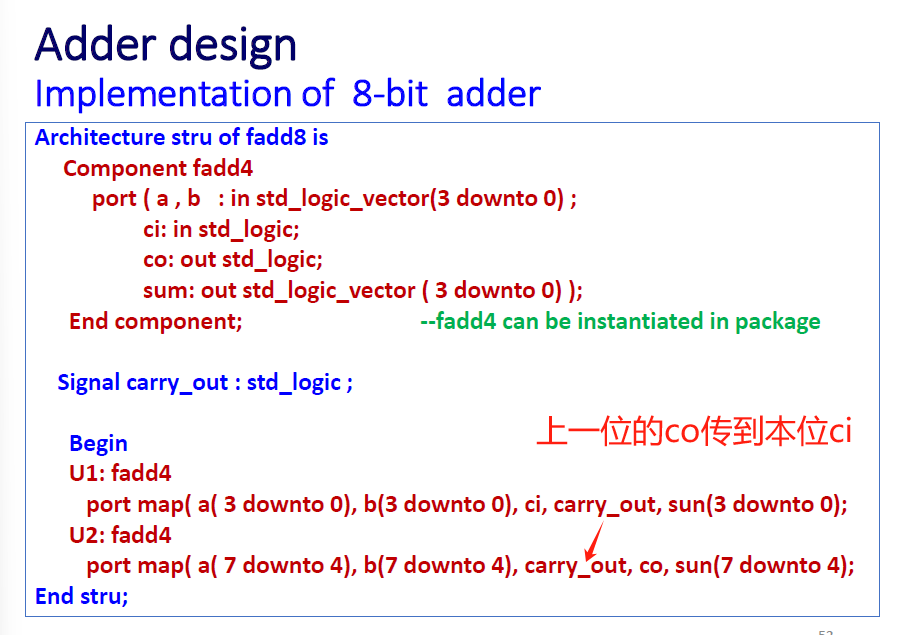