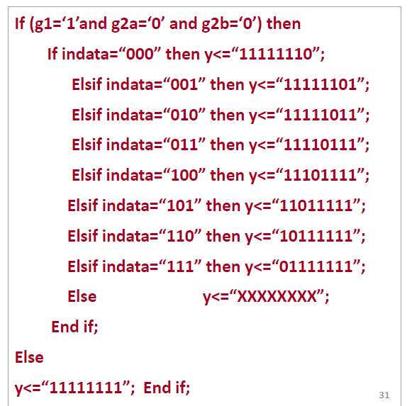
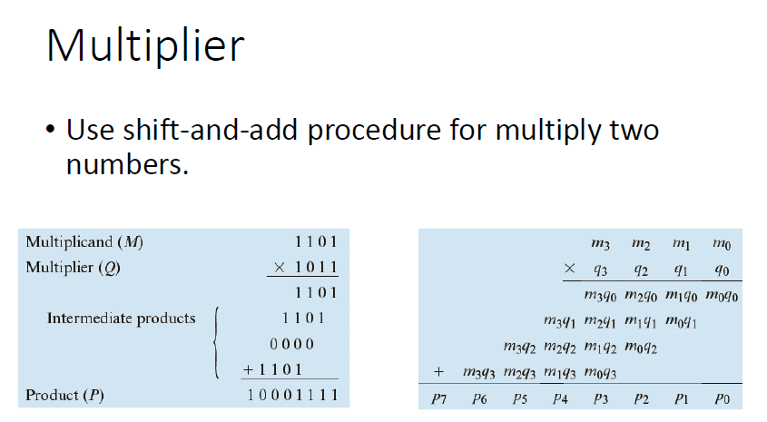

## Subtractor

相比于上次的Adder，这里的subtractor为减法器，刚刚的进位也变成了借位，加位也变成了差位。


### 减法器的工作原理：

- **差位（Difference bit, $d_i$）**：在二进制减法中，每一位的差$d_i$是由相应的被减数位$x_i$、减数位$y_i$和从下一位传来的借位$b_i$计算得出的。

- 借位（Borrow-in and Borrow-out）

  ：

  - **借入（$b_i$）**：从高一位传递到当前位的借位。
  - **借出（$b_{i+1}$**：如果当前位的被减数小于减数加上借位，则需要从更高位借一个，这个借出的位将作为下一位的借入。

### 表达式：

- 差位的表达式为：

  $d_i = x_i - b_i + 2b_{i+1} - y_i$

  - 这里，$b_i$是当前位的借入，$b_{i+1}$是下一位的借出。

但是如果单纯简单设计一个减法器会有些浪费，为何不用已有的加法器改造成减法器呢，这样又可以有加法的功能又可以有减法的功能


相比于计算A-B，不如计算A-(-B)

### 加减合一器的特点：

1. **操作选择**：
   - 使用一个名为 `s` 的选择信号来控制操作类型。
   - 当 `s = 0` 时，电路执行加法（A + B）。
   - 当 `s = 1` 时，电路执行减法，通过将 B 的二进制补码加到 A 上实现，即 $A + (-B)$。
2. **二进制补码的应用**：
   - 在二进制补码系统中，减法可以通过加法来实现。具体方法是对被减数 B 取反（即按位取反或一位一位地求反）然后加1，得到 $-B$。
   - 减法 $A - B$ 转换为 $A + (-B)$。

### 实现方式：

- 对 B 操作数的位反转：
  - 在执行减法时，如果选择信号 `s = 1`，则对 B 进行按位取反操作，然后在加法操作中加上一个额外的 1（这通常通过进位输入实现）。
- 加法操作：
  - 不需要对 B 的位进行反转，直接进行 A 和 B 的加法。


关于符号溢出：

**无符号溢出（Unsigned Overflow）**：

- 当两个无符号数相加，其结果超出了数据类型所能表示的最大范围时发生。
- 无符号溢出的判断依据是最高位的进位输出（$C_{out}$）。

**有符号溢出（Signed Overflow）**：

- 在有符号数的运算中，如果两个正数相加得到负数，或两个负数相加得到正数，即表示发生了溢出。
- 有符号溢出可以通过检测最高有效位（MSB）的进位输出（$C_3$，即最高位进位）和最终的进位输出（$C_{out}$）是否不同来判断。这通常通过一个异或（XOR）门实现，即 $C_{out} \oplus C_3$。


无符号溢出主要发生在两个无符号（可以看成正数）相加上面，当超过了最大位，相当于是adder里面的进位co

有符号溢出主要是发生在两个有符号（可以是两个负数也可以是两个正数）相加上面，当超过了最大位，就要考虑最高位的进位$c_o$和次高位的进位$c_3$是否一致，不一致则出现有符号溢出。


当使用VHDL语言实现时，有符号溢出的检测逻辑依赖于操作数的最高位以及结果的最高位，但是我们并不能非常容易地提取出$c_3$的值，于是这里我们使用一个不一样的方法来检测signed_overflow，以下是图片中的具体解释和表达式：

**加法操作（Addition）**：

$\text{Signed\_Overflow} = (A_n \cdot B_n \cdot \overline{F_n}) + (\overline{A_n} \cdot \overline{B_n} \cdot F_n)$

其中，$A_n$ 和 $B_n$ 是加数的最高位，$F_n$ 是结果的最高位。此表达式计算两种情况：

1. 当**两个负数相加**（$A_n$ 和 $B_n$ 都是1）且**结果为正数**（$\overline{F_n}$ 是1）。

这里可以理解为没有取反的话就是1，有取反就是0；原式前半部分就是两个最高位为1的数相加得到了0，相乘即可，后半部分也是一样

1. 当**两个正数相加**（$\overline{A_n} $和 $\overline{B_n} $都是1）且**结果为负数**（$F_n $是1）。

**减法操作（Subtraction）**：

$\text{Signed\_Overflow} = (A_n \cdot \overline{B_n} \cdot \overline{F_n}) + (\overline{A_n} \cdot B_n \cdot F_n)$

此表达式适用于：

1. 当**正数减去一个负数**，**结果为负**（$\overline{A_n}$ 是1，$B_n$ 是1，$F_n $是1）。

An取反，为正数，Bn没有取反为负数，最后Fn是1为负数

1. 当**负数减去一个正数**，**结果为正**（$A_n$ 是1，$\overline{B_n}$ 是1，$\overline{F_n} $是1）。

example:


```vhdl
LIBRARY IEEE;
USE IEEE.STD_LOGIC_1164.ALL;
USE IEEE.STD_LOGIC_UNSIGNED.ALL;

ENTITY AddSub IS
    PORT(S : IN STD_LOGIC;  -- select subtract signal
         A, B : IN STD_LOGIC_VECTOR(3 DOWNTO 0); --传入的两个数据
         F : OUT STD_LOGIC_VECTOR(3 DOWNTO 0); --结果
         Unsigned_Overflow : OUT STD_LOGIC;
         Signed_Overflow : OUT STD_LOGIC);
END AddSub;

ARCHITECTURE Behavioral OF AddSub IS
    SIGNAL TempF : STD_LOGIC_VECTOR(4 DOWNTO 0);
BEGIN
    PROCESS(S, A, B)
    BEGIN
        IF (S = '0') THEN  -- addition
            TempF <= ('0' & A) + ('0' & B); --为借位预留空间
            F <= TempF(3 DOWNTO 0); 
            Unsigned_Overflow <= TempF(4); --对于unsigned overflow，看其最高位的值就行，因为补充的都是零，正常来说最后也应该是0，超了变成1就是溢出
            -- signed overflow = most significant bit of A'B'F + ABF'
            Signed_Overflow <= ((NOT A(3)) AND (NOT B(3)) AND (TempF(3))) OR 
                               (A(3) AND B(3) AND (NOT TempF(3))); --公式计算，此处为相加，则AB的最高位保持一致，不用其中一个取反
        ELSE  -- subtraction
            TempF <= ('0' & A) - ('0' & B);
            F <= TempF(3 DOWNTO 0);
            Unsigned_Overflow <= TempF(4);
            -- signed overflow = most significant bit of AB'F' + A'BF
            Signed_Overflow <= ((A(3) AND (NOT B(3)) AND (NOT TempF(3)))) OR 
                               ((NOT A(3)) AND B(3) AND (TempF(3))); --此处为相减，则AB的最高位保持补位，需要其中一个取反
        END IF;
    END PROCESS;
END Behavioral;

```


## Arithmetic Logic Unit

### 算术逻辑单元（ALU）的职责：

1. **算术操作**：
   - **加法**：ALU 可以执行二进制加法，这是最基本的算术操作之一。
   - **减法**：使用二进制补码或逻辑门实现减法。
   - ALU 通常还支持简单的增量和减量操作。
2. **逻辑操作**：
   - **逻辑 AND**：执行位与操作，用于位掩码和其他逻辑判断。
   - **逻辑 OR**：执行位或操作，常用于组合条件或位设置。
   - 通常还包括逻辑非（NOT）和异或（XOR）操作。

### ALU 的限制：

- **不执行乘除法**：由于乘法和除法在逻辑和硬件实现上比加法和减法要复杂得多，传统的简单 ALU 设计不包括这些操作。乘法和除法需要更多的硬件资源和时间来执行，通常由专门的硬件单元处理，如乘除法器或通过软件算法在更复杂的处理器设计中实现。


其中包括三个element，分别是：

1. LE(Logic Element)功能分析，显示了多个门电路组合，实现复杂的逻辑功能。


2. AE(Arithmetic Element)功能分析，类似 LE，基于不同的选择信号实现不同的算术操作。


3. CE(Control Element)功能分析，简单的与非逻辑，用于控制信号的生成。


```vhdl
LIBRARY IEEE;
USE IEEE.STD_LOGIC_1164.ALL;
USE IEEE.STD_LOGIC_UNSIGNED.ALL;

ENTITY alu IS
    PORT(
        S : IN STD_LOGIC_VECTOR(2 DOWNTO 0); -- select for operations
        A, B : IN STD_LOGIC_VECTOR(3 DOWNTO 0); -- input operands
        F : OUT STD_LOGIC_VECTOR(3 DOWNTO 0) -- output
    );
END alu;

ARCHITECTURE Behavioral OF alu IS
BEGIN
    PROCESS(S, A, B)
    BEGIN
        CASE S IS
            WHEN "000" => -- pass A through
                F <= A;
            WHEN "001" => -- AND
                F <= A AND B;
            WHEN "010" => -- OR
                F <= A OR B;
            WHEN "011" => -- NOT A
                F <= NOT A;
            WHEN "100" => -- add
                F <= A + B;
            WHEN "101" => -- subtract
                F <= A - B;
            WHEN "110" => -- increment
                F <= A + 1;
            WHEN "111" => -- decrement
                F <= A - 1;
            WHEN OTHERS =>
                F <= (OTHERS => '0'); -- default or undefined behavior
        END CASE;
    END PROCESS;
END Behavioral;

```


## Encoder

### 编码器设计：

- **输入**：一组信号，这些信号通常是低（0）或高（1）电平。
- **输出**：一组二进制代码，这些代码是输入信号的编码表示。

### 编码器的功能：

- **编码过程**：编码是解码过程的逆过程。在解码中，一组二进制代码被转换为更具体或更广义的信号或值；在编码中，具体的信号转换为一组二进制代码。
- 应用：
  - **传输效率**：编码可以增加数据传输的效率，通过减少所需传输的数据量来加快传输速度或降低传输成本。
  - **存储效率**：通过优化数据的二进制表示，编码可以减少所需的存储空间，使得存储更多的信息成为可能，或降低存储成本。


编码器设计概念涉及一个 n-by-m 编码器，其中 n 是输入信号的数量，m 是输出的二进制代码位数。这里的关键点是，n 是 2 的幂次方，因此 m 等于 $\log_2(n)$。下面详细解释相关概念：

### n-by-m 编码器

- **n 输入信号**：编码器接受 n 个输入信号，每个信号都是一个单独的位（0 或 1）。
- **m 输出位**：编码器输出一个 m 位的二进制代码，这个代码唯一地标识了哪一个输入信号是高电平（1）。由于 n 是 2 的幂次方，输出的位数 m 是 n 的二进制对数。

```vhdl
LIBRARY IEEE;
USE IEEE.STD_LOGIC_1164.ALL;

ENTITY encoder IS
    PORT (
        x : IN STD_LOGIC_VECTOR(3 DOWNTO 0);
        y : OUT STD_LOGIC_VECTOR(1 DOWNTO 0)
    );
END encoder;

ARCHITECTURE Behavioral OF encoder IS
BEGIN
    WITH x SELECT
        y <= "00" WHEN "1000",  -- Input x(3) is high
             "01" WHEN "0100",  -- Input x(2) is high
             "10" WHEN "0010",  -- Input x(1) is high
             "11" WHEN "0001",  -- Input x(0) is high
             "ZZ" WHEN OTHERS;  -- Invalid input case
END Behavioral;

```


既可以用with...select并发语句实现也可以用WHEN...ELSE顺序语句实现。


## Decoder

### 解码器设计：

- **解码器**：一种组合逻辑电路，用于解码，即把接收到的二进制代码转换为一组更有用的输出信号。
- **解码（Decoding）**：转换的过程，通常被理解为将一组二进制代码翻译成为具体的信号或动作。

### 输入和输出：

- 输入：
  - 一组二进制代码，这些代码是通过某种方式（如编码器）编码的，用于表示不同的状态或指令。
- 输出：
  1. 一组信号，每个输入组合只激活一个输出信号。这些信号通常在不同的逻辑电平上表示不同的条件或动作。
  2. 可能的另一组输出是二进制代码，具体取决于解码器的设计和用途。

==具体来说，encoder将一个多位的数据转换为少位的数据，例如，原来长度为8的数据，若要表示0~7，则在相应的地方就会出现一个1，但只会出现一个，不会有第二个出现，则现在可以通过encoder将数据压缩，8的数据可以用$2^3$来表示，则现在只需要3位就可以表示8位的信息；decoder则是反过来。==


example:


```vhdl
LIBRARY IEEE;
USING IEEE.STD_LOGIC_1164.ALL;

ENTITY decoder_38 IS
    port(g1, g2a, g2b: IN std_logic;
        a,b,c : IN std_logic;
        --y0,y1,y2,y3,y4,y5,y6,y7 : IN std_logic);
         y : IN std_logic_vector(7 downto 0)
        );
END decoder_38;
    
ARCHITECTURE behav of decoder_38 IS
    Signal INDATA : STD_LOGIC_VECTOR(2 DOWNTO 0);
BEGIN
    INDATA <= c & b & a;
	process(INDATA, g1, g2a, g2b)
    BEGIN
        IF (g1='1' AND g2a='0' AND g2b='0') then
            case INDATA IS
                WHEN "000" => y <= "11111110"; --注意这里是activate low，要全部取反
            	when "001" => y <= "11111101";
        		when "010" => y <= "11111011";
        		when "011" => y <= "11110111";
				when "100" => y <= "11101111";
				when "101" => y <= "11011111";
				when "110" => y <= "10111111";
				when "111" => y <= "01111111";
				when others => y <= "XXXXXXXX";
			END CASE;
         ELSE y <= "11111111";
         end if;
     end process;
end behav;
				
```



或者可以用if statement

这里注意，选择线为000的时候对应的激活其实是第一位，而不是00000000，不是数值上对应，而是顺序


## Tri-State Buffer

### 三态缓冲器的特点：

- **三个状态**：逻辑0（低电平）、逻辑1（高电平）和高阻抗（Z）。
- **高阻抗状态**：在高阻抗状态下，缓冲器的输出端接口处于断开状态，使得多个三态缓冲器可以连接到同一输出线，但只有被使能（enabled）的缓冲器才会对输出线驱动信号。

### 图中各部分说明：

- **(a)** 三态缓冲器的使能信号表：当使能（E）为0时，输出（y）是高阻抗（Z）；当使能为1时，数据输入（d）直接传输到输出。
- **(b)** 三态缓冲器的符号表示：显示了输入（d）、输出（y）和使能端（E）。
- **(c)** 内部结构示意图：展示了PMOS和NMOS晶体管如何配置来实现三态控制。使能信号（E）控制两个晶体管的导通和关闭状态，从而控制输出状态。
- **(d)** 逻辑表格：表明不同的输入信号和使能状态下，输出（y）的状态。其中"A"和"B"可能代表其他相关逻辑控制输入。

### 应用场景：

三态缓冲器常用于数字电路中，特别是在需要多个设备共享同一通信总线时。例如，在计算机内部总线、多处理器系统或数据交换接口中，三态缓冲器允许各个设备在需要时接入总线进行数据传输，而在不需要时则不会对总线造成干扰。这种设计增加了电路的灵活性和效率。

example: VHDL code for a 4-bit wide tri-state buffer

```vhdl
LIBRARY IEEE;
USE IEEE.STD_LOGIC_1164.ALL;

ENTITY Tristate_Buffer IS
    GENERIC (n: INTEGER :=4);
	PORT(
    E: IN STD_LOGIC;
    D: IN STD_LOGIC_VECTOR(n-1 DOWNTO 0);
    Y: OUT STD_LOGIC_VECTOR(n-1 DOWNTO 0));
END Tristate_Buffer;

ARCHITECTURE Behavioral OF Tristate_Buffer IS
    BEGIN
        Y <= D WHEN (E='1') ELSE (OTHERS =>'Z');
END Behavioral;
```


## Comparator

比较器是一种数字电路，用于比较两个二进制值，并指示这些值之间的关系是真还是假。这里提到了三种逻辑门的使用情况：

1. **AND门**：用于判断一个值是否等于一个常数值。如果所有输入都为1（真），则输出也为1（真）；这可以用来验证所有位都符合预定条件。
2. **XOR门和XNOR门**：
   - **XOR门**：用于比较不等性。当两个输入不相同时，XOR门输出为1（真），这表示输入值是不相等的。
   - **XNOR门**：用于比较相等性。它是XOR门的反逻辑，当两个输入相同时，XNOR门输出为1（真），这表示输入值是相等的。
3. **构建真值表和电路**：为了比较大于或小于关系，可以构建真值表来定义输入和预期输出的关系，进而构建实现这些比较功能的电路。

当比较多位大小的时候，可以将多个一位比较器串联，然后进行每一位的比较。


```vhdl
LIBRARY IEEE;
USE IEEE.STD_LOGIC_1164.ALL;
USE IEEE.STD_LOGIC_UNSIGNED.ALL;

ENTITY greater IS
  PORT (
    X, Y: IN STD_LOGIC_VECTOR(3 DOWNTO 0);
    G: OUT STD_LOGIC
  );
END greater;

ARCHITECTURE Dataflow OF greater IS
BEGIN
  G <= '1' WHEN (X > Y) ELSE '0';
END Dataflow;

```


## Shifter


example: 4-bit shifter


```VHDL
LIBRARY IEEE;
USE IEEE.STD_LOGIC_1164.ALL;
USE IEEE.STD_LOGIC_UNSIGNED.ALL;

ENTITY shifter IS 
	PORT(
        S : IN STD_LOGIC_VECTOR(1 DOWNTO 0);
        data_in : in STD_LOGIC_VECTOR(7 DOWNTO 0);
        data_out : out STD_LOGIC_VECTOR(7 DOWNTO 0)
	);
    
ARCHITECTURE Behavioral OF shifter IS
    BEGIN
        PROCESS(S,data_in)
        BEGIN
            CASE S IS
                WHEN "00" =>
                data_out <= data_in;
            	WHEN "01" =>
            	data_out <= data_in(6 downto 0) & '0';
        		WHEN "10" =>
        		data_out <= '0' & data_in(7 downto 1);
    			WHEN "11" =>
    			data_out <= data_in(0) & data_in(7 downto 1);
    		end case;
         end process;
end Behavioral;
```


## Multiplier



```vhdl
library ieee;
use ieee.std_logic_1164.all;
use ieee.numeric_std.all;
entity multiplier is
    port(
    M,Q : IN STD_LOGIC_VECTOR(3 DOWNTO 0);
    P : OUT STD_LOGIC_VECTOR(7 DOWNTO 0));
END multiplier;
    
ARCHITECTURE Behavioral OF multiplier IS
BEGIN
    P <= STD_LOGIC_VECTOR(UNSIGNED(M) * UNSIGNED(Q));
END Behavioral;
```

