## SR Latch

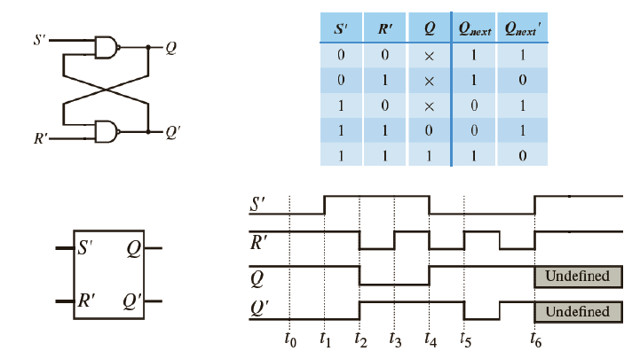

**SR锁存器电路图**：

- 该图显示了一个由两个交叉耦合的NOR门组成的SR锁存器。
- 输入标记为S'（置位）和R'（重置）。
- 输出标记为Q和Q'（Q的反向输出）。

**真值表**：

- 表格显示了不同组合的输入S'和R'对输出Q和Q'的状态。
- S' = 0和R' = 0保持当前状态（无变化）。
- S' = 1和R' = 0将Q设为1（置位状态）。
- S' = 0和R' = 1将Q重置为0（重置状态）。
- S' = 1和R' = 1是SR锁存器的无效状态，导致输出未定义。

**时序图**：

- 该图显示了输出Q和Q'如何随时间变化响应输入S'和R'的变化。
- 它展示了锁存器对不同置位和重置命令序列的响应。
- 当S'和R'同时为高时，也可以看到未定义状态的效果，此时输出变得不可预测。

```vhdl
library ieee;
use ieee.std_logic_1164.all;
entity RS_latch2 IS
    PORT(
    S, R : IN STD_LOGIC;
    Q,Qbar : OUT STD_LOGIC);
END RS_latch2;

ARCHITECTURE behav of R_latch2 IS
BEGIN
PROCESS(R,S)
    variable rs: std_logic_vector(1 downto 0);
    begin
        rs:=R & S;
		CASE rs IS
            WHEN "00" =>Q<='X';Qbar<='X';
			WHEN "01" =>Q<='1';Qbar<='0';
			WHEN "10" =>Q<='0';Qbar<='1';
			WHEN OTHERS=>null;
		end case;
    end process;
end behav;
            
```

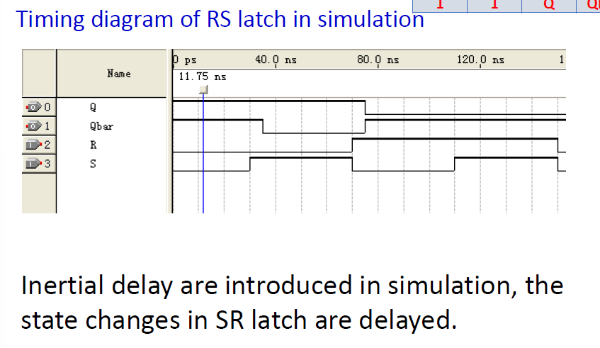

当模拟的时候可以发现，其中的变化会有一定的延迟。


example:

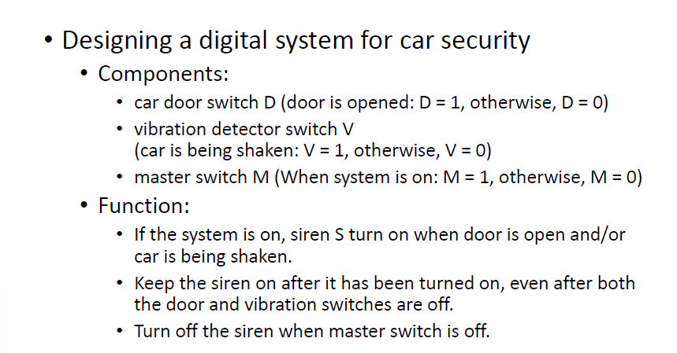

跟据图片，可以得到：

```vhdl
when M=1 then
	when (D=1 or V=1) then S=1;
```

可以得到表达式：$S = M(D + V)$


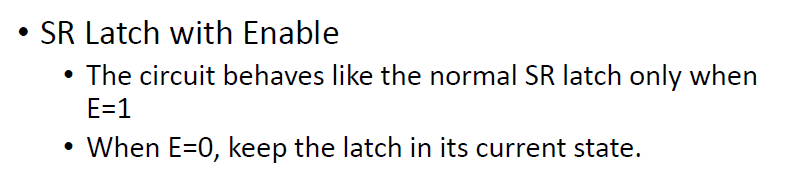

**D锁存器电路图**：

- 使用了NAND门来实现。
- 输入端为D，输出端为Q和Q'（Q的反向输出）。
- 具有S'和R'输入，这些输入由D输入通过逻辑门转换而成，确保S'和R'不会同时为高电平，避免了SR锁存器可能的无效状态。

**真值表**：

- D = 0时，Q保持不变，Q'输出为1。
- D = 1时，Q输出为1，Q'保持不变。

**逻辑符号**：

- 显示了D锁存器的符号表示，简化了复杂的内部结构，清晰表示输入D和输出Q，Q'。

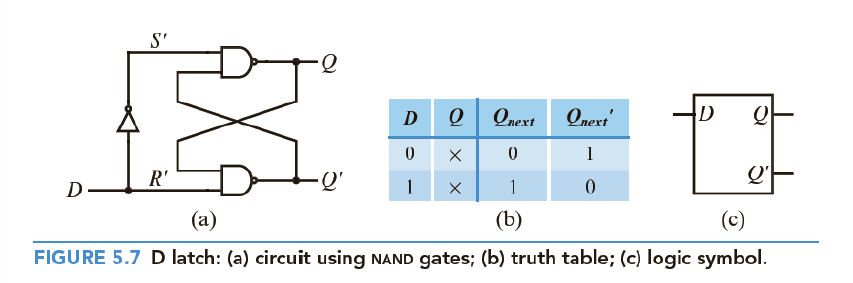

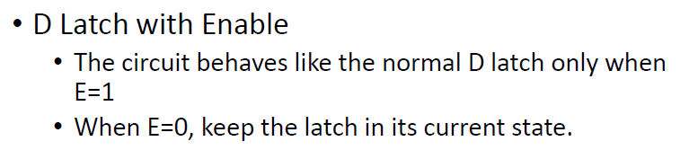


```vhdl
LIBRARY IEEE;
USE IEEE.STD_LOGIC_1164.ALL;
ENTITY no_memory_element IS PORT(
	D, Enable: IN STD_LOGIC;
	Q: OUT STD_LOGIC);
END no_memory_element;

ARCHITECTURE Behavior OF no_memory_element IS
BEGIN
	PROCESS(D, Enable)
	BEGIN
		IF(Enable = '1') then
			Q <= D;
		ELSE
			Q <= '0';
		END IF;
	END PROCESS;
END Behavior;
```


## Clock

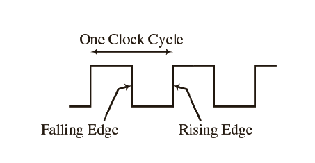

```vhdl
library ieee;
use ieee.std_logic_1164.all;

entity divider is
    port (
        clk : in std_logic;
        q : out std_logic
    );
end divider;

architecture sig of divider is
    signal s: integer range 0 to 5;
begin
    process(clk)
    begin
        if rising_edge(clk) then
            s <= s + 1;
            if s = 5 then
                q <= '1';
                s <= 0;
            else
                q <= '0';
            end if;
        end if;
    end process;
end sig;

```


## Flip-Flop

ff 为clk上升/下降沿触发


## D-Flip-Flop

```vhdl
--描述1：使用事件和条件判断
library ieee;
use ieee.std_logic_1164.all;

entity D_FF1 is
    port ( 
        D, clk : in std_logic;
        Q : out std_logic
    );
end D_FF1;

architecture behav of D_FF1 is
begin
    process(clk)
    begin
        if clk'event and clk='1' then --if then语句
            Q <= D;
        end if;
    end process;
end behav;

--描述2：使用等待语句
library ieee;
use ieee.std_logic_1164.all;

entity D_FF1 is
    port (
        D, clk : in std_logic;
        Q : out std_logic
    );
end D_FF1;

architecture behav of D_FF1 is
begin
    process
    begin
        wait until clk = '1'; --wait until语句
        Q <= D;
        wait on clk;
    end process;
end behav;

--描述3：使用条件检查
library ieee;
use ieee.std_logic_1164.all;

entity D_FF1 is
    port (
        D, clk : in std_logic;
        Q : out std_logic
    );
end D_FF1;

architecture behav of D_FF1 is
begin
    process(clk)
    begin
        if clk = '1' then --if then语句，直接判断
            Q <= D;
        end if;
    end process;
end behav;

```

关于clock edge detection的方法，有以下几种：

1. clk'event

   1. rising edge: clk' event and clk='1';
   2. falling edge: clk' event and clk='0';
   3. **注意使用：`if clk' event and clk='1'`后面不用接`else`语句** 

2. edge detection functions

   1. rising edge: if rising_edge(clk)
   2. falling edge: if falling_edge(clk)
   3. 这两个函数**只能当clk为std_logic**的时候才能被使用

3. use wait statement:

   1. rising edge: wait until clk'event and clk='1'
   2. falling edge: wait until clk'event and clk='0'
   3. 当process带有sensitivity list时不能有wait statement出现

4. if statement in process

   ```VHDL
   PROCESS(clk)
   	BEGIN 
   		IF clk='1' THEN
   			Q <= D;
   		END IF;
   	END PROCESS;
   
   ```


exercise: D F.F. with a NOT Q output

Compared with a common D-F.F., it has an extra NOT Q output and an asynchronous active-low reset as well.

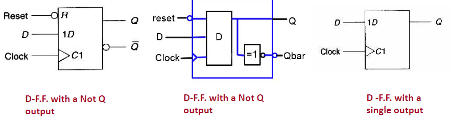

```vhdl
--错误案例
ENTITY D_FF IS
    PORT(D, clock: IN std_logic;
         Q, Qbar: OUT std_logic);
END D_FF;

ARCHITECTURE behav OF D_FF IS
BEGIN
    PROCESS(clock)
    BEGIN
        IF rising_edge(clock) THEN
            Q <= D;
            Qbar <= NOT D; --这里不能直接将两个变量赋值上，因为这样子本质上就会有两个DFF出现
        END IF;
    END PROCESS;
END behav;

```

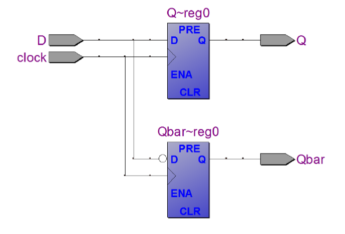

那怎么样才是正确逻辑的编写呢？

Description 1(using signal):

```vhdl
ARCHITECTURE sig of D_FF IS
    signal state: std_logic;
BEGIN
    PROCESS(clock, reset)
    begin
        if(reset='0') then
            state<='0';
        elsif rising_edge(clock) then
            state<=D;
        end if;
    end process;
    Q <= state; -- 这里不是直接把输入计算得到输出，而是用一个中间变量来承担DFF的计算部分，模拟的时候就不会出现两个DFF，毕竟这个部分的计算才出现一次，得到的state就已经和原来的DFF没有关系了，这个时候赋值就不会有问题。
    Qbar <= not state;
END sig;
```

Description 2(using variable)

```vhdl
ARCHITECTURE var of D_FF IS
BEGIN
	PROCESS(clock, reset)
		variable state: std_logic;
	begin
	if(reset='0') then
		state:='0';
	elsif rising_edge(clock) then
		state:=D;
	end if;
	Q <= state; --variable 'state' 只能在本process中使用，则Q，Qbar的赋值也应该在process内部
	Qbar <= not state;
	end process
end var
```

 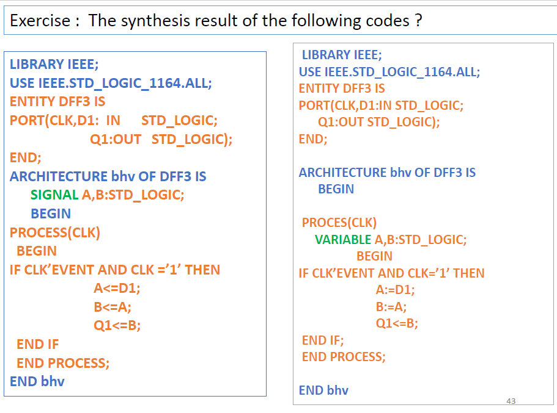

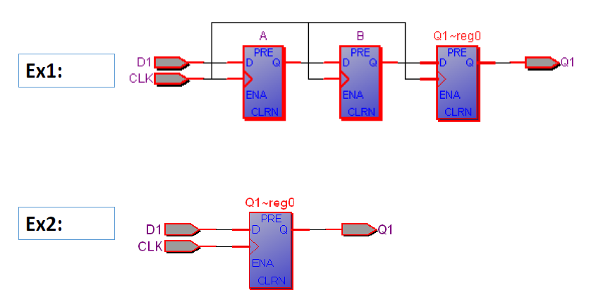

在构建ff逻辑的时候，要注意信号赋值的执行次数与实际硬件的构建个数关系，信号之间的赋值与计算本质上在模拟中调用了同样的组件但是并不是同一个组件。

这里的A被传递到了B，但是二者都是信号，都是真实存在的，于是就会创建出两个FF


example:D FF with enable and clear

When Clear=1, Q is reset to 0 immediately.

When Enable = 1, Q follows D at the rising edge of theclock, otherwise, **Q keeps its previous content.**

```vhdl
LIBRARY IEEE;
USE IEEE.STD_LOGIC_1164.ALL;

ENTITY D_flipflop IS
    PORT (
        Clock : IN STD_LOGIC;
        Clear : IN STD_LOGIC;
        Enable : IN STD_LOGIC;
        D : IN STD_LOGIC;
        Q : OUT STD_LOGIC
    );
END D_flipflop;

ARCHITECTURE Behavioral OF D_flipflop IS
BEGIN
    PROCESS(Clock,Clear)--敏感列表中写的是if中的条件涉及到的信号
    BEGIN
        IF (Clear = '1') THEN --这里注意clear 和时钟上升沿属于同一个判断级别
            Q <= '0';
        ELSIF (Clock'EVENT AND Clock = '1') THEN
            IF (Enable = '1') THEN --enable有才赋值，没有的话维持，属于是在上升沿之后的判断
                Q <= D;
            END IF;
        END IF;
    END PROCESS;
END Behavioral;

```


## JK Flip Flop

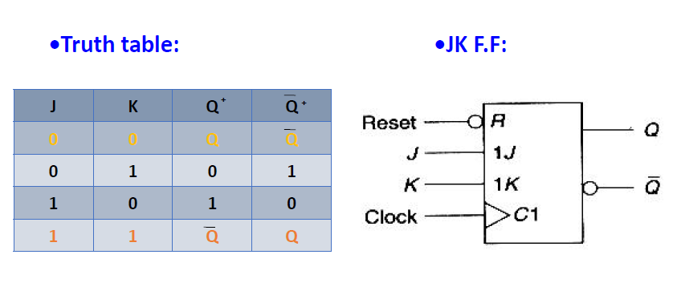

```vhdl
LIBRARY ieee;
USE ieee.std_logic_1164.all;

ENTITY JK_FF IS
    PORT (
        J, K : IN std_logic;
        clock, reset : IN std_logic;
        Q, Qbar : OUT std_logic
    );
END JK_FF;

ARCHITECTURE behav OF JK_FF IS
    SIGNAL state : std_logic;
BEGIN
    PROCESS(clock, reset)
        VARIABLE jk : std_logic_vector(1 DOWNTO 0);
    BEGIN
        jk := J & K; --中间变量防止多次实例化JKFF
        IF (reset = '0') THEN
            state <= '0';
        ELSIF rising_edge(clock) THEN
            CASE jk IS
                WHEN "11" => state <= NOT state; --取反
                WHEN "10" => state <= '1'; --1
                WHEN "01" => state <= '0'; --0
                WHEN OTHERS => NULL; --00的时候不做操作
            END CASE;
        END IF;
        Q <= state;
        Qbar <= NOT state;
    END PROCESS;
END behav;

```


## T Flip Flop

```vhdl
LIBRARY ieee;
USE ieee.std_logic_1164.all;

ENTITY T_FF IS
    PORT (
        T, clock, reset : IN std_logic;
        Q, Qbar : OUT std_logic
    );
END T_FF;

ARCHITECTURE behav OF T_FF IS
BEGIN
    PROCESS(clock, reset)
        VARIABLE state: std_logic;
    BEGIN
        IF (reset = '0') THEN
            state := '0';
        ELSIF rising_edge(clock) THEN
            IF T = '1' THEN
                state := NOT state; --只要有T=1就在每个risingedge翻转
            END IF;
        END IF;
        Q <= state;
        Qbar <= NOT state;
    END PROCESS;
END behav;

```

