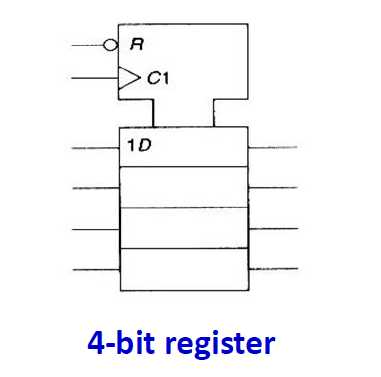
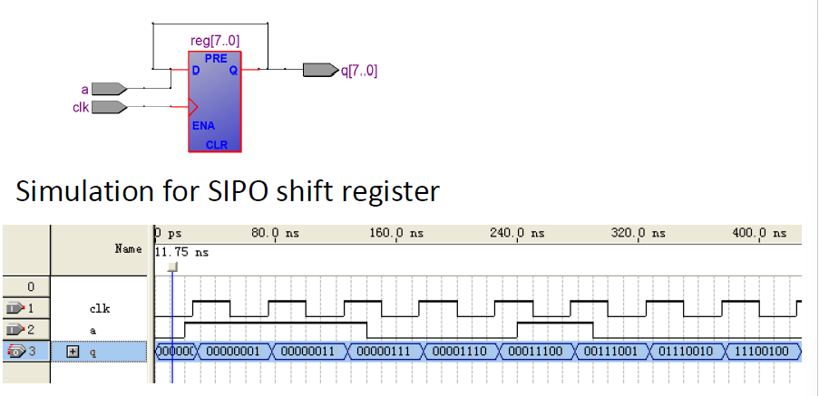
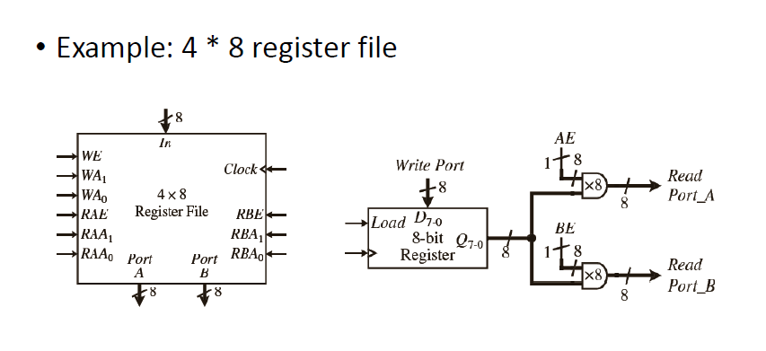
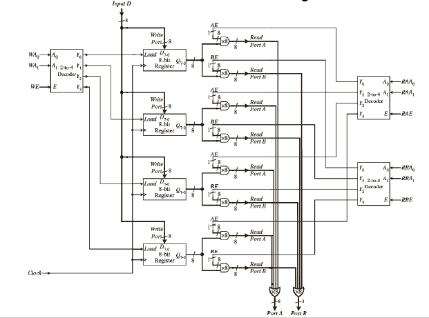
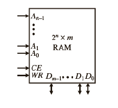

## Register



D-FF是一个一位寄存器，多位寄存器需要多个D-FF实现。

```vhdl
library ieee;
use ieee.std_logic_1164.all;

Entity reg is
  generic(n: natural := 4);--寄存器长度为4
  port(
    D: in std_logic_vector(n-1 downto 0); --对应输入
    clock, reset: in std_logic;
    Q: out std_logic_vector(n-1 downto 0) --对应输出（存储）
  );
End reg;

Architecture behav of reg is
Begin
  process(clock, reset)
  begin
    if (reset = '0') then
      Q <= (others => '0');
    elsif rising_edge(clock) then
      Q <= D;
    end if;
  end process;
End behav;

```


## shift register

```vhdl
library ieee;
use ieee.std_logic_1164.all;

Entity sipo is
    generic(n: natural := 8);
    port(
        a: in std_logic;
        q: out std_logic_vector(n-1 downto 0);
        clk: in std_logic
    );
End sipo;

Architecture behav of sipo is
Begin
    process(clk)
        variable reg: std_logic_vector(n-1 downto 0);
    begin
        if rising_edge(clk) then
            reg := reg(n-2 downto 0) & a;  -- 这里相当于把a接到最低位，然后reg最高位舍弃，即向左移动
            -- reg := a & reg(n-1 downto 1);  -- 相反，向右移动
        end if;
        q <= reg;
    end process;
End behav;

```

提供的输入数据序列是 "11100100"，你可以观察到这些数据是如何在每个时钟脉冲下逐位进入寄存器，最终在并行输出 `q` 上显示完整的输入序列。

仿真结束时的输出捕获了整个输入序列，显示在寄存器的输出端，表明移位寄存器正确地处理并将输入的串行数据转换为并行输出。




## Register File

寄存器文件是由多个寄存器组成的数组，通常用于处理器的算术逻辑单元（ALU）。以下是图像中提到的一些关键点：

1. **寄存器文件结构**：寄存器文件是一个寄存器的数组。每个寄存器可以独立地存储一个数据单元。
2. **控制信号**：所有寄存器的控制信号（如读使能、写使能等）通常是连接在一起的，以便集中管理。
3. **ALU的寄存器文件**：典型的寄存器文件为ALU设计，会包含**一个写端口和两个读端口**。这样设计是为了在单个指令周期内同时支持两个操作数的读取和一个结果的写入。
4. **读写操作**：
   - 当读使能为0时，读端口输出0，表示没有读取操作。
   - 当写使能为1时，按照指定的写地址将值加载到寄存器中。





```vhdl
LIBRARY IEEE;
USE IEEE.STD_LOGIC_1164.ALL;
USE IEEE.STD_LOGIC_UNSIGNED.ALL; -- 用于将二进制向量转换为整数的库。

-- 寄存器文件实体的声明，包括泛型和端口。
ENTITY regfile IS
    PORT(
        Clock   : IN STD_LOGIC;               -- 时钟信号
        WE      : IN STD_LOGIC;               -- 写使能信号
        WA      : IN STD_LOGIC_VECTOR(1 DOWNTO 0); -- 写地址（2位，可寻址4个寄存器）
        D       : IN STD_LOGIC_VECTOR(7 DOWNTO 0); -- 数据输入（8位）
        RAE, RBE: IN STD_LOGIC;               -- A与B端口的读使能信号
        RAA, RBA: IN STD_LOGIC_VECTOR(1 DOWNTO 0); -- A与B端口的读地址
        PortA, PortB: OUT STD_LOGIC_VECTOR(7 DOWNTO 0) -- A与B端口的输出
    );
END regfile;

-- 寄存器文件的行为描述架构。
ARCHITECTURE Behavioral OF regfile IS
    SUBTYPE reg IS STD_LOGIC_VECTOR(7 DOWNTO 0);
    TYPE regArray IS ARRAY(0 TO 3) OF reg;   -- 寄存器数组。
    SIGNAL RF: regArray;                     -- 寄存器文件内容。

BEGIN
    -- 处理写操作的进程。
    WritePort: PROCESS(Clock)
    BEGIN
        IF (clock'EVENT AND clock = '1') THEN -- 时钟的上升沿。
            IF (WE = '1') THEN                -- 如果写使能激活。
                RF(CONV_INTEGER(WA)) <= D;    -- 向由 WA 索引的寄存器写入数据。
            END IF;
        END IF;
    END PROCESS;

    -- 从端口 A 读取的进程。
    ReadPortA: PROCESS(RAA, RAE)
    BEGIN
        IF (RAE = '1') THEN                   -- 如果端口 A 的读使能激活。
            PortA <= RF(CONV_INTEGER(RAA));   -- 输出由 RAA 索引的寄存器的数据。
        ELSE
            PortA <= (OTHERS => '0');         -- 否则输出零。
        END IF;
    END PROCESS;

    -- 从端口 B 读取的进程。
    ReadPortB: PROCESS(RBE, RBA)
    BEGIN
        IF (RBE = '1') THEN                   -- 如果端口 B 的读使能激活。
            PortB <= RF(CONV_INTEGER(RBA));   -- 输出由 RBA 索引的寄存器的数据。
        ELSE
            PortB <= (OTHERS => '0');         -- 否则输出零。
        END IF;
    END PROCESS;

END Behavioral;

```


## Memory

计算机系统中用于存储数据和指令的存储器（内存）。它详细说明了两种主要类型的存储器：易失性和非易失性。

易失性存储器，比如随机访问存储器（RAM），在断电后数据会丢失。非易失性存储器则包括只读存储器（ROM）、电擦除可编程只读存储器（EEPROM）和闪存，这些存储器在断电后仍然可以保持数据不丢失。

这些存储器的应用范围广泛，例如在电子设备、计算机和其他类型的信息处理系统中，用于永久或临时保存信息。

**Mask-programmable ROMs**：这种ROM在制造时就将数据永久存储其中，不能被修改。

**PROMs (Programmable ROMs)**：一次性编程存储器，一旦写入数据后就不能更改。

**EPROMs (Erasable Programmable ROMs)**：可擦写编程只读存储器，使用紫外线来擦除数据，可以重新编程。

**EEPROMs (Electrically Erasable Programmable ROMs)**：电擦除可编程只读存储器，可以使用电脉冲来擦除并重新编程，但只能进行有限次数的擦写。

**Flash Memory**：闪存，类似于EEPROM，但使用不同的电荷存储机制，通常具有内置的编程和擦除功能。


VHDL code for a typical RAM



```vhdl
LIBRARY IEEE;
USE IEEE.STD_LOGIC_1164.ALL;
USE IEEE.STD_LOGIC_unsigned.ALL;

ENTITY ram IS
GENERIC( size: INTEGER := 5);
PORT (
	CE, WR : IN STD_LOGIC; --CE(Chip Enable)控制端口，当此信号为低逻辑'0'时，RAM不响应任何操作
    --WR(Write Enable)写入控制端口，决定是进行写入操作还是读取操作，1代表写入，0代表读取
	Address: IN STD_LOGIC_VECTOR(size-1 DOWNTO 0);--地址
	Data: INOUT STD_LOGIC_VECTOR(7 DOWNTO 0)); -- 数据，这里既可以当作输入也可以当作输出端口
END ram;

ARCHITECTURE Behavioral OF ram IS
    TYPE memtype IS ARRAY(0 TO 2**size-1) OF
    	STD_LOGIC_VECTOR(7 DOWNTO 0); --这里的std_logic_vector（8位）代表一个字节代表的长度，也就是8bits
	SIGNAL mem: memtype := (OTHERS => (OTHERS => '0')); --两层嵌套，注意，内外层都是0
BEGIN
    PROCESS(CE,WR,Address)
    BEGIN
        IF(CE = '0') THEN
            Data <= (OTHERS =>'Z');
        ELSE
            IF (WR'EVENT AND WR = '1') THEN --注意只在WR发生变化的那一刻才进行写入操作（上升沿）
                mem(CONV_INTEGER(Address)) <= Data;
            END IF;
            IF (WR = '0') THEN
                Data <= mem(CONV_INTEGER(Address));--读取
            ELSE
                Data <= (OTHERS => 'Z');
            END IF;
        END IF;
    END PROCESS;
END Behavioral;
```

左侧为输入的为地址，一共有$2^n$种情况，下方为输出的数据，长度固定为m，即字长。总共表达就是$地址种类 \times 每个地址能存储的数据大小$，也就是$2^n \times m$。


## Shift Registers(Serial-to-Parallel and Parallel-to-Serial Shift Register)

```vhdl
LIBRARY IEEE;
USE IEEE.STD_LOGIC_1164.ALL;

ENTITY shiftreg IS
    PORT (
        Clock       : IN STD_LOGIC;
        SHSel       : IN STD_LOGIC_VECTOR(1 DOWNTO 0);
        Serial_in   : IN STD_LOGIC;
        D           : IN STD_LOGIC_VECTOR(3 DOWNTO 0);
        Serial_out  : OUT STD_LOGIC;
        Q           : OUT STD_LOGIC_VECTOR(3 DOWNTO 0)
    );
END shiftreg;

ARCHITECTURE Behavioral OF shiftreg IS
    SIGNAL content : STD_LOGIC_VECTOR(3 DOWNTO 0);
BEGIN
    PROCESS(Clock)
    BEGIN
        IF rising_edge(Clock) THEN
            CASE SHSel IS
                WHEN "01" =>  -- 如果 SHSel 是 "01"，则加载 D 到寄存器中，parallel输入
                    content <= D;
                WHEN "10" =>  -- 如果 SHSel 是 "10"，则将寄存器内容右移，右边出来的位放到 Serial_out
                    content <= Serial_in & content(3 DOWNTO 1);--serial输入
                WHEN OTHERS =>
                    NULL;  -- 其他情况不进行操作
            END CASE;
        END IF;
    END PROCESS;

    Q <= content;  -- 更新输出 Q 为当前寄存器的内容，parallel输出
    Serial_out <= content(0);  -- 更新串行输出为寄存器最右边的位，serial输出
END Behavioral;

```

