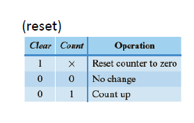

## Counters

#### 二进制递增计数器（Binary Up Counter）

- **功能描述**：一个n位的二进制递增计数器可以通过修改一个n位寄存器来构建，其中寄存器的数据输入来自一个加法器。

- **复位逻辑表**：
  - 当`Clear`（清除）为1时，无论`Count`（计数）信号如何，计数器都会被重置为零。
  - 当`Clear`为0且`Count`也为0时，计数器的状态不会改变。
  - 当`Clear`为0且`Count`为1时，计数器会递增。

- **电路图**：展示了一个4位的二进制递增计数器的电路结构。每个触发器（D触发器）都有一个时钟输入（Clk）、清除输入（Clear）以及来自加法器的输入。加法器的输出连接到触发器的数据输入端（D），而触发器的输出（Q）则连接到下一个触发器的输入，形成一个链式结构。

- **信号说明**：
  - `Cin` 和 `Cout` 分别代表加法器的输入和输出进位信号。
  - `HA` 可能代表半加器（Half Adder），用于处理两个输入位的加法。
  - `s` 和 `a` 可能是半加器的和（Sum）和进位（Carry）输出。
  - `Q0` 到 `Q3` 代表触发器的输出位。
  - `Do` 到 `D3` 代表触发器的数据输入端。

- **溢出（Overflow）**：当计数器达到最大值时，下一个计数周期将导致溢出，计数器会从0开始重新计数。




1. description using "+" function:

```vhdl
LIBRARY IEEE;
USE IEEE.STD_LOGIC_1164.ALL;
USE IEEE.STD_LOGIC_UNSIGNED.ALL;

ENTITY counter IS PORT(
	Clock: IN STD_LOGIC;
	Clear: IN STD_LOGIC;
	Count: IN STD_LOGIC;
	Q : OUT STD_LOGIC_VECTOR(3 DOWNTO 0));
END Counter;

ARCHITECTURE Behavioral OF counter IS
    SIGNAL value : STD_LOGIC_VECTOR(3 DOWNTO 0);
BEGIN
    PROCESS(Clock, Clear)
    BEGIN
        IF(Clear = '1') THEN
            value <= (OTHERS => '0'); --重置为0
        ELSIF (Clock'EVENT AND Clock='1') THEN --上升沿
            IF(Count = '1') THEN
                value <= value + 1;
            END IF;
        END IF;
    END PROCESS;
    Q <= value; --注意，还是调用次数的问题，这里最好还是不要直接将Q输出信号放到process里，用中间变量得到结果再赋值的选择是最好的
END Behavioral;
```


2. Binary counter in cascade of T-F.F. s


```vhdl
LIBRARY IEEE;
USE IEEE.STD_LOGIC_1164.ALL;
USE IEEE.STD_LOGIC_UNSIGNED.ALL;
ENTITY Counter IS
	GENERIC(n: natural:=4);
	PORT(clk : in std_logic;
		reset : in std_logic;
		count : out std_logic_vector(n-1 downto 0));
END counter;

ARCHITECTURE ripple OF Counter IS
    COMPONENT T_FF IS
    PROT(T : IN STD_LOGIC;
        clk: IN STD_LOGIC;
        reset: IN STD_LOGIC;
        Q : OUT STD_LOGIC;
        Qbar : OUT STD_LOGIC);
	end component;
	signal carry : std_logic_vector(n downto 0);
BEGIN
    carry(0)<=clk;
	g0: for i in 0 to n-1 generate
        T1: T_FF port map('1', carry(i), reset, count(i),carry(i+1));
    END GENERATE g0;
END ripple;
```


从"001" 到 "010"的过渡

**状态变化步骤**：

- **Step 1**: `count(0)<=0; carry(1)<=1`，状态变为 “000”。
- **Step 2**: `count(1)<=1`，状态变为 “010”。
- **过渡路径**：`001 → 000 → 010`。

**原因**：

- 级联结构导致信号的传输有延迟。
- `count(0)` 的变化首先影响 `carry(1)`，然后传递到 `count(1)`。

**结论**：

- **短暂状态**：在理想 “010” 状态之前，电路会短暂停留在 “000”。


从"011" 到 "100"的过渡

**状态变化步骤**：

- **Step 1**: `count(0)<=0; carry(1)<=1`，状态变为 “010”。
- **Step 2**: `count(1)<=0; carry(2)<=1`，状态变为 “000”。
- **Step 3**: `count(2)<=1`，状态变为 “100”。
- **过渡路径**：`011 → 010 → 000 → 100`。

**原因**：

- 级联结构导致信号需要逐级传递。
- 每一级 T-FF 翻转都会引入延迟。

**结论**：

- **短暂状态**：电路会经过 “010” 和 “000” 两个中间状态，最终稳定到目标状态 “100”。

==也就是说，每次的变化是通过从最低位开始翻转，一次一次翻转到要变化的最高位部分。==


## Timing Verification


### **六个静态时序路径**

1. **从 A 到 D1**（**输入到触发器**）：
   - **路径**：输入 A → D1 数据输入。
2. **从 D1 到 D2（包含 XOR 门）**（**触发器到触发器**）：
   - **路径**：D1 输出 (Q1) → XOR 门 → D2 输入。
3. **从 D2 通过 XOR 门返回到 D2**（**触发器到触发器**）：
   - **路径**：D2 输出 → XOR 门 → D2 输入。
4. **从 D2 通过 AND 门返回到 D1**（**触发器到触发器**）：
   - **路径**：D2 输出 → AND 门 → D1 输入。
5. **从 D2 到 Z 通过 OR 门**（**触发器到输出**）：
   - **路径**：D2 输出 → OR 门 → 输出 Z。
6. **从 A 到 Z 通过 OR 门**（**输入到输出**）：
   - **路径**：输入 A → 组合逻辑 → OR 门 → 输出 Z。


#### **1. 时序参数 (Timing Parameters)**

主要针对**触发器 (Flip-Flop)** 的时序特性：

1. 传播延迟 (Propagation Delay / Clock-to-Q Delay)：
   - 定义：时钟的有效边沿到触发器输出发生变化的时间。
2. 建立时间 (Setup Time)：
   - 定义：触发器输入信号需要在时钟有效边沿**之前**保持稳定的时间。
3. 保持时间 (Hold Time)：
   - 定义：触发器输入信号需要在时钟有效边沿**之后**保持稳定的时间。

这些参数是时序分析的重要基础，任何违反都会导致**时序违规**（例如，建立时间或保持时间不满足）。

------

#### **2. 静态时序分析 (Static Timing Analysis, STA)**

1. **关键路径 (Critical Path)**：
   - 定义：电路中延迟最长的路径决定了设计的**最大时钟频率**。
   - 原理：时钟频率必须确保在关键路径上的所有数据传输完成，避免数据竞争或错误。
2. **静态时序分析 (STA)**：
   - **定义**：一种在**最坏情况假设**下，估算电路最大工作频率和时序特性的分析方法。
   - 优势：
     - 不需要进行动态仿真。
     - 快速、全面地检测电路是否满足时序要求。

------

### **总结**

- **时序参数**（传播延迟、建立时间、保持时间）是分析电路时序的基础。
- **STA** 是现代集成电路设计中广泛使用的方法，用于验证时序约束，确保设计稳定运行。
- **关键路径** 分析帮助确定设计的最大时钟频率。


#### **1. 静态时序分析 (STA) 的特性**

- **路径分析**：所有电路路径都被考虑，而不假设特定的输入值。
- **时序检查**：验证每个逻辑门或触发器在**最高速**与**最低速**之间工作时，是否发生时序违规。
- **适用范围**：仅适用于**同步电路**（具有时钟信号的电路）。

------

#### **2. 常见时序错误**

1. **建立时间违规 (Setup Time Violation)**：
   - **原因**：数据到达得太晚，无法满足触发器的**建立时间要求**。
   - **影响**：导致触发器无法正确地采样输入数据。
2. **保持时间违规 (Hold Time Violation)**：
   - **原因**：数据变化得太快，时钟边沿之后没有足够的**保持时间**。
   - **影响**：触发器采样时数据不稳定，导致错误的数据被存储。

------

#### **3. Slack 时间**

- 定义：在信号违反建立时间或保持时间约束之前剩余的时间。
  - 正的 **Slack**：表示时序满足要求，设计安全。
  - 负的 **Slack**：表示时序违规，需要优化电路或调整设计。

------

#### **4. 图示解析**

下方的时序图展示了：

- **建立时间 (t_setup)**：数据必须在时钟有效边沿之前稳定的时间。
- **保持时间 (t_hold)**：数据必须在时钟有效边沿之后稳定的时间。

------

### **总结**

- STA 通过检查所有路径，确保满足**建立时间**和**保持时间**约束。
- **建立时间违规** 和 **保持时间违规** 是设计中必须避免的关键时序错误。
- **Slack** 作为时序裕量的指标，帮助评估设计时序的健康状况。


#### **1. 静态分析路径 (Static Analysis Path)**：

- **起点**：始于 **源触发器 (source flip-flop)** 的输入。
- **终点**：终止于 **目标触发器 (destination flip-flop)** 的输入。
- **注意**：路径分析会忽略目标触发器的内部行为，关注的是 **输入到输入** 之间的传输延迟。

#### **2. 时序路径的终止条件**：

- 路径分析会在遇到时钟控制的设备（例如触发器）时终止。

------

#### **3. 四种时序路径类型**：

1. **寄存器到寄存器路径 (Register-to-Register Path)**：
   - 路径：触发器输出 → 组合逻辑 → 另一个触发器输入。
2. **输入到寄存器路径 (Primary Input-to-Register Path)**：
   - 路径：电路的**主要输入** → 触发器输入。
3. **寄存器到输出路径 (Register-to-Primary Output Path)**：
   - 路径：触发器输出 → 组合逻辑 → 电路的**主要输出**。
4. **输入到输出路径 (Input-to-Output Path)**：
   - 路径：电路的**主要输入** → 组合逻辑 → 电路的**主要输出**（不涉及触发器）。


1. **组合逻辑的最大传播延迟**：
   - **$t_{cmax}$**：数据通过**组合逻辑**的最大延迟。
   - 这个延迟决定了数据从 FF1 输出到达 FF2 输入的时间。
2. **寄存器传播延迟**：
   - **$t_{pmax}$**：时钟有效边沿到 FF1 输出 Q1 发生变化的最大传播延迟。
3. **时钟周期 ($t_{ck}$)**：
   - 时钟信号的周期，必须满足所有延迟要求，保证数据正确采样。

------

### **时序约束条件**

为了保证电路正常工作，必须满足以下条件：

$t_{pmax} + t_{cmax} \leq t_{ck}$

- **$t_{pmax}$**：触发器 (FF1) 的传播延迟。
- **$t_{cmax}$**：组合逻辑的最大延迟。
- **$t_{ck}$**：时钟周期。

------

### **总结**

1. 时序分析的重点是确保数据从源触发器 (FF1) 通过组合逻辑传输到目标触发器 (FF2) 输入时，满足时钟周期的约束。
2. **$t_{ck}$** 必须大于所有路径延迟之和，以避免时序违规。
3. 在**无时钟偏移**情况下，时钟信号一致，不存在额外的时钟不对齐影响。


这里看的是两个CLK接到的节点，中间涉及到的延迟是否满足要求，观察图片可以发现，中间先经过了FF1，然后经历了Combinational logic，所以涉及到的延迟就是这两个部分。


### Timing rules for Flip-Flop to Flip-Flop Paths

1. ==Setup time rule for flip-flop to flip-flop path: Clock period should be long enough to satisfy flip-flop setup time==

- 时钟周期 $t_{ck}$ 必须足够长，确保满足触发器的建立时间要求。

- 时序约束公式：

  $t_{ck} \geq t_{pmax} + t_{cmax} + t_{su}$

  - $t_{pmax}$：**源触发器 (FF1)** 的最大传播延迟 (Clock-to-Q Delay)。
  - $t_{cmax}$：组合逻辑的最大传播延迟。
  - $t_{su}$：目标触发器 (FF2) 的建立时间 (Setup Time)。

#### **建立时间裕量 (Setup Time Margin)**

- 定义：时钟周期 

  $t_{ck} $与 $(t_{pmax} + t_{cmax} + t_{su})$ 之间的差值。

  $\text{Setup Time Margin} = t_{ck} - (t_{pmax} + t_{cmax} + t_{su})$

  - 正裕量：时序满足要求。
  - 负裕量：时序违规，需要优化时钟周期或减少路径延迟。


2. ==Hold-time rule for flip-flop to flip-flop path : Minimum circuit delays should be long enough to satisfy flip-flop hold time.==

### **规则描述**：
- 最小路径延迟必须足够大，以满足目标触发器的**保持时间**要求。

### **公式**：
$t_{pmin} + t_{cmin} \geq t_h$
- \( $t_{pmin}$ \)：源触发器 (FF1) 的最小传播延迟 (Clock-to-Q Delay)。  
- \( $t_{cmin}$ \)：组合逻辑的最小延迟。  
- \( $t_h$ \)：目标触发器 (FF2) 的保持时间。


1. 如果**最小路径延迟不足**，导致违反保持时间：
   - 数据会在时钟有效边沿之后变化得太快，FF2 无法正确采样数据。
2. **保持时间违规无法通过改变时钟频率修复**：
   - 解决方案：通过**增加最小路径延迟**，例如插入缓冲器或增加组合逻辑延迟。


- **路径**：  
   \( Q1 \) → 组合逻辑 → \( D2 \)  
- **时钟**：  
   \( CLK1 \) 驱动 FF1，\( CLK2 \) 驱动 FF2。


- **\( $t_{pmin}$ \)**：源触发器最小传播延迟。  
- **\( $t_{cmin}$ \)**：组合逻辑的最小延迟。  
- 如果以下条件不满足：
   $t_{pmin} + t_{cmin} \geq t_h$
   则发生保持时间违规。

- **保持时间约束**：确保最小路径延迟 \($ t_{pmin} + t_{cmin}$\) 足够大。
- **解决方法**：增加路径延迟，而非改变时钟周期。

**假设说CLK有两个上升沿，在第一个上升沿被触发后，两个FF都会进行数据传递与运算，这个时候，第二个FF在两个上升沿之间稳定保持不动的这段时间就是holdtime，这个时候，FF1的数据不能这么快传递到FF2不然的话就会冲突，于是我们也要约束其最小传播延迟，不能传播的太快**


3. ==Setup time rule for input to flip-flop path : External input changes to the circuit should satisfy flip-flop setup time.==

外部输入信号 \( X \) 变化到电路中时，必须满足目标触发器的**建立时间**要求。

**时序约束公式**  
$$
t_x \geq t_{cxmax} + t_{su}
$$
- **\( $t_x$ \)**：输入信号 \( X \) 到达触发器输入的最大时间。  
- **\( $t_{cxmax} $\)**：输入信号 \( X \) 通过组合逻辑传输到触发器输入 \( D \) 的最大传播延迟。  
- **\( $t_{su}$ \)**：触发器的建立时间 (Setup Time)。  


- \( $t_{cxmax}$ \)：组合逻辑的最大传播延迟，影响信号传输到触发器的时序。  
- **时钟约束**：**输入信号必须提前到达，留出足够的时间满足建立时间。**  


- **路径**：\( X \) → 组合逻辑 → 触发器输入 \( D \)。  
- **时钟**：时钟信号驱动触发器。  


**时序波形图**  

- **\( $t_x$ \)**：从 \( X \) 开始变化到触发器输入 \( D \) 的时间。  
- **\( $t_{cxmax} $\)**：组合逻辑的最大传播延迟。  
- **\( $t_{su}$ \)**：触发器的建立时间。  

若 \( $t_x$ \) 不满足以下公式：  
$$
t_x \geq t_{cxmax} + t_{su}
$$
则触发器无法正确采样数据，发生**建立时间违规**。

- **输入到触发器路径**必须满足时序约束：  
   $$ t_x \geq t_{cxmax} + t_{su} $$  
- **解决方案**：确保输入信号提前到达，优化组合逻辑延迟 \( $t_{cxmax}$ \)。


**总而言之，在X发生变化之后，信号必须提早一步到达FF，假设说，规定$t_x$为10ns，则代表CLK的period也跟10ns相关，如果说中间耗费的时间太久，则无法在相应的period中正确的对输入信号进行及时的反应**


4. ==Hold-time rule for input to flip-flop path : External input changes to the circuit should satisfy flip-flop hold times.==

外部输入信号 \( X \) 的变化必须满足目标触发器的**保持时间**要求。

---

### **时序约束公式**  
$$
t_y \geq t_h - t_{cxmin}
$$
- **\( $t_y$ \)**：输入信号 \( X \) 的最小变化时间。  
- **\( $t_h$ \)**：触发器的保持时间 (Hold Time)。  
- **\( $t_{cxmin}$ \)**：输入信号通过组合逻辑传输到触发器输入的最小传播延迟。

## 
1. **保持时间约束**：  
   输入信号 \( X \) 必须在时钟有效边沿之后，保持稳定一段时间 \( $t_h$ \)。  
   同时考虑组合逻辑的最小延迟 \( $t_{cxmin}$ \)。

2. **违反保持时间的影响**：  
   如果 \( $t_y < t_h - t_{cxmin}$ \)，输入信号变化过快，会导致触发器无法正确采样数据，出现保持时间违规。


**电路示意图**  

- **路径**：输入信号 \( X \) → 组合逻辑 → 触发器输入 \( D \)。  
- **时钟**：驱动触发器的时钟信号 \( CLK \)。  


**时序波形图**  

- **\( $t_y$ \)**：输入信号 \( X \) 的最小稳定时间。  
- **\( $t_h$ \)**：触发器的保持时间要求。  
- **\( $t_{cxmin}$ \)**：输入信号经过组合逻辑的最小延迟。

若以下条件不满足：  
$$
t_y \geq t_h - t_{cxmin}
$$
则发生**保持时间违规**。


简而言之，公式可以换成
$$
t_y + t_{cxmin} \geq t_h 
$$
**也就是说，在holdtime内，FF不可以接收到新信号的传入，也就是说，在信号变化后，再经历了组合逻辑的时间，到达FF的时候，这个时候holdtime应该结束。**


example:


### **给定参数**
1. **CLK-to-Q 延迟**：
   - Flip-flop A: 7 ns / 9 ns (最小 / 最大)  
   - Flip-flop B: 8 ns / 10 ns  
   - Flip-flop C: 9 ns / 11 ns  
2. **组合逻辑延迟**：
   - 最小延迟: 3 ns  
   - 最大延迟: 4 ns  
3. **建立时间 (Setup Time)**：
   - 2 ns  
4. **保持时间 (Hold Time)**：
   - 1 ns  

## **路径延迟计算**

1. **从触发器 A 到触发器 B**  
   $$
   t_{clk-to-Q}(A) + t_{su}(B) = 9 \, \text{ns} + 2 \, \text{ns} = 11 \, \text{ns}
   $$

2. **从触发器 A 到触发器 C**  
   $$
   t_{clk-to-Q}(A) + t_{combo} + t_{su}(C) = 9 \, \text{ns} + 4 \, \text{ns} + 2 \, \text{ns} = 15 \, \text{ns}
   $$

3. **从触发器 B 到触发器 C**  
   $$
   t_{clk-to-Q}(B) + t_{combo} + t_{su}(C) = 10 \, \text{ns} + 4 \, \text{ns} + 2 \, \text{ns} = 16 \, \text{ns}
   $$

4. **从输入到触发器 A**  
   $$
   t_{su}(A) = 2 \, \text{ns}
   $$

5. **从触发器 C 到输出**  
   $$
   t_{clk-to-Q}(C) = 11 \, \text{ns}
   $$

---

## **最大时钟周期与频率**

- **最长路径延迟**：从触发器 B 到触发器 C  
   $$
   t_{max} = 16 \, \text{ns}
   $$

- **最大时钟频率**：  
   $$
   f_{max} = \frac{1}{t_{max}} = \frac{1}{16 \, \text{ns}} = 62.5 \, \text{MHz}
   $$

---

## **结论**

由于从 B 到 C 的路径延迟 \( 16 \, \text{ns} \) 是所有路径中最长的，  
**最大时钟频率** 为：  
$$
f_{max} = 62.5 \, \text{MHz}
$$


==**如果题目中问的是最大时钟周期的话，就回应到公式，与时钟周期有关的部分，一般来说是setup time rule，其时钟周期要满足大于中间最大的传播可能时间，则选择的是最大延迟，即要确保时钟周期要大于等于这个最大的可能值，以确保在一个周期内，无论信号多慢都能到达FF。**==

