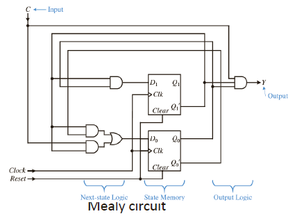

## state machine

跟据sequential logic，我们可以将其转换成state machine

## **定义**
- 状态机是用于描述计算机程序或**时序逻辑**的**数学模型**。**状态与事件**：

1. - **时序逻辑事件**可以被视为一个具有**有限状态**的抽象机器。
   - 在任意时间，状态机只能处于**一种状态**。
   
2. **状态转换 (State Transition)**：
   - 状态机从一个状态转换到另一个状态的过程由**触发事件**或**条件**引发。

## **关键区别**
| 特性             | Moore 状态机               | Mealy 状态机                   |
| ---------------- | -------------------------- | ------------------------------ |
| **输出依赖**     | 仅依赖**当前状态**         | 依赖**当前状态和输入**         |
| **输出变化时机** | 在状态改变时更新           | 输入变化时输出也会立即变化     |
| **设计复杂度**   | 较简单，输出与状态直接相关 | 较复杂，需考虑输入与状态的关系 |

---

## **总结**
- **Moore 机**：输出仅与当前状态相关，设计简单且稳定。
- **Mealy 机**：输出与当前状态和输入相关，反应更快但设计更复杂。

选择哪种状态机？

- **Moore 机**：设计简单，输出稳定，状态数量更多。   

- **Mealy 机**：设计灵活，反应更快，状态数量更少。  

$s_0$为初始状态，进入while循环，首先有个判断，$x ≠ 0$，判断结束后来到$s_1$，之后output输出，之后来到$s_2$，此刻$x = x -1$，这个时候正常情况下会一直进行循环，于是还有一个箭头指回$s_1$；当$x ≠ 0$这个条件不被满足的时候，就会进入下一个状态，也就是$s_3$，这里$s_3$有个箭头指向其本身，而且没有从$s_3$出发的去往别的状态的箭头，则代表这个就是最终的状态，不可循环不可逆。最后$s_0$也有一个箭头指向$s_3$，这里就是为了迎接x在一开始就等于0的情况。

## Steps for the analysis of FSM Machines

==**The steps for the analysis of FSM circuits:**==

1. **Derive the next-state equations**:  
   - From the combinational next-state logic circuit, determine the equations that describe the next state based on the current state and inputs.

2. **Derive the next-state table**:  
   - Use the next-state equations to create the next-state table, showing transitions between states for all possible inputs.

3. **Derive the output equations**:  
   - From the combinational output logic circuit, determine the equations that describe the outputs based on the current state (Moore) or the current state and inputs (Mealy).

4. **Derive the output table**:  
   - Use the output equations to create a table describing the outputs for each state and input combination.

5. **Draw the state diagram**:  
   - Using the next-state table and output table, create the state diagram to visually represent the FSM's behavior.

### Next-State Equations

根据图片，我们可以发现：
$$
D_1 = Q_1'Q_0
\\
D_0 = Q_1'Q_0' + CQ_1'
$$

于是，可以写出
$$
Q_{1next} = D_1 = Q_1'Q_0
\\
Q_{0next} = D_0 = Q_1'Q_0' + CQ_1'
$$

## Next-State Table

根据上面的Next-State Equations可以画出Next-State Table

左边的图：左侧一列是所有涉及到的输入（当前），右边是涉及到的要变化的变量（next状态）

右边的图：左侧一列是当前状态，右侧由于有不随着状态机变化的变量C，于是分成两列两种情况

## Output equations

这里就会分成两种情况，分别是Moore circuit和Mealy circuit，前者的输出不会和输入直接相关，后者会和输入相关。

左：$Y = CQ_1'Q_0$

右：$Y = Q_1'Q_0$

## Output Table

跟据上述两个output equations

## State Diagram

跟据上述的两个Table，画出state diagram

首先看到moore FSM，一共四种状态，就是四个圈，里面放$Q_1Q_0$，具体来说，里面放的是状态机的内部存储变量。之后，画出它们之间的转换顺序，用箭头表示，不同C的输入如果影响到$Q_1Q_0$则用不同的箭头分开来表示，然后表示一下C在不同情况下取得值。最后，将输出的Y也填写到圈中，整个过程就算完成。

Mealy机相比于Moore机的结果会多一个涉及到的变量，但是也是满足一个状态内对应一种输出的关系，与Moore机思路相似。

# FSM电路综合的步骤(synthesis of circuits)

1. **根据功能描述绘制状态图**：  
   - 从电路的功能描述出发，绘制出状态图，表示状态及其转换关系。

2. **从状态图推导下一状态表**：  
   - 根据状态图，列出所有状态及输入组合下的下一状态表。

3. **从下一状态表推导下一状态方程**：  
   - 使用下一状态表，推导出描述状态转换的布尔方程。

4. **推导输出**：  
   - 从状态图中推导输出表，描述在不同状态和输入下的输出。  
   - 从输出表中推导输出方程，得到输出逻辑的布尔表达式。

5. **绘制FSM电路**：  
   - 根据推导出的**下一状态方程**和**输出方程**，绘制出完整的FSM电路。

==这里相当于是和上面的步骤反过来，之前的是由电路图推出state diagram，现在通过伪代码先推到state diagram，然后再反推回电路图，后续需要通过卡诺图判断连接。==

### State diagram

跟据左侧的伪代码可以推理出，Y=0为最初始的状态，之后跟据B的值分出两个分支，得到$s_1$和$s_2$，分别代指Y=0和Y=1，之后收束到$s_3$，然后循环回到$s_0$

### Next-State Table

然后，注意总的state数，四个圈代表四个state，也就是说有$2^2$个状态，对应两个FF，则有$Q_0Q_1$两个存储变量。跟据$s_0 \to s_3$对应四种组合，从00到11，补充表格。

### Next-State Equations

**这一步需要通过卡诺图得到**

这里需要单独对两个存储变量进行卡诺图分析，即左边的卡诺图对应的是$Q_{1next}$的分析，里面的1代表在这个时刻$Q_{1next}=1$，左侧一列$Q_1Q_0$则是current state，在通过current state的$Q_1Q_0$和外部输入B来分析这个对应Next state的$Q_{1next}$或者$Q_{0next}$的值。

### Output Table and Output Equations

跟据原state diagram得到

### FSM Circuit

最后跟据两个equation进行接线，得到最终的FSM

