## VHDL code for FSM Circuits

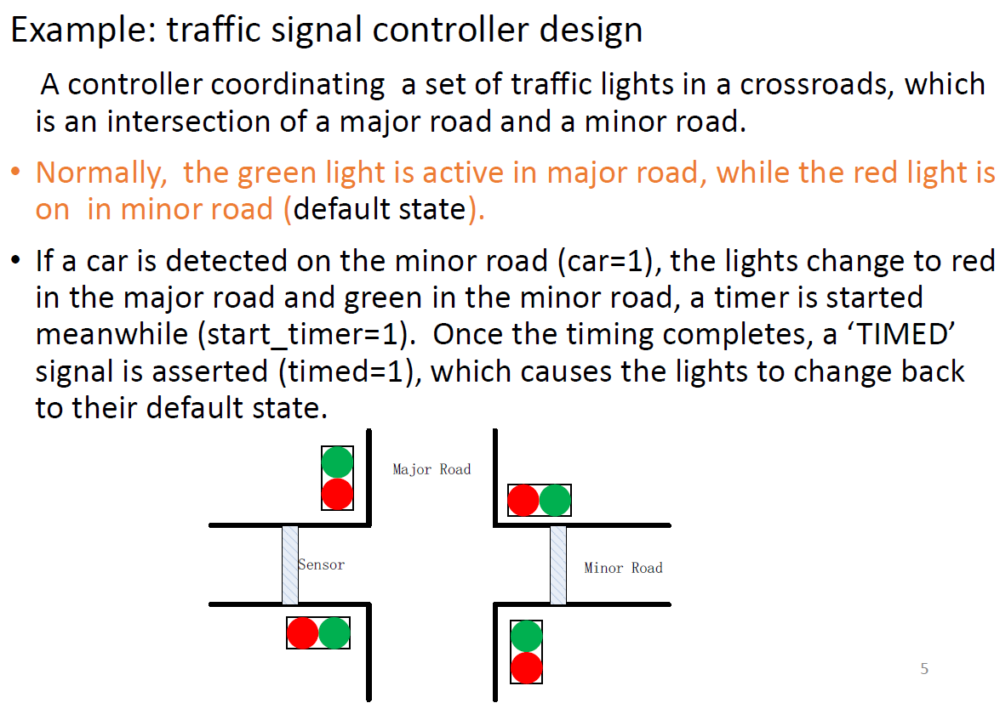

解读：默认情况下，主路的绿灯亮起，辅路的红灯亮起。

如果检测到辅路有车，辅路绿灯亮起，主路红灯亮起，同时开始计时，start_timer=1，当计时完成，设置time=1，然后同时变回默认状态。


Steps:

1. Input:

clock, car, timed

2. output:

start_timer;

major_green, minor_green

3. all possible states

$state = G \to major\_green=1, minor\_green=0;$

$state = R \to major\_green=0, minor\_green=1;$

通过之前的流程可以画出以下的流程

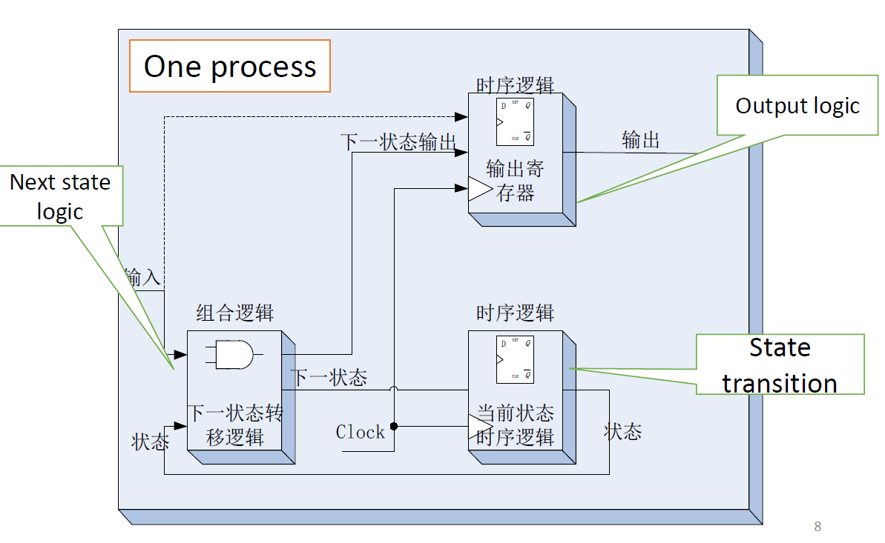

## **One-Process State Machine**（状态存储, 输出与下一状态合并成一个process）

```vhdl
LIBRARY IEEE;
USE IEEE.STD_LOGIC_1164.ALL;
ENTITY traffic IS
	PORT(clock, timed, car : IN std_logic;
		start_timer, major_green, minor_green : OUT std_ulogic);
END ENTITY traffic;

ARCHITECTURE asm1 OF traffic IS
BEGIN
	PROCESS(clock, timed, car)
		TYPE state_type IS(G,R); --创建数据类型，里面只能是G或者R，这里默认是给的主路的state
		VARIABLE state:state_type;
	BEGIN
		IF(rising_edge(clock)) THEN
			CASE state IS
				WHEN G => --当主路state为G的时候
					major_green <= '1';
					minor_green <= '0';
                    IF(car='1') THEN
                        start_timer <= '1';
                        state := R;
                    END IF;
            
                WHEN R => --当主路情况为R的时候
                    major_green <= '0';
                    minor_green <= '1';
                    IF (timed ='1') THEN
                        state := G;
                    END IF;
                WHEN OTHERS => NULL;
            END CASE;
    	END IF;
    END PROCESS;
END ARCHITECTURE;
```


### **要点**：
1. **状态使用变量表示**：
   - 状态可以通过**变量（variables）**表示，并在进程中声明。

2. **描述以时钟边沿检测语句开始**：
   - 使用 `rising_edge(clock)` 或 `clock'event and clock='1'` 语句检测时钟上升沿。

3. **敏感列表问题**：
   - 问题：`car` 和 `timed` 可以从敏感列表中移除吗？  
   - 答案：敏感列表中只需要包含用于触发的时钟和复位信号。

4. **不完整的 if 语句可能引入寄存器**：
   - 在一个进程中同时混合**时序逻辑**和**组合逻辑**，可能导致生成**不必要的寄存器**。

5. **避免不必要的寄存器**：
   - 将**时序逻辑**和**组合逻辑**分离，分别用两个独立的进程描述。

---

### **总结**：
- 使用单进程状态机时，需谨慎处理时钟边沿检测与敏感列表，确保逻辑正确性。
- 为了避免寄存器误导入，可以通过将时序逻辑和组合逻辑分离来优化代码设计。


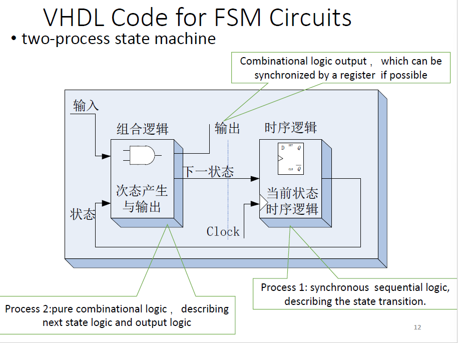


## **Two-Process State Machine**(状态存储一个process, 输出与下一状态合并成一个process)

### **架构描述**
1. **两个进程划分**：
   - **Process 1: 时序逻辑**  
     - 描述状态转换，包含当前状态的存储和同步。
     - 由时钟信号驱动（通常为 `rising_edge(clock)`）。

   - **Process 2: 组合逻辑**  
     - 描述下一状态逻辑和输出逻辑。
     - 用于计算根据当前状态和输入生成的下一状态和输出信号。

2. **逻辑划分**：
   - **时序逻辑**：
     - 保存当前状态。
   - **组合逻辑**：
     - 计算下一状态和输出信号。

---

### **模块组成**
1. **时序逻辑**（Process 1）：  
   - 通过触发器（D-FF）存储当前状态。
   - 在每个时钟上升沿更新状态。

2. **组合逻辑**（Process 2）：  
   - 输入当前状态和外部输入，生成下一状态和输出信号。
   - 输出信号可以通过寄存器同步，以消除组合逻辑延迟带来的不稳定性。

---

### **总结**
- **分离时序逻辑和组合逻辑**可以避免寄存器误导入，提高电路稳定性。
- 这种结构清晰地将 FSM 的状态存储与状态计算分开，有助于设计和调试。

```vhdl
LIBRARY IEEE;
USE IEEE.STD_LOGIC_1164.ALL;

ENTITY traffic IS
    PORT (
        clock, timed, car : IN std_ulogic; -- 输入信号：时钟、计时完成标志、车辆检测标志
        start_timer, major_green, minor_green : OUT std_ulogic -- 输出信号：启动计时器、主道路绿灯、次道路绿灯
    );
END ENTITY traffic;

ARCHITECTURE asm2 OF traffic IS
    --固定写法
    TYPE state_type IS (G, R); -- 定义状态类型：主绿灯（G）、次绿灯（R）
    SIGNAL pr_state, next_state : state_type; -- 定义当前状态和下一状态信号
BEGIN
    -- 时序逻辑：状态存储
    seq: PROCESS (clock)
    BEGIN
        IF (rising_edge(clock)) THEN
            pr_state <= next_state; -- 在时钟上升沿更新当前状态
        END IF;
    END PROCESS seq;

    -- 组合逻辑：输出与下一状态
    com: PROCESS (pr_state, car, timed)
    BEGIN
        start_timer <= '0'; -- 默认情况下关闭计时器
        CASE pr_state IS
            WHEN G => -- 当前状态为主绿灯（G）
                major_green <= '1'; -- 主路绿灯亮
                minor_green <= '0'; -- 次路红灯亮
                IF (car = '1') THEN -- 如果检测到车辆
                    start_timer <= '1'; -- 启动计时器
                    next_state <= R; -- 转换到次绿灯状态（R）
                ELSE
                    next_state <= G; -- 保持当前状态
                END IF;

            WHEN R => -- 当前状态为次绿灯（R）
                major_green <= '0'; -- 主路红灯亮
                minor_green <= '1'; -- 次路绿灯亮
                IF (timed = '1') THEN -- 如果计时完成
                    next_state <= G; -- 转换到主绿灯状态（G）
                ELSE
                    next_state <= R; -- 保持当前状态
                END IF;
        END CASE;
    END PROCESS com;
END ARCHITECTURE asm2;
```

==注意，与之前的单process不同，这里多process涉及信息传递，则在architecture创建的数据类型必须要是signal，才能在process之间传递==

1. **状态通过信号表示**：   - 使用信号 (`signals`) 表示状态，这样可以在不同进程之间交换状态信息。 
2. **添加异步复位信号**：   - 在同步进程中加入异步复位信号，当复位信号被激活时，系统状态初始化。 
3. **正确使用 if 语句**：   - `if` 语句需要适当且完整地使用，避免逻辑错误。

```vhdl
seq: PROCESS (clock)
BEGIN
    IF reset = '1' THEN
        pr_state <= G; -- 当复位信号激活时，将状态初始化为 G（主绿灯状态）
    ELSIF rising_edge(clock) THEN
        pr_state <= next_state; -- 在时钟上升沿时更新当前状态
    END IF;
END PROCESS seq;
```

2 process相当于1 process多了state的状态讨论，相比于在一个process内对单独的state，这里创建出了两种state，分别是pr_state现在的状态和next_state下一状态，并在输出与下一状态process内进行更新，存储process内进行赋值。


## Three-process description（状态存储, 输出与下一状态各为一个process）

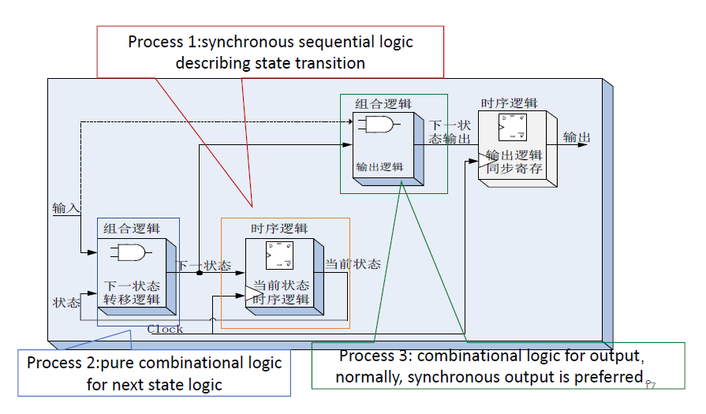

```vhdl
LIBRARY IEEE;
USE IEEE.STD_LOGIC_1164.ALL;

ENTITY traffic IS
    PORT (
        clock, timed, car : IN std_ulogic; -- 输入信号：时钟、计时完成标志、车辆检测标志
        start_timer, major_green, minor_green : OUT std_ulogic -- 输出信号：启动计时器、主道路绿灯、次道路绿灯
    );
END ENTITY traffic;

ARCHITECTURE asm3 OF traffic IS
    TYPE state_type IS (G, R); -- 定义状态类型：主绿灯（G）、次绿灯（R）
    SIGNAL pr_state, next_state : state_type; -- 定义当前状态和下一状态信号
BEGIN
    -- 时序逻辑：状态存储
    seq: PROCESS (clock)
    BEGIN
        IF (rising_edge(clock)) THEN
            pr_state <= next_state; -- 在时钟上升沿更新当前状态
        END IF;
    END PROCESS seq;

    -- 下一状态逻辑
    ns: PROCESS (car, timed, pr_state)
    BEGIN
        CASE pr_state IS
            WHEN G => -- 当前状态为主绿灯（G）
                IF (car = '1') THEN
                    next_state <= R; -- 如果检测到车辆，转到次绿灯状态（R）
                ELSE
                    next_state <= G; -- 否则保持主绿灯状态
                END IF;
            WHEN R => -- 当前状态为次绿灯（R）
                IF (timed = '1') THEN
                    next_state <= G; -- 如果计时完成，返回主绿灯状态（G）
                ELSE
                    next_state <= R; -- 否则保持次绿灯状态
                END IF;
        END CASE;
    END PROCESS ns;

    -- 输出逻辑
    op: PROCESS (car, pr_state)
    BEGIN
        start_timer <= '0'; -- 默认情况下关闭计时器
        IF (pr_state = G) THEN -- 当前状态为主绿灯
            major_green <= '1'; -- 主绿灯亮
            minor_green <= '0'; -- 次红灯亮
            IF (car = '1') THEN
                start_timer <= '1'; -- 检测到车辆时启动计时器
            END IF;
        ELSE -- 当前状态为次绿灯
            major_green <= '0'; -- 主红灯亮
            minor_green <= '1'; -- 次绿灯亮
        END IF;
    END PROCESS op;

END ARCHITECTURE asm3;

```

这里相比于2 process来说，进一步将下一状态和输出逻辑拆分到两个不同的process内，对于下一状态逻辑，只进行状态参数的更新，对于输出逻辑，进行实际变量的输出与控制。

或者，op process内的逻辑也可以写成并发语句，如下：

```vhdl
start_timer <= '1'
WHEN (pr_state = G AND car = '1')
ELSE '0';

major_green <= '1'
WHEN (pr_state = G)
ELSE '0';

minor_green <= '1'
WHEN (pr_state = R)
ELSE '0';
```


## Example: Moore FSM

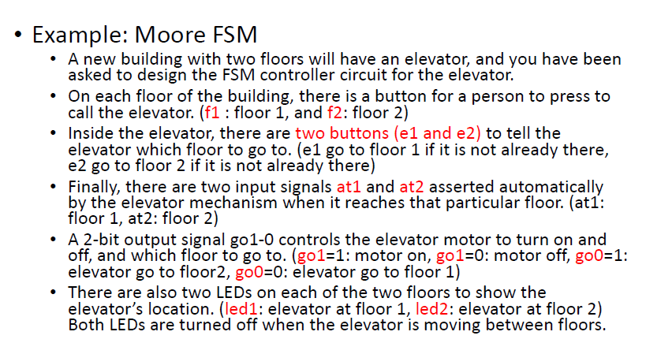

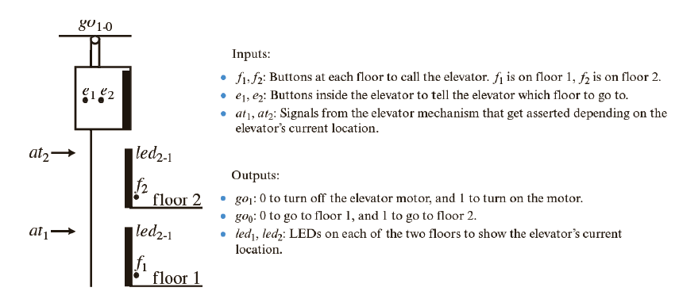

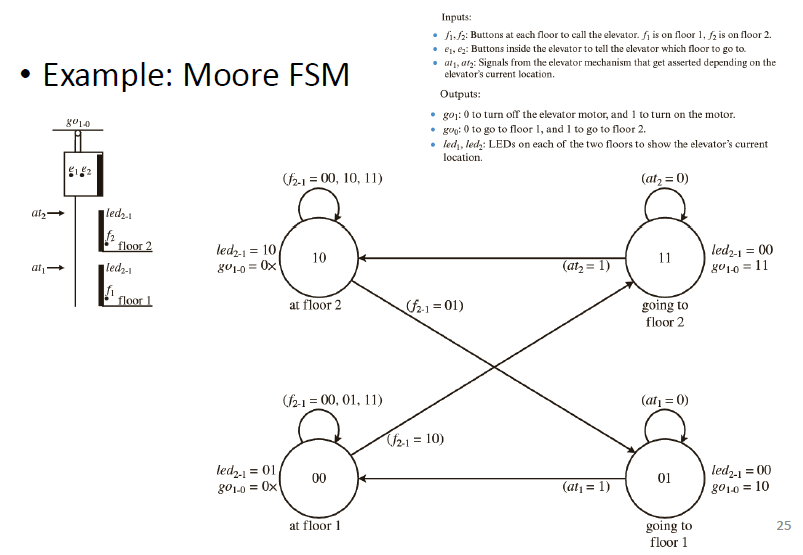

```vhdl
LIBRARY IEEE;
USE IEEE.STD_LOGIC_1164.ALL;

ENTITY MooreFSM IS
    PORT(
        Clock, Reset : IN STD_LOGIC;
        f, at : IN STD_LOGIC_VECTOR(2 DOWNTO 1);
        go : OUT STD_LOGIC_VECTOR(1 DOWNTO 0);
        led : OUT STD_LOGIC_VECTOR(2 DOWNTO 1)
    );
END MooreFSM;

ARCHITECTURE Behavioral OF MooreFSM IS
    TYPE state_type IS (s00, s01, s10, s11); -- 定义状态类型
    SIGNAL state : state_type; -- 当前状态信号
BEGIN

    -- 下一状态逻辑
    next_state_logic: PROCESS (Clock, Reset)
    BEGIN
        IF (Reset = '1') THEN
            state <= s00; -- 复位后进入初始状态 s00
        ELSIF (RISING_EDGE(Clock)) THEN
            CASE state IS
                WHEN s00 =>
                    IF (f = "10") THEN
                        state <= s11; -- 转换到 s11
                    ELSE
                        state <= s00; -- 保持 s00
                    END IF;
                WHEN s01 =>
                    IF (at(1) = '1') THEN
                        state <= s00; -- 转换到 s00
                    ELSE
                        state <= s01; -- 保持 s01
                    END IF;
                WHEN s10 =>
                    IF (f = "01") THEN
                        state <= s01; -- 转换到 s01
                    ELSE
                        state <= s00; -- 转换到 s00
                    END IF;
                WHEN s11 =>
                    IF (at(2) = '1') THEN
                        state <= s10; -- 转换到 s10
                    ELSE
                        state <= s11; -- 保持 s11
                    END IF;
            END CASE;
        END IF;
    END PROCESS next_state_logic;

    -- 输出逻辑 - 仅依赖于状态
    output_logic: PROCESS (state)
    BEGIN
        CASE state IS
            WHEN s00 =>
                led <= "01";
                go <= "00";
            WHEN s01 =>
                led <= "00";
                go <= "10";
            WHEN s10 =>
                led <= "10";
                go <= "00";
            WHEN s11 =>
                led <= "00";
                go <= "11";
        END CASE;
    END PROCESS output_logic;

END Behavioral;

```


## State coding style

Symbolic coding

Binary coding

- Natural binary coding
- One-hot code(独热码状态机)
- Gray code(格雷码状态机)

**1. 符号编码 (Symbolic Coding)**

- **符号状态表示法 (Symbolic State Notations)**：
  - 使用符号或枚举类型来表示状态。
- **示例**：
  - **Example 1**: 
    ```vhdl
    TYPE state_type IS (G, R);
    ```
    使用枚举类型定义状态 `G` 和 `R`。
  - **Example 2**:
    使用多位寄存器表示状态，从 `0...00` 到 `1...11`。

**2. 二进制编码 (Binary Coding)**

二进制编码通过使用一组比特来表示 FSM 的状态。

**2.1 自然二进制编码 (Natural Binary Coding)**

- 使用 `n` 个比特表示 $2^n$ 个状态。
- **特点**：
  - 紧凑，节省硬件资源。
  - 适合状态较少的场景。

**2.2 独热码 (One-Hot Code)**

- 每个状态由一个独立的比特表示，只有一个比特为 `1`。
- 如果有 `N` 个状态，则需要 `N` 个比特。
- **特点**：
  - 状态间转换时，只有一个比特发生变化。
  - 适合 FPGA 实现，减少动态功耗和时序问题。

**2.3 格雷码 (Gray-Code)**

- 相邻状态间只有一个比特发生变化。
- **特点**：
  - 适合高速电路设计。
  - 减少状态转换引起的噪声和误差。


### Symbolic coding

\- 使用信号或变量来表示状态。 - 利用用户自定义的 **枚举类型 (Enumeration Type)** 表示状态的名称。

#### **特点** 

1. **可读性强**：   - 状态名称直接用枚举的符号表示，易于理解。 
1. **多进程描述的支持**：   - 对于多进程描述，推荐使用 `Signal` 定义状态，方便不同进程间的信息交换。   - 通常，信号需要加入敏感列表中。

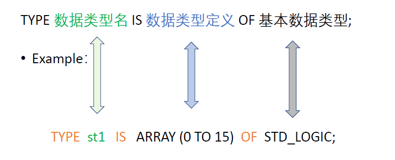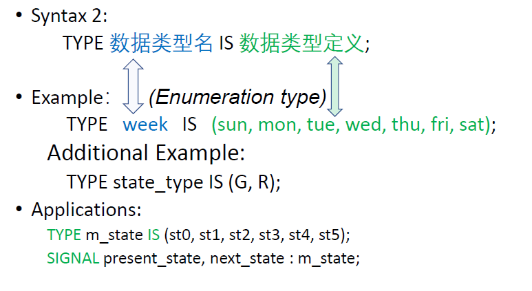

有两种方式定义type


### Natural Binary coding

每一个state由自然整数编码，比如：

FSM四个状态，编码成"00", "01", "10", "11"

好处，非常节省存储空间

坏处：速度较慢，单数转换成负数可能出现不可预测情况


### Gray code

在natural binary coding的基础上，每次只有一位发生变化，这样可以加快速度

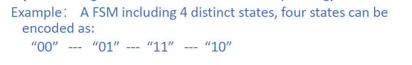

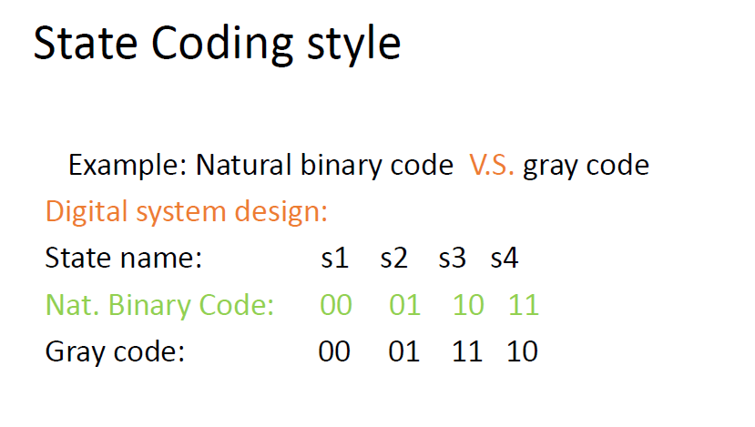


### One-hot code

每一种状态用一个单独的FF表示，其中每个状态只有一个FF是1。

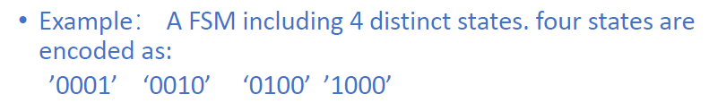

好处：high speed

坏处，需要更多的资源存储($N-log_2N$更多的FF)

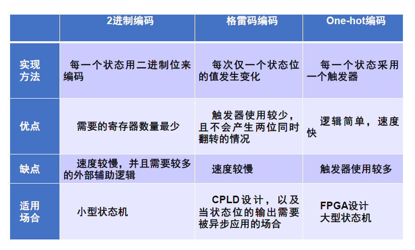

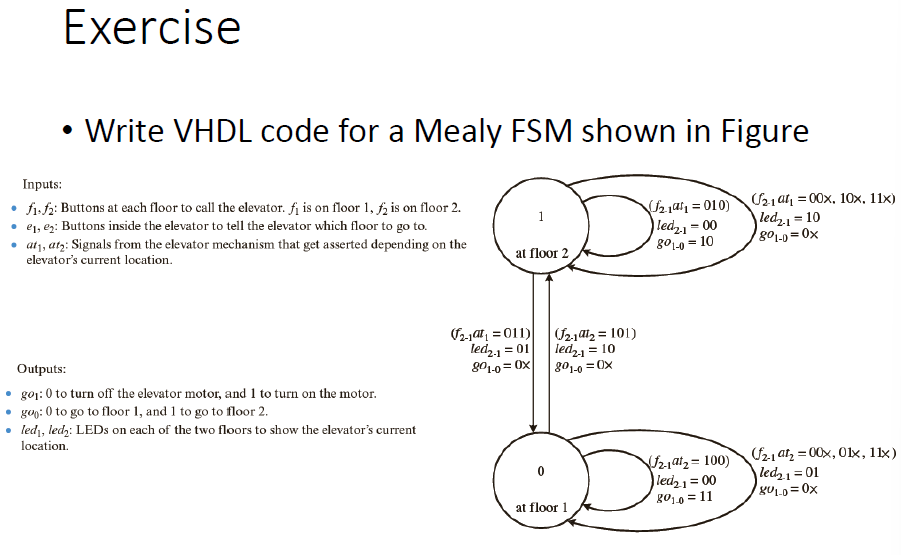