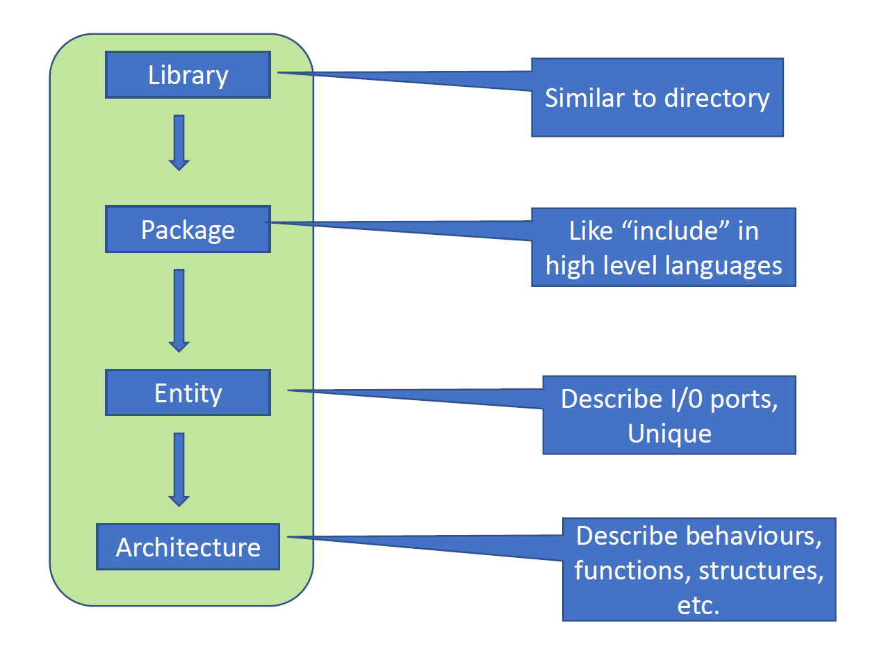

# Brief overview of VHDL

```vhdl
LIBRARY IEEE --Library 库
USE IEEE.std_logic_1164.all; --Package程序包
ENTITY MUX2 IS --定义实体，一般来说是数电中的硬件设备，后续会被用到
    PORT(d0, d1:IN std_logic; --Port 端口
        sel:IN std_logic;
        q:OUT std_logic);
END ENTITY;
```

```vhdl
ARCHITECTURE behav OF MUX2 IS --定义结构体名为behav
BEGIN
    PROCESS (d0,d1,sel) --Process 进程
    BEGIN
        IF sel='0' THEN --IF为Control Statement，是流程控制语句
            q<=d0;
        ELSIF sel='1' THEN
            q<=d1; --Data Object 数据对象
        ELSE q<='Z';
        END IF;
    END PROCESS;
END behav;
```

VHSIC (Very-High-Speed Integrated Circuit ) Hardware Description Language


VHDL对于大小写不敏感，即and和AND效果是一样的，--之后代表注释。


## Structure of VHDL code 



具体来说，Library包含了Package，而Package中又包含像Functions, Procedures, Components, Constants, types等组件


## Library

```vhdl
Library llibrary_name;
USE library_name.package_name.package_parts;

LIBRARY IEEE;
USE IEEE.std_logic_1164.ALL; --std_logictypes & related functions
USE IEEE.std_logic_unsigned.ALL; -- unsigned arithmetic functions
USE IEEE.std_logic_arith.ALL; -- arithmetic functions算数运算函数
USE IEEE.std_logic_signed.ALL; -- signed arithmetic functions

```


## Package

来源于同一个library的不同packages可以创造一样的逻辑函数但是不一样的物理电路


## Entity

**实体（Entity）** 定义了硬件模块的接口，列出了电路的所有**输入和输出端口（管脚）**。

**实体和结构体（架构）是分开的**：实体定义模块的外部接口，而结构体定义模块的内部功能。

**实体是唯一的**：每个实体代表一个特定的模块，并作为该模块的唯一标识。

**每个实体可以有多个架构**：这允许同一个实体有不同的实现方式或行为。

**多种实现方式**：多个架构提供了模块功能的灵活性。

**不同的描述层次**：实体可以用不同的抽象层次来描述，从高层次的行为描述到低层次的结构描述。


```vhdl
ENTITY entity_nameIS;
[generics] --optional
PORT (
	port_name: signal_modesignal_type;
	port_name: signal_modesignal_type;
	…);
END [ENTITY] [entity_name];
```

注意：实体名不可以数字开头；

实体名不可以是关键字（保留词）比如signal或process

不区分大小写

### 泛型（Generic）：

- 泛型用于指定实体的**静态参数**，例如延迟或总线宽度。
- 泛型以保留字 `GENERIC` 开头。
- 定义泛型参数的语法如下：

```vhdl
GENERIC (constant_name: data_type := value);
GENERIC (m: time := 1 ns);
```


### Port

```vhdl
PORT (port_name: signal_modesignal_type;)
PORT (d0:IN std_logic);
```


Port Type:

BIT, STD_LOGIC, INTEGER, etc

通常来说常用的就是std_logic代表数电的高低电平，前者只是信息传递，后者相当于是常数


在 VHDL 中，**端口（Port）** 类型的使用规则如下：

端口类型规则：

- **In 端口**：输入端口，仅用于接收信号。不能对 `in` 端口赋值。
- **Out 端口**：输出端口，仅用于输出信号。不能将 `out` 端口作为赋值的信号源。
- **Inout 端口**：双向端口，可以同时用于输入和输出，适用于需要双向通信的信号。
- **Buffer 端口**：作为输出端口使用，但其值可以重新加载，用于需要反馈的情况。

这些端口类型在设计中帮助定义信号的流向和使用方式。


example: 使用VHDL描述以下器件


```vhdl
ENTITY my_design IS
PORT(d:IN std_logic_vector(15 DOWNTO 0);
    clk,reset,oe:IN std_logic;
    q:OUT std_logic_vector(15 DOWNTO 0);
    ad:INOUT std_logic_vector(15 DOWNTO 0);
    int:BUFFER std_logic;
    as: OUT std_logic);
END my_design;
```

==特别注意，这里的PORT列表，最后一个元素定义完了之后，那个分号要打到右括号的外面==


## Architecture

```vhdl
ARCHITECTURE architecture_nameOF entity_nameIS
--[declarations]
BEGIN
(code) --concurrent statements(并行语句)
END architecture_name;
```

具体来说，结构名可以跟entity一致

声明语句仅在定义架构内有效。这意味着在该特定架构中声明的任何变量、信号或类型都将是局部的，不能在架构外部访问。

架构内的语句默认是并发执行的，意味着它们将同时执行，除非另有指定。

如果需要顺序执行语句（即一个接一个地执行），请使用`PROCESS`构造。这样可以在架构内包含顺序语句。


example:用VHDL描述一个2 input的AND gate

```vhdl
entity And2 is
    port(x,Y:IN BIT;
        z: out BIT);
end entity And2;
    
architecture ex1 of And2 is --ex1为结构名
begin --起始begin
    z<= x and y; --内部逻辑
end architecture ex1; --结束，end后要加结构关键字及结构名
```

Entity: describes the **physical appearance** of a black box (Name, input, output and type of each) ;

Architecture: describes the **function or structure** of the circuit


example:用VHDL描述一个半加法器Half Adder


```vhdl
library IEEE;
USE IEEE.std_logic_1164.all;
ENTITY half_adder is 
    port(X, Y:IN BIT; sum, carry: OUT BIT);
END half_adder;

ARCHITECTURE dataflow OF half_adder is 
begin
    --并行处理语句
    sum<= x xor y after 10ns; --这个after语句可以模拟延迟，但仅仅是在模拟的时候，在代码运行的时候并不会延迟
    carry<= x and y after 10ns;
END ARCHITECTURE dataflow;
```


## Concurrency and delay


跟据上述的图片，可以写出以下的逻辑
$$
F = \overline{A \cdot B + C \cdot D} 
$$
转换成VHDL语句可以有两种形式

```vhdl
F <= not((A and B) or (C and D))
F <= (A and B) nor (C and D)
```

在architecture内的语句顺序其实并不重要，因为其都是同时发生的，当然使用after语句可以模拟延迟，但仅仅是在模拟的时候。

但是实际执行的时候又会有2ns左右的延迟（以A and B举例）


## Architecture description

Behavior description

Data flow description(RTL)

Structure description

example: Full adder behaviour description

```vhdl
library ieee;
use ieee.std_logic_1164.all;
entity adder is
    port(x,y,ci:in bit;
        sum, carry:out bit)
    end adder;

architecture behav of adder IS
    begin
        process(x, y ,ci) --之后的behaviour变量变化按照这个顺序执行，该进程的执行依赖于输入信号x、y 和 ci的变化。进程是VHDL中的顺序执行结构。
        variable n: integer;
		constant sum_vector: bit_vector(0 TO 3):="0101"; --定义了一个常量 sum_vector，类型是位向量，内容为"0101"，用于表示不同输入组合的和。
		constant carry_vector: bit_vector(0 TO 3):="0011";--定义了另一个常量 carry_vector，内容为"0011"，用于表示不同输入组合的进位。
		
		begin
            n:=0;
			if x='1' then n:=n+1; end if;
            if y='1' then n:=n+1; end if;
            if ci='1' then n:=n+1; end if;
            sum<=sum_vector(n); --假设这里n为3的话，sum_vector(3)对应0101中的第三位也就是1（从左往右数），所以sum将被赋值成1
			carry<=carry_vector(n); --同理carry_vector(3)对应0011中的第三位也就是1，这里最左边是第零位，以此类推
		end process;

	end behav;

    
```

**`:=`**：用于变量和常量赋值，立即生效，只在进程、函数或过程内使用。

**`<=`**：用于信号赋值，有时序延迟效果，在进程结束或下一个事件周期才生效。


上述只是一种定义architecture的其中一种方法，上面要求提前知道sum和carry的变化顺序，然后在下面的process中跟据特定的逻辑加法和判断得到顺序编号，最后传入定义好的constant得到最终结果。

简单点的话就直接用逻辑运算就可以得到这个逻辑了

```vhdl
library ieee;
use ieee.std_logic_1164.all;

entity adder is
    port (
        x, y, ci : in  std_logic;
        sum, carry : out std_logic
    );
end adder;

architecture gate_level of adder is
begin
    sum <= x xor y xor ci;
    carry <= (x and y) or (x and ci) or (y and ci);
end gate_level;

```


## Configuration

配置在VHDL中用于指定一个实体（entity）应该使用哪个架构（architecture）。

通常来说，一个实体可以对应多个架构，但是实际设计中需要指定在特定时间要使用哪种架构。也可以让一个实体有多个架构

语法如下：

```vhdl
configuration configuration_name of entity_name is
    for architecture_name --for 架构名
        end for;
    end configuration_name;
```


example: 对于一个example实体，实现三个不同的架构


```vhdl
-- 引入IEEE标准库
LIBRARY IEEE;
USE IEEE.std_logic_1164.ALL;

-- 实体声明
ENTITY example IS
    PORT (
        a : IN std_logic;
        b : IN std_logic;
        y : OUT std_logic
    );
END example;

-- OR门架构定义
ARCHITECTURE or2_arc OF example IS
BEGIN
    PROCESS (a, b)
    BEGIN
        y <= a OR b;
    END PROCESS;
END or2_arc;

-- AND门架构定义
ARCHITECTURE and2_arc OF example IS
BEGIN
    PROCESS (a, b)
    BEGIN
        y <= a AND b;
    END PROCESS;
END and2_arc;

-- XOR门架构定义
ARCHITECTURE xor2_arc OF example IS
BEGIN
    PROCESS (a, b)
    BEGIN
        y <= a XOR b;
    END PROCESS;
END xor2_arc;

-- AND门配置定义
CONFIGURATION and2_cfg OF example IS
    FOR and2_arc
    END FOR;
END and2_cfg;

-- OR门配置定义
CONFIGURATION or2_cfg OF example IS
    FOR or2_arc
    END FOR;
END or2_cfg;

-- XOR门配置定义
CONFIGURATION xor2_cfg OF example IS
    FOR xor2_arc
    END FOR;
END xor2_cfg;

```


# Data Types

VHDL是一种强类型（strongly-typed）语言，意味着每个数据元素都必须具有明确的类型。

**强类型语言**：所有数据元素必须有一个关联的类型（associated type）。

**类型转换**：不同类型之间的转换只能通过显式的转换函数（explicit conversion functions）实现。

**子类型（subtype）**：可以通过定义子类型来约束类型的使用范围。

### VHDL的五种主要数据类型

1. 标量类型（Scalar Types）：
   - 包括整数（integers）、实数（reals）、物理量（physical types）和枚举类型（enumerated types）。
   - 最常使用，用于表示不同类型的数字，信号和物理量
2. 访问类型（Access Types）：
   - 类似于软件编程中的指针，用于访问特定的存储位置。
3. 文件类型（File Types）：
   - 通常用于磁盘文件，包含一系列的值，可以在VHDL设计中进行文件操作。
4. 复合类型（Composite Types）：
   - 包括数组（arrays）和记录（records），可以存储多个元素。
5. 保护类型（Protected Types）：
   - 用于实现共享变量（shared variables），支持在多进程之间共享数据。

上述这些数据类型都会在代码开头自动生成，不需要手动添加，为library std中的std.standard.all


### VHDL预定义的数据类型

| 数据类型               | 描述                                              | 使用说明                                                     |
| ---------------------- | ------------------------------------------------- | ------------------------------------------------------------ |
| **Integer**            | 4字节长度，范围为 -2,147,483,647 到 2,147,483,647 | 用于表示总线宽度等。**不支持位操作或逻辑操作**，需要指定范围（例如：`range 10 downto 1`）。 |
| **Real**               | 浮点数，范围为 -1.0E+38 到 1.0E+38                | 用于电压表示和算法。                                         |
| **Natural / Positive** | 整数的子集                                        | 需要指定范围。                                               |
| **Bit**                | 逻辑值 '0' 或 '1'                                 | 信号值，使用单引号表示，例如 `'1'`。                         |
| **Bit_vector**         | 比特向量                                          | 用于表示多个位的值，使用双引号表示，例如 `"1100"`。          |
| **Character**          | ASCII码                                           | 区分大小写（例如，`'Z'` 和 `'z'` 是不同的字符）。            |
| **String**             | 字符数组                                          | 用于仿真提醒等。                                             |

### 总结

- **Integer** 和 **Real** 类型适用于数值计算，但**需要指定范围**。
- **Bit** 和 **Bit_vector** 类型适合逻辑操作，常用于数字设计。
- **Character** 类型区分大小写，用于表示单个ASCII字符。
- **String** 类型表示字符数组，用于文本信息传递或仿真提醒。

这些类型使VHDL能够精确描述硬件设计中的各种数值和逻辑信号，有助于实现严谨的逻辑控制和数据表示。


这张图片展示了VHDL中的一些预定义数据类型，具体包括布尔类型、时间类型和严重性等级。以下是详细解释：

### VHDL预定义的数据类型

| 数据类型           | 描述                                       | 使用说明                       |
| ------------------ | ------------------------------------------ | ------------------------------ |
| **Boolean**        | 逻辑“true”或“false”                        | 用于信号状态、总线控制和仲裁   |
| **Time**           | 时间单位：fs, ps, ns, us, ms, sec, min, hr | 用于表示信号延迟，在仿真中使用 |
| **Severity level** | 包括 `NOTE`, `WARNING`, `ERROR`, `FAILURE` | 用于程序状态提醒或仿真警告信息 |

### 代码示例
以下代码展示了如何在VHDL中定义和使用这些类型：

```vhdl
-- Integer类型定义
type integer is range -2147483647 to 2147483647;

-- Real类型定义
type real is range -1.0E38 to 1.0E38;

-- Time类型定义，包含单位
type time is range -2147483647 to 2147483647
    units
        fs;  -- 飞秒
        ps = 1000 fs;  -- 皮秒
        ns = 1000 ps;  -- 纳秒
        us = 1000 ns;  -- 微秒
        ms = 1000 us;  -- 毫秒
        sec = 1000 ms; -- 秒
        min = 60 sec;  -- 分
        hr = 60 min;   -- 小时
    end units;

-- Boolean类型定义
type boolean is (false, true);

-- Bit类型定义
type bit is ('0', '1');

-- Character类型定义，包含ASCII字符
type character is (
    '0', 'A', 'B', 'C', 'D', 'E', 'F', 'G',
    'H', 'I', 'J', ...
);

-- Severity level类型定义
type severity_level is (note, warning, error, failure);

-- Natural和Positive子类型
subtype natural is integer range 0 to integer'high;
subtype positive is integer range 1 to integer'high;
```

### 说明
- **Boolean**：适用于逻辑控制，可以用于条件判断。
- **Time**：定义了各种时间单位，用于模拟时序和延迟。
- **Severity level**：用于仿真中生成不同级别的消息，帮助调试和状态监控。


### IEEE定义的多值逻辑类型

1. **std_ulogic**
   - **9值逻辑（9-valued logic）**：包含9种逻辑状态，如 `'U'`（未定义）、`'X'`（未知）、`'0'`（逻辑0）、`'1'`（逻辑1）、`'Z'`（高阻态）等。
   - **未解析逻辑系统（unresolved logic system）**：不支持多个驱动信号，如果在同一个信号上有多个驱动，编译会报错。
   - **区分大小写（case sensitive）**：逻辑状态区分大小写。
2. **std_logic**
   - **8值逻辑（8-valued logic）**：包含8种逻辑状态，与 `std_ulogic` 类似，但没有未解析状态，即没有U
   - **解析逻辑系统（resolved logic system）**：支持多个驱动信号，当多个信号驱动到同一个节点时，使用解析函数确定最终的信号值。
   - **区分大小写（case sensitive）**：同样区分大小写。


**注意，9值或者8值逻辑都得是大写，小写没用。**

### std_ulogic和std_logic值的含义

1. **'0'**：逻辑0
2. **'1'**：逻辑1
3. **'X'**：未知状态（Unknown），无法确定值或结果。
4. **'Z'**：高阻态（High Impedance），通常用于三态逻辑。
5. **'W'**：弱信号，不确定应为0还是1。
6. **'L'**：弱信号，倾向于0。
7. **'H'**：弱信号，倾向于1。
8. **'-'**：不关心（Don't care），表示对该信号值没有要求。
9. **'U'**：未初始化（Uninitialized），表示信号尚未被设置。==只有ulogic才有==

### std_ulogic与std_logic的区别

- **std_ulogic**：是一种未解析逻辑类型（unresolved logic system）。它不允许多驱动器的情况，因为编译器无法解析多重驱动的冲突。
- **std_logic**：是std_ulogic的子类型，具备解析功能（resolved logic system），支持多驱动器。std_logic包含额外的决策函数，用于解决信号冲突，因此在大多数实际设计中更为常用。

example:

```vhdl
process(A, B, SEL)
begin
    if SEL = '0' then
        Y <= A;
    elsif SEL = '1' then
        Y <= B;
    else
        Y <= 'X';  -- 未知或不确定状态
    end if;
end process;

```


当两个std_logic信号被连接到同一个节点，则冲突信号会跟据下表进行解析：


但是如果是std_ulogic信号的话，则全部冲突信号都无法被解析，则它们永远不能被连接到一起，所有的信号的都是未知的。ulogic通常来用作debug，不用于实际使用


## 定义数据类型的宽度/区间 Width/Interval

### 区间/宽度定义示例

1. **整数范围定义**：
   ```vhdl
   INTEGER RANGE 100 DOWNTO 1
   ```
   - 定义一个从 100 到 1 的整数范围，其中 `DOWNTO` 表示从高到低的顺序。
   - 常用于定义信号或变量的取值范围，确保数值在指定范围内。

2. **比特向量宽度定义**：
   ```vhdl
   BIT_VECTOR (3 DOWNTO 0)
   ```
   - 定义一个比特向量，从索引 3 到索引 0，总共包含 4 位。
   - `BIT_VECTOR` 类型通常用于表示二进制数据，例如信号总线的宽度。

3. **实数范围定义**：
   ```vhdl
   REAL RANGE 2.0 TO 30.0
   ```
   - 定义一个从 2.0 到 30.0 的实数范围。
   - 适用于表示有浮点数的范围限制。

### 注意事项
- **区分大小写**：VHDL是区分大小写的。例如，高阻态要用大写的 `'Z'` 表示，而不是小写的 `'z'`。
  

- 在定义**比特向量或总线**的索引时通常使用 `DOWNTO`，因为硬件设计中常用高位到低位的顺序。

```vhdl
SIGNAL my_vector : BIT_VECTOR(3 DOWNTO 0);  -- 索引为 3, 2, 1, 0
SIGNAL my_vector1 : BIT_VECTOR(3 DOWNTO 0);  -- 从高位 3 到低位 0
```

TO的话在硬件设计中比较少用，DOWNTO表示高位到低位的顺序，用的比较多


Example:
•SIGNAL a : BIT;

•SIGNAL b : BIT_VECTOR(7 DOWNTO 0);

•SIGNAL c: STD_LOGIC;

•SIGNAL d : STD_LOGIC _VECTOR(7 DOWNTO 0);

•SIGNAL e: INTEGER RANGE 0 TO 255;


Legal or illegal:
•a <= b(5); 合法，因为向量类型相同，这里相当于在b这个向量里面用索引提取

•d(0) <= c; 合法，赋值到向量里

•a <= c; 不合法，类型不匹配

•e <= b; 不合法

•e <= d; 不合法


==std类型相比来说比bit类型（0，1）多了很多实际电路中的状态，二者即使只是0，1赋值也是不可以的==


## User-defined data types

语法：

```vhdl
TYPE 数据类型名 IS 数据类型定义 OF 基本数据类型
--或者
TYPE 数据类型名 IS 数据类型定义
```

其中包括两种具体的类型包括**枚举类型**和**子类型**。

1. **枚举类型（Enumeration Types）**：
   
   - 枚举类型列出了所有可能的元素，常用于状态机等设计中。
   - 例如：
     ```vhdl
     TYPE week IS (sun, mon, tue, wed, thu, fri, sat);
     ```
   - 上述代码定义了一个名为 `week` 的枚举类型，其取值可以是 `sun`、`mon`、`tue` 等，每个元素都代表一周中的一天。
   
2. **子类型（Subtype）**：
   - 子类型是从现有类型派生出的一个子集，用于对类型的取值范围进行约束。
   - 例如：
     ```vhdl
     SUBTYPE natural IS integer RANGE 0 TO integer'high;
     ```
   - 上述代码定义了 `natural` 子类型，它是 `integer` 类型的一个子集，限定其范围为非负整数（从0到整数的最大值）。

### 总结
- **枚举类型**用于定义一组有限的、互不相同的元素，非常适合用来表示有限状态。
- **子类型**用于对现有类型进一步约束，使其符合特定范围或条件，增加代码的安全性和可读性。


```VHDL
TYPE percent IS INTEGER RANGE -100 TO 100
    
    
--可以创建数组类型的
TYPE word8 IS ARRAY(1 TO 8) OF BIT;
```

