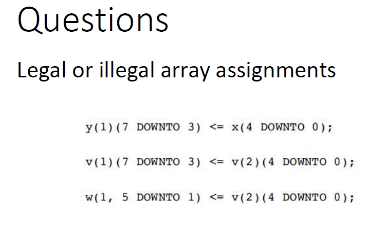

## VHDL data types: Array

首先Array存储的元素应该是同一种数据类型的

在VHDL中，有两种提前定义好的数组类型，分别是：

1. string -an array of characters
2. bit_vector -an array of bits

```vhdl
signal str: string(1 to 5);
signal bts:bit_vector(0 to 4);
```


当然也可以自定义Array，如下图：
```vhdl
type real_vect is array (natural range <> ) of real;
signal temp : real_vect(0 to 4);

--这里的natural为index type，代表索引的类型，之后访问要用什么类型去索引
--这里的real为array type，代表数组内的元素类型
-- <>代表这是一个没有数量限制的数组，即没有索引最大最小限制，里面有多少元素都行

type real_vect2 is array (natural range 0 to 5) of real; --这里限制了数组的索引就是0-5
signal temp : real_vect2 -- 因为上面已经定义过数组的索引范围，则这里就不用再定义了，默认就是0-5的索引
```


### Index Range of an Array

```vhdl
signal A : real_vect(0 to 15); --这是一个上升索引的数组
signal B : real_vect(15 downto 0); -- 这是一个下降索引的数组

--当然这里的索引不像是C或者Python需要从0开始
signal some_reals : real_vect(5 to 20);

-- 如果要从一维数组中提取出单个元素的话，可以直接用括号
R <= some_reals(5); --得到最左边的元素
some_reals(20) <= 1e3; --设置最右边的元素
```


### Array assignments

数组之间可以相互赋值，但是需要满足数据类型一样，元素数量一样

```vhdl
signal A : bit_vector(0 to 7);
signal B : bit_vector(3 to 10);

B <= A; --会报错，因为数量不匹配

B(3 to 5) <= A(5 to 7) --可以实现，这里称其为slice assignment
```

### 报错原因（第三行 `B <= A;`）

信号 `A` 和 `B` 的 **索引范围和长度** 不匹配，VHDL 无法直接进行赋值操作：

- `A` 的索引范围是 `(0 to 7)`，长度为 8 位。
- `B` 的索引范围是 `(3 to 10)`，长度为 8 位。

尽管两者的长度是相等的，但它们的索引范围不同。VHDL 中的 **赋值操作** 会严格检查索引范围，因此直接赋值会报错。

### 为什么 `B(3 to 5) <= A(5 to 7)` 可以实现？

在这种情况下，你明确地指定了目标信号 `B` 和源信号 `A` 的部分范围（称为 **切片赋值**，Slice Assignment）：

- `B(3 to 5)` 表示信号 `B` 的第 3 位到第 5 位（3 位宽）。
- `A(5 to 7)` 表示信号 `A` 的第 5 位到第 7 位（也是 3 位宽）。

### Array Literals(数组赋值)

有以下几种方式给数组赋值：

1. 逐个赋值：

```Vhdl
signal a : bit_vector(3 downto 0);
a(3) <= '1';
a(2) <= '0';
a(1) <= '0';
a(0) <= '0';
```

2. 使用聚合表达式赋值

```vhdl
signal a : bit_vector(3 downto 0);
a <= (3=>'1', 2=>'0', 1=>'0', 0=>'0'); --按照索引赋值，注意前者为索引，后者是要赋的值，=>顺序不要反
a <= (3=>'1', 2|1|0 => '0'); --使用索引范围赋值，“|”代表多个索引，这样索引2，1，0都会被赋值成0
a <= (3=>'1', 2 downto 0 => '0'); --使用 downto 范围赋值
a <= (3=>'1', others=>'0'); -- others 表示除已指定的索引（即索引 3）外，其他所有索引都赋值为 '0'
```

### 聚合赋值的潜在混淆

- 当你对数组进行聚合赋值时，仿真器会从聚合表达式中创建一个**临时数组对象**。
- 在聚合赋值中，源数组和目标数组的索引实际上不会一一对应，而是按照位置顺序赋值。这意味着，即使索引不匹配，赋值仍然可以进行，但可能会导致理解上的混乱。

```vhdl
signal a : bit_vector(3 downto 0);
a <= (10=>'1', 9=>'0', 8=>'0', 7=>'0');
```

虽然 `a` 的索引范围是 `3 downto 0`，而聚合赋值中使用的索引是 `10` 到 `7`，赋值仍然有效。

**原因**：仿真器会忽略这些索引，并按照位置顺序将 `'1'` 和 `'0'` 赋值到 `a` 中。索引只是在聚合表达式中定义时的标签，实际赋值时不考虑这些标签。

由于索引混淆，**不推荐**在没有必要的情况下使用带有明确索引的聚合表达式。相对安全且无歧义的写法是使用 `others`，例如：

```vhdl
a <= (others => '0');
```


其实还有个更简单的赋值方法：

```vhdl
signal a : bit_vector(3 downto 0);
a <= ('1','0','0','0'); --1000分别对应位置3210
```

还有更简单的，因为是字符串字面量

```vhdl
a <="1000";
```

这将整个数组 `a` 赋值为二进制字符串 `"1000"`，这种方式简单直观，适合赋值较长的二进制序列。

**字符数组**实际上包括 `bit_vector` 和 `std_logic_vector`。这意味着可以直接用字符串字面量对它们赋值。

**原因**：`bit` 和 `std_logic` 被定义为**枚举**类型，这样可以方便地使用字符串进行赋值，使得处理二进制字（如 `"0011101...00110"`）变得简单易行。

以后直接用最后一种方式赋值就行，到那时要注意原索引是downto还是to的，上升和下降是反过来的，通常来说downto定义的数组较多，因为左边的一般是高位


example:判断array assignments是否合法

```VHDL
TYPE row ARRAY (7 DOWNTO 0) OF STD_LOGIC; --1D array
TYPE array1 IS ARRAY(0 TO 3) OF row; --这里array1包含了多个row，0 TO 3，则这里有四个row --1Dx1D array
TYPE array2 IS ARRAY(0 TO 3) OF STD_LOGIC_VECTOR(7 DOWNTO 0); --这里的array2包含了多个LOGIC_VECTOR，也就是4个 --1Dx1D array
TYPE array3 IS ARRAY(0 TO 3, 7 DOWNTO 0) OF STD_LOGIC; --前面的对应第一层索引，也就是(a, b)中的a，后面对应b --2D array
SIGNAL x: row;
SIGNAL y: array1;
SIGNAL v: array2;
SIGNAL w: array3;

--请判断以下语句是否合理
x(0) <= y(1)(2);--将array1的第一位置row的第二位置也就是row中索引为6（因为倒序）的元素取出
x(1) <= v(2)(3); --同理
x(2) <= w(2,1); --取出0 TO 3 中的索引2的列，以及这个列的第一索引元素

x <= y(0); --y的第一个row的所有成分被赋予到x，x也是row
x <= v(1); --非法操作 row和std_logic_vector不一样，是两个不同的成分
x <= w(2); --非法操作，w必须用(a,b)提取元素
x <= w(2, 2 DOWNTO 0); --非法操作，row和std_logic类型不一样
v(0) <= w(2, 2 DOWNTO 0) --非法操作，前者为std_logic，后者是std_logic_vector
v(0) <= w(2); --非法
y(1) <= v(3) --ROW和std_logic_vector类型不同
```

**1Dx1D Array**：通过一维数组嵌套形成的结构，每个元素都是一个独立的一维数组。访问时需要双层括号。

**2D Array**：直接定义的二维数组，所有元素在同一结构中，使用行和列的索引访问，结构更紧凑，访问更简洁。

==注意1Dx1D和2D的区别前者是一维数组的相互嵌套，后者在定义的时候就直接是二维的数组，二者在索引访问上也有区别，前者用(a)(b)；后者用(a,b)==

赋值的时候，首先观察等号左右边的变量：

**x就是row类型变量，x(1)就是STD_LOGIC类型变量，y就是array1类型变量，y(1)就是row类型变量，y(1)(1)就是STD_LOGIC类型变量，v(1)就是STD_LOGIC_VECTOR类型变量，w就是array3类型变量，w(1,1)就是STD_LOGIC类型变量。**


example

假设需要设计一个delay line


```vhdl
type delayline is array (natural range <>) of std_logic_vector(7 downto 0);

signal my_delayline : delayline (0 TO 6);
```


## VHDL data types: Records

不同于arrays，records可以装填不同类型的数据。跟C与C++中的结构体很像。

```vhdl
type device_input is record
    CLK: std_logic;
	CE: std_logic;
	DIN: std_logic_vector(7 downto 0);
end record;

--之后，里面的元素就可以用.来获取，跟C/C++一样

signal a : device_input;
a.CLK <= '0';
a.DIN <= "01001001";

```


## VHDL data types: Signed and Unsigned

SIGNAL x: SIGNED (7 DOWNTO 0);
SIGNAL y: UNSIGNED (0 TO 7);

‘’0101’’ for decimal 5, ‘’1101’’ signifies 13, in UNSIGNED

‘’0101’’ represent decimal 5, ‘’1101’’ means -3, in SIGNED;

For arithmetic operations, logical operations are not allowed.
Accept relational (comparison) operations.


resize()对于两种不同的类型会有不同的处理方法：


对于unsigned类型，直接拿0来填充高位，而对于signed类型，会选择拿最高位的来填充高位，参考signed类型取反加一得相反值。


unsigned可以有逻辑运算符，但是signed不可以用。


## VHDL data type conversion

```vhdl
r = real(1234);
i = integer(76.4);
s = to_string(123); --将123转换为character string格式
```

这里格式转换的方式和python比较相似，integer会将括号里的数字四舍五入到最近的整数。


## VHDL Operators

**操作符种类**：VHDL中有**算术操作符**、**逻辑操作符**、**关系操作符**和**其他类型的操作符**。

**优先级**：操作符的计算顺序是由优先级决定的，图中提醒我们需要注意操作符的优先级（优先级在括号中用汉字“优先级”标注）。

**最高优先级操作符**：在VHDL中，`NOT` 操作符的优先级最高，也就是说它会最先被计算。

**相同优先级的操作符**：`AND`、`OR`、`NAND`、`NOR`、`XOR`、`XNOR` 操作符拥有相同的优先级。当这些操作符出现在同一表达式中时，它们会按照书写的顺序进行计算。


### 赋值操作符种类

1. `<=`：用于将一个值赋给**信号 (SIGNAL)**。
2. `:=`：用于将一个值赋给**变量 (VARIABLE)**、**常量 (CONSTANT)** 或 **通用变量 (GENERIC)**，也用于设定初始值。
3. `=>`：用于赋值给向量的单个元素，或者使用 `OTHERS` 关键字进行批量赋值。


以下赋值操作是合法的：

- `x <= '1';`：使用 `<=` 将值 `'1'` 赋给信号 `x`。
- `y := "0000";`：使用 `:=` 将字符串 `"0000"` 赋给变量 `y`。
- `w <= "10000000";`：将字符串 `"10000000"` 赋给信号 `w`，其中最高有效位 (MSB) 是 `'1'`，其他位是 `'0'`。
- `w <= (0 => '1', OTHERS => '0');`：使用 `=>` 操作符为向量 `w` 的特定位置赋值，`w(0)` 为 `'1'`，其他位均为 `'0'`。

`=>`只在向量赋值中出现，其他地方不出现


### Logic Operators


```vhdl
y <= NOT a AND b; -- (a'.b)
y <= NOT (a AND b); --(a.b)'
y <= a NAND b; --(a.b)'
```


### 算术操作符 (Arithmetic Operators)
- `+`：加法
- `-`：减法
- `*`：乘法
- `/`：除法
- `**`：指数运算
- `MOD`：取模，返回余数
- `REM`：取余数
- `ABS`：绝对值

### 比较操作符 (Comparison Operators)
- `=`：等于
- `/=`：不等于
- `<`：小于
- `>`：大于
- `<=`：小于或等于
- `>=`：大于或等于

### 串联操作符 (Concatenation Operators)
- `&`：用于将两个信号或值连接在一起。
- `( , , )`：用于连接多个值或信号。

### 示例
- `Z <= x & "1000000";`：如果 `x <= '1'`，则 `Z` 赋值为 `"11000000"`，即将 `x` 和 `"1000000"` 连接在一起。
- `Z <= ('1', '1', '0', '0', '0', '0', '0', '0');`：`Z` 赋值为 `"11000000"`，通过多个字符连接形成一个整体字符串。

这张图展示了 VHDL 中各种常用的算术、比较和串联操作符的用法，并提供了串联操作符的示例。


**VHDL 解析器会根据上下文来判断 `<=` 的用途：**

- 当 `<=` 出现在**信号赋值**的上下文中（例如 `x <= '1';`），它会被解释为赋值操作符。
- 当 `<=` 出现在**条件判断**或**比较表达式**中（例如 `if (a <= b) then`），它会被解释为比较操作符。


## operator overloading

**定义自定义操作符**：可以使用与预定义操作符相同的名称，定义自己的操作。这样，当不同的数据类型需要特定的操作时，VHDL 会选择合适的操作符版本。

**示例**：这里定义了一个 `+` 操作符，用于将一个整数和一个 1 位的二进制数（`BIT` 类型）相加。

```vhdl
-- 定义一个重载的 "+" 操作符，用于将整数和一个位类型相加
FUNCTION "+" (a: INTEGER; b: BIT) RETURN INTEGER IS --直接以函数的形式来定义就行，把+看成函数名
BEGIN
    IF (b = '1') THEN
        RETURN a + 1;
    ELSE
        RETURN a;
    END IF;
END "+";

```


# VHDL data objects

•Constant: defined to represent a fixed value;
•Variable: representing the varying value in process or sub-program;
•Signal: analogous to wire or node


### Constant

```vhdl
CONSTANT VCC:real:=5.0; --指定电源电压
CONSTANT delay:time:=10ns; -- 某信号的延迟
CONSTANT fbus:bit_vector:="0101"; --总线上的数据总量
```

当作全局变量，描述静态数据


### Variable

- **定义位置**：变量只能在 **进程 (process)** 或 **子程序 (sub-program)**（如函数 `function` 或过程 `procedure`）中定义。
- **作用**：变量用于保存中间数据或用于计算。它在特定的过程或子程序内部使用，适合存储局部的中间值。
- **局部性**：变量是**局部的**，这意味着它的值只在定义它的进程或子程序中有效，在其他地方无法访问。


```vhdl
VARIABLE 变量名 : 数据类型 := 初始值;
VARIABLE temp : INTEGER := 0; --其中:=为初始化变量赋值，可以选择性添加
```

- 与信号 (signal) 不同，**变量赋值是立即生效的**，不会等待一个时钟周期或事件。

### 变量赋值的语法

- 变量的赋值与信号不同，使用 `:=` 而不是 `<=`。

- 赋值示例：

  ```vhdl
  current_bit := current_bit +1;
  ```

### 变量的特性

- **可多次赋值**：变量可以在程序执行过程中多次赋新值，使用赋值操作符 `:=`。
- **初始化可选**：变量的初始化是可选的，可以选择是否在声明时赋初始值。
- **立即生效**：变量的赋值是立即生效的（不同于信号赋值的延迟生效）。
- **没有对应的硬件实现**：变量在硬件中没有直接对应的物理实现，它仅仅作为一个存储中间计算结果的工具。
- **只在顺序区域有效**：变量只能在**顺序区域**内使用，例如在**进程 (process)**、**子程序 (sub-program)** 中（不能在架构体（architecture body）中直接使用）。


**常量 (constant)** 与变量的主要区别如下：

- **只能赋值一次**：常量在声明时必须赋值，并且这个值在整个程序执行过程中保持不变。

==常量只能赋值一次==


### Signal

```vhdl
signal carry_out: std_logic := '0';
```

- `carry_out` 是一个 `std_logic` 类型的信号，初始值为 `'0'`。
- **可选初始化**：这里的初始化是可选的，且在综合过程中会被**忽略**。

- 信号用于**连接并行元素**，类似于电子电路中的连线。
- 在 VHDL 中，信号用于描述硬件中不同部分之间的数据传输或逻辑连接。


```vhdl
carry_out <= '1' after 10ns;
```


 VHDL 中**信号 (signal)** 和**变量 (variable)** 的不同之处：

| 属性         | **信号 (SIGNAL)**                                            | **变量 (VARIABLE)**                                          |
| ------------ | ------------------------------------------------------------ | ------------------------------------------------------------ |
| **赋值符**   | `<=`                                                         | `:=`                                                         |
| **用途**     | 表示电路的连接（类似于电路中的导线）                         | 表示局部信息，用于存储中间计算结果                           |
| **作用域**   | 可以是全局的（整个代码都可见）                               | 局部的，只在对应的 **进程 (PROCESS)**、**函数 (FUNCTION)** 或 **过程 (PROCEDURE)** 中可见 |
| **行为**     | 在顺序代码中不会立即更新（新值通常只在进程、函数或过程结束时可用） | 立即更新（新值可在下一行代码中使用）                         |
| **使用场景** | 可以在 **包 (PACKAGE)**、**实体 (ENTITY)** 或 **结构 (ARCHITECTURE)** 中使用。在 **实体 (ENTITY)** 中，所有端口默认都是信号 | 只能在顺序代码中使用，即只能在 **进程 (PROCESS)**、**函数 (FUNCTION)** 或 **过程 (PROCEDURE)** 中使用 |

### 总结

- **信号 (Signal)** 适合用于描述电路连接和状态，它可以在全局范围内访问，且在顺序逻辑中赋值延迟生效。
- **变量 (Variable)** 适合用于局部范围的计算或中间结果存储，赋值立即生效，但只能在局部范围（进程、函数或过程）内使用。


### 总结内容

1. **Variable (变量)**：
   - **定义位置**：出现在进程 (process) 或子程序 (sub-program)（如函数或过程）中。
   - **用途**：用于保存计算过程中的**临时数据**。
   - **硬件实现**：没有对应的硬件，仅用于仿真和中间计算。
   - **范围**：局部（local），仅在定义它的进程或子程序中有效。
   - **赋值特性**：赋值立即生效，使用 `:=` 符号。

2. **Constant (常量)**：
   - **用途**：用于保存**静态信息**，即不会改变的固定值。
   - **赋值符**：使用 `:=` 符号赋值。
   - **特性**：常量的值在定义时确定，在整个程序中保持不变。

3. **Signal (信号)**：
   - **硬件对应**：在硬件上有对应的物理连接，表示电路的连线，产生波形。
   - **赋值延迟**：赋值生效通常有**时间延迟**，因此在仿真时可以观察到时序特性。
   - **范围**：可以是全局的（global），在整个模块或子程序之间传递信息。
   - **赋值符**：使用 `<=` 符号。

### 总结对比
- **变量**用于局部且即时的计算，没有硬件对应；**常量**用于存储固定值；**信号**用于表示模块之间的连接，有硬件映射，且赋值有延迟。


### 组合逻辑 (Combinational Logic)

- 特点：
  - 输出仅依赖于当前的输入，不依赖之前的状态。
  - 不需要存储器元素（即不需要记忆）。
- **实现**：使用**并行代码 (Concurrent Code)**，通常用于描述电路中不涉及状态保持的部分。
- **示例**：加法器、解码器等纯逻辑电路。
- **图解**：左图展示了组合逻辑的基本结构，输入直接通过组合逻辑产生输出。

### 时序逻辑 (Sequential Logic)

- 特点：
  - 输出不仅依赖当前的输入，还依赖于之前的状态（即过去的输出或状态）。
  - 需要存储器元素（如触发器或寄存器）来保持状态。
- **实现**：使用**顺序代码 (Sequential Code)**，通常用于描述具有状态存储功能的电路。
- **示例**：寄存器、计数器和状态机等需要记忆的电路。
- **图解**：右图展示了时序逻辑的结构，包含组合逻辑和存储单元。当前状态和输入共同决定输出，同时存储单元会保存下一状态。

### 总结

- **组合逻辑**适用于没有状态的电路，使用并行代码描述。
- **时序逻辑**用于需要记忆功能的电路，使用顺序代码描述，依赖存储单元来保持状态。


### 并行语句 (Concurrent Statements)

- **出现位置**：并行语句出现在架构体 (architecture) 的并行区域中。
- **执行方式**：并行语句是**同时执行**的。
- **语句顺序**：多个并行语句的顺序**无关紧要**，因为它们在逻辑上是并行的。

### 顺序语句 (Sequential Statements)

- **出现位置**：顺序语句出现在**进程 (process)**、**函数 (function)** 和**过程 (procedure)** 的代码体中。
- **执行方式**：顺序语句是**按顺序执行**的。
- **语句顺序**：多个顺序语句的顺序**至关重要**，因为它们依赖于前一条语句的执行结果。

### 总结

- **并行语句**用于描述并行执行的逻辑，与顺序无关，适合组合逻辑。
- **顺序语句**用于描述按顺序执行的操作，顺序很重要，适合时序逻辑。


顺序语句和并行语句的区别就在于是先后执行还是同时执行，如果是同时执行的话，则用的都是变量的初始条件，并不会因为变量在中间发生变化而影响后面的计算。


### 并行语句类型

1. **Concurrent Signal Assignments (并行信号赋值)**：
   - 基本的信号赋值语句，适用于描述组合逻辑。
2. **Conditional Signal Assignments (条件信号赋值)**：
   - 使用 `when else` 语句，根据条件进行信号赋值。

```vhdl
output <= '1' when condition else '0';
```

3. **Selective Signal Assignments (选择信号赋值)**：

- 使用 `with select` 语句，根据选择条件赋值给信号。

```vhdl
with sel select
    output <= '1' when "01",
              '0' when others;
```

**Component Instantiations (组件实例化)**：

- 实例化模块或组件，用于在设计中调用其他设计单元。

**Procedure Calls (过程调用)**：

- 调用在并行区域中定义的过程，以执行一组并行操作。

**Generate Statements (生成语句)**：

- 使用生成语句根据条件或循环产生多个实例。
- 常用于模块化设计，生成重复的结构。

**Processes (进程)**：

- 定义在并行区域中，但可以包含顺序语句，用于描述复杂的组合逻辑或时序逻辑。




在 VHDL 中，数组赋值的合法性取决于**数组切片的位宽是否匹配**。具体来说：

- 赋值的左右两边位宽必须一致。
- 数组的索引范围必须匹配，且符合声明的规则。


### 示例分析

1. **`y(1)(7 DOWNTO 3) <= x(4 DOWNTO 0);`**
   - 左边：`y(1)(7 DOWNTO 3)` 表示 `y` 数组中第 1 个元素的第 7 到第 3 位，共 5 位。
   - 右边：`x(4 DOWNTO 0)` 表示 `x` 数组的第 4 到第 0 位，共 5 位。
   - **结论**：合法（legal），因为左右两边的位宽都为 5 位。
2. **`v(1)(7 DOWNTO 3) <= v(2)(4 DOWNTO 0);`**
   - 左边：`v(1)(7 DOWNTO 3)` 表示 `v` 数组中第 1 个元素的第 7 到第 3 位，共 5 位。
   - 右边：`v(2)(4 DOWNTO 0)` 表示 `v` 数组中第 2 个元素的第 4 到第 0 位，共 5 位。
   - **结论**：合法（legal），因为左右两边的位宽都为 5 位，且 `v` 数组的元素可以相互赋值。
3. **`w(1, 5 DOWNTO 1) <= v(2)(4 DOWNTO 0);`**
   - 左边：`w(1, 5 DOWNTO 1)` 的语法有些特殊，`w` 是一个二维数组，`w(1, 5 DOWNTO 1)` 是否有效取决于 `w` 的声明方式。
   - 如果 `w(1, 5 DOWNTO 1)` 表示 `w` 数组第一个元素的 5 到 1 位，那么它是 5 位。
   - 右边：`v(2)(4 DOWNTO 0)` 是 5 位。
   - **结论**：需要知道 `w` 的具体声明方式，但**如果 `w` 是有效的切片，且位宽为 5 位**，则该赋值是合法的；否则，如果 `w` 的切片不支持该格式或位宽不匹配，则非法（illegal）。


