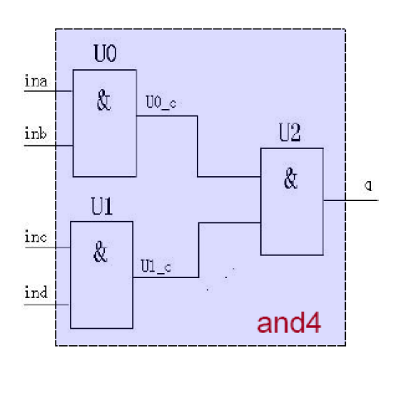
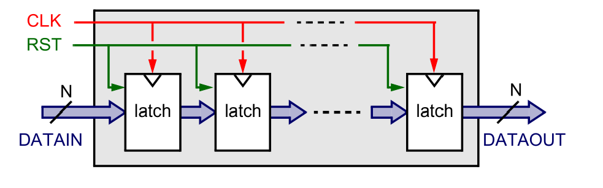
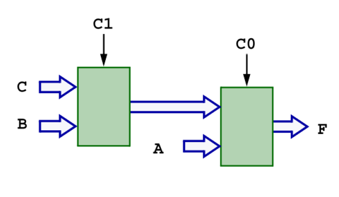
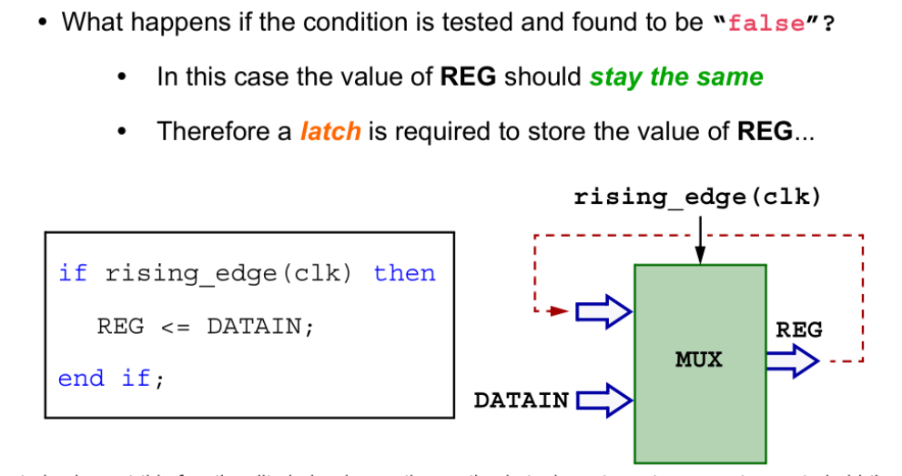
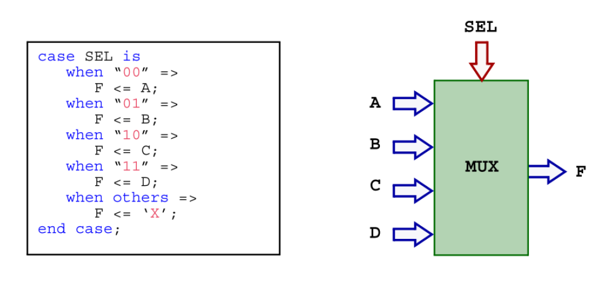
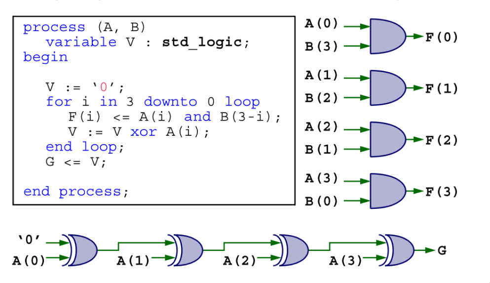
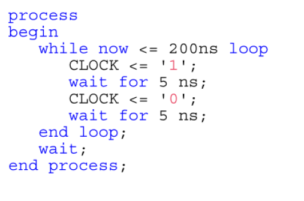
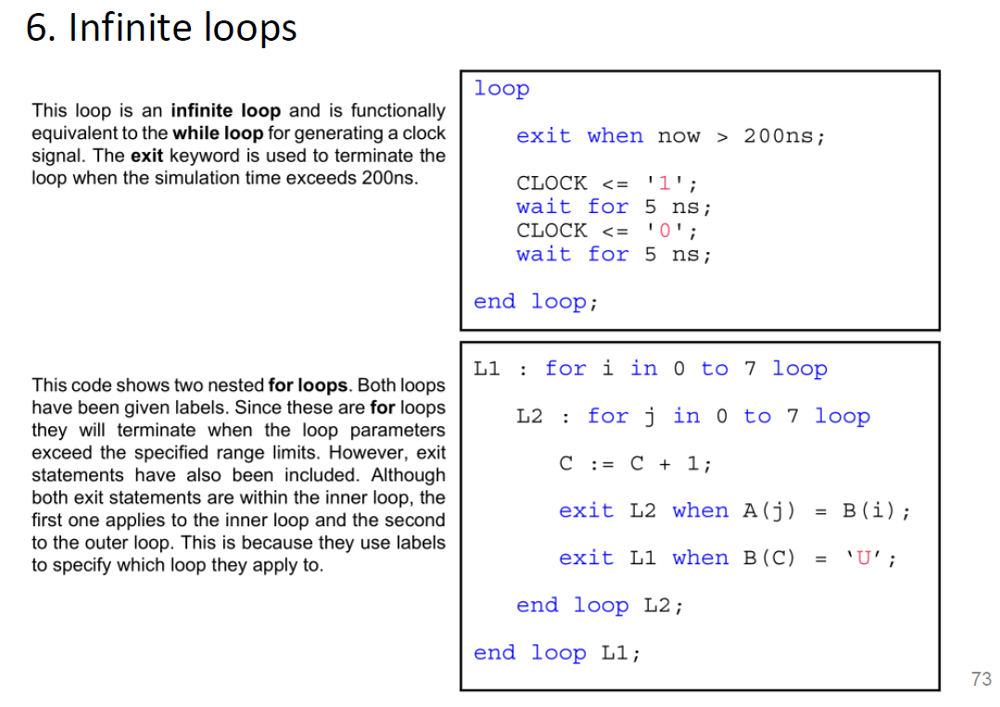
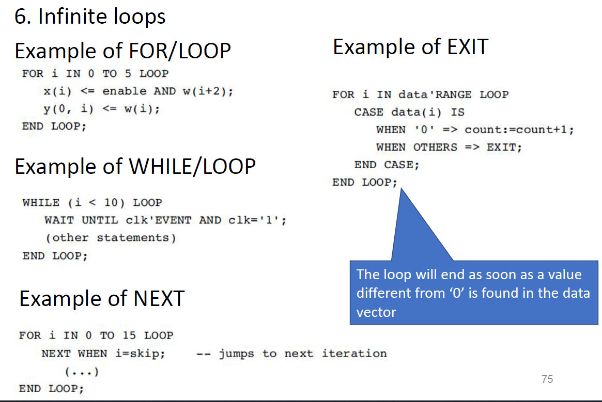
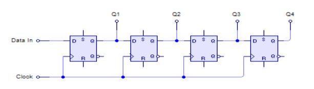

## Concurrent Statement

### 赋值语句 (Assignment Statement)

格式：

```vhdl
赋值目标 <= 赋值源;
q <= "0010000";
```


### 并行条件信号赋值语句 (Conditional Signal Assignment)

```vhdl
Y <= A when Sel = "00" else
     B when Sel = "01" else
     C when Sel = "10" else
     D;
```

条件是按**优先级顺序**排列的，最先符合条件的表达式将被执行。

图中每个条件的优先级从上到下递减，第一条条件 `when Sel = "00"` 优先级最高，最后的 `else` 部分优先级最低。

**注意事项**：

- 每个 `else` 后面不需要标点符号，只有在语句结束时需要用分号 `;` 结束整个条件赋值语句。


```vhdl
with Sel select
    Y <= A when "00", --跟据sel的条件取值
         B when "01",
         C when "10",
         D when others;

```

选择信号赋值语句允许通过 `with... select` 语句，根据一个对象的取值为信号赋值。

与 `when... else` 不同，这种赋值**没有优先级，所有条件是平等的**。

**注意事项**：

- 每个 `when` 条件后面用逗号 `,` 分隔。
- 最后一个 `when others` 之后使用分号 `;` 结束整个语句。


### Component Declaration

组件声明定义了组件的接口，包括**泛型 (generic)** 和**端口 (port)**。

组件的基本结构如下：

```vhdl
COMPONENT 组件名 IS
    GENERIC (泛型表);
    PORT (端口名表);
END COMPONENT;
```

**泛型 (Generic)**：定义组件的参数（类似于可配置的属性），是可选的。

**端口 (Port)**：定义组件的输入输出接口，类似于电路模块的输入和输出连接。


### **组件实例化 (Instantiation)**：

- 实例化组件是将声明的组件具体化，用于实际的电路连接。

```vhdl
实例化名: 组件名
    GENERIC MAP (泛型值);
    PORT MAP ([端口名 =>] 连接端口名, ...);
```

**实例化名**：给这个实例起的名字，便于引用和管理。

**GENERIC MAP**：给泛型参数赋值，用于配置组件的特性。

**PORT MAP**：将组件的端口与实际的信号或端口相连。


**注意事项**：

- 在使用组件之前，组件**必须先声明**。
- 每个 `PORT MAP` 的映射关系需要明确，将组件的端口和外部信号一一对应。


example:

```vhdl
COMPONENT half_adder --定义组件
    PORT (x, y : in bit; sum, carry : out bit);
END COMPONENT;
    
architecture structure of adder is --定义结构
    signal temp_sum, temp_carry1, temp_carry2 : bit;


U0: half_adder --实例化组件
    port map (x => x, y => y, sum => temp_sum, carry => temp_carry1); --低位半加法器

    
U1: half_adder --实例化组件
    port map (x => temp_sum, y => ci, sum => sum, carry => temp_carry2); --高位半加法器

    
    
carry <= temp_carry1 or temp_carry2; --合并两个半加法器的计算结果
end structure;

```


#### Port Map

 VHDL 中**组件实例化 (Component Instantiation)** 中的 `PORT MAP` 的两种映射方式：**位置映射 (Positional Mapping)** 和 **命名映射 (Nominal Mapping)**


```vhdl
COMPONENT inverter IS
    PORT (a: IN STD_LOGIC; b: OUT STD_LOGIC);
END COMPONENT;

--positional mapping位置映射
U1: inverter PORT MAP (x, y);

--nominal mapping命名映射
U1: inverter PORT MAP (a => x, b => y);

```

二者各有各的优点，严谨一点建议命名映射，不容易出问题


#### Generic Map

`GENERIC MAP` 用于传递静态信息，例如**延迟时间**、**总线宽度**等，在组件实例化时设定。

这些参数可以在不同的实例中使用不同的值，从而增强模块的灵活性和可重用性。

```vhdl
GENERIC (m : time := 1ns); --定义格式para_name: para_type := data
label: component_name GENERIC MAP (param_list) PORT MAP (port_list);

    
U1: adder
    GENERIC MAP (delay => 2ns, bus_width => 8)
    PORT MAP (a => x, b => y, sum => s);

```


example: 4 input AND gate



```vhdl
LIBRARY IEEE;
USE IEEE.std_logic_1164.ALL;
ENTITY and4 IS
    PORT (ina, inb, inc, ind: IN bit;
         q:OUT bit);
END and4;

ARCHITECTURE stru OF and4 IS
    COMPONENT and2 IS --定义已经设计好的组件，在std_logic_1164中已经存在
    PORT (a,b:IN bit; c:OUT bit);
    END COMPONENT;
    
    SIGNAL U0_C, U1_C:bit;
BEGIN
    U0:and2 PORT MAP(ina,inb,U0_C);
    U1:and2 PORT MAP(inc,ind,U1_C);
    U2:and2 PORT MAP(U0_C,U1_C,q);
END stru;
```


### Generate Statement

**生成语句 (Generate Statement)**，用于构建大规模且具有高度重复结构的设计。

`Generate` 语句适用于描述具有高度规律性和重复性的结构，例如多个相同模块的实例化（如多位加法器、并行移位器等）。

在结构化描述中，`Generate` 语句可以看作并行代码中的循环，与顺序代码中的 `for` 循环类似，但适用于并行描述。

`Generate` 语句需要使用标签进行标识，以便在代码中区分不同的实例。


```vhdl
gen_label: for i in 0 to 3 generate
    U: my_component PORT MAP (a => a(i), b => b(i), c => c(i));
end generate gen_label;
```


**语法**：

- **For... Generate**：使用 FOR 循环语句生成并行语句。
  - 其中 `ELSE` 语句是不允许的。
- **If... Generate**：使用 `IF` 条件语句生成并行语句。


### For... Generate 示例

```vhdl
GEN_FOR: FOR i IN 0 TO 3 GENERATE
    AND_Gate: AND2 PORT MAP (A(i), B(i), Y(i));
END GENERATE GEN_FOR;

```

- `GEN_FOR` 是这个 `Generate` 语句的标识符（可以自定义）。
- `FOR i IN 0 TO 3` 表示循环变量 `i` 的范围是从 `0` 到 `3`。
- `AND_Gate` 是并行结构（与门）的标识符，每次循环会生成一个 `AND2` 与门。
- `END GENERATE GEN_FOR;` 结束 `For... Generate` 语句。

这里会生成四个并行的与门，每个与门的输入为 `A(i)` 和 `B(i)`，输出为 `Y(i)`。


### If... Generate 示例

```vhdl
GEN_IF: IF ENABLE = '1' GENERATE
    AND_Gate: AND2 PORT MAP (A, B, Y);
END GENERATE GEN_IF;

```

`GEN_IF` 是这个 `Generate` 语句的标识符（可以自定义）。

`IF ENABLE = '1'` 表示只有当 `ENABLE` 信号为 `'1'` 时，才会生成以下的并行语句。

`AND_Gate` 是生成的并行结构（与门）的标识符。

`END GENERATE GEN_IF;` 结束 `If... Generate` 语句。


### 注意事项

- 在 `For... Generate` 中不允许使用 `ELSE`。
- 范围的上下限必须是固定的（如 `0 TO 3` 或固定的常量），不能动态变化。


生成语句适用于适用于创建**规则的硬件结构**，如阵列、移位寄存器等。

example:

假设一个**延迟线**需要总共延迟 `L` 个采样。

这个延迟线可以通过一系列 `L` 个锁存器（latch）来实现，如图所示。



则有两种方式来实现：

#### For-generate statement

```vhdl
type Delayline_T is array (natural range <>)
                           of signed(N-1 downto 0);
signal dl : DelayLine_T(0 to L);

DL_GEN : for i in 0 to L-1 generate
	DL_ELEM_GEN: latch
    	port map(DIN=>dl(i), DOUT=>dl(i+1)); --将每一个latch的首尾相连，得到中间矩形区域部分，将上一个dl输入到本元件的DIN端口，将下一个dl输入到本元件的DOUT端口
end generate;

--
dl(0) <= DATAIN; --将datain输入到最左侧latch
DATAOUT <= dl(L); --将最右侧latch输入到dataout

```


#### If-generate statement

```vhdl
DL_GEN: for i in 0 to L-1 generate
	DL_GEN0: if i = 0 generate --generate first latch
		DL_ELEM_GEN: latch
		port map (DIN=>DATAIN, DOUT=>dl(i+1));
	end generate;
	
	DL_GEN1: if (i>0) and (i<(L-1)) generate
		DL_ELEM_GEN: latch
		port map (DIN=>dl(i), DOUT=>dl(i+1));
	end generate;
	
	DL_GEN2: if i = L-1 generate --generate last latch
		DL_ELEM_GEN: latch
		port map (DIN=>dl(i), DOUT=>DATAOUT);
	end generate;
end generate;
```


### Process statement

```vhdl
[label:] PROCESS (sensitivity list)
    [VARIABLE name type [range] [:= initial_value;]]
    BEGIN
        (sequential code)
    END PROCESS [label];

```

`label:` 是进程的标识符，可选。

`PROCESS` 后跟一个**敏感度列表（sensitivity list）**，其中列出触发该进程的信号。

`VARIABLE` 声明在进程中使用的变量。

`BEGIN` 到 `END PROCESS` 包含顺序代码，这部分代码在进程触发时按顺序执行。

**执行机制**：通常情况下，进程处于挂起状态，只有当**敏感度列表中的信号发生变化**（或与 `WAIT` 相关的条件满足）时，进程才会被触发执行。

**暂停与触发**：进程完成执行后再次挂起，直到下一个事件（敏感度列表中信号的变化）发生。


example: D-Flip-Flop

```vhdl
LIBRARY IEEE;
USE ieee.std_logic_1164.ALL;
ENTITY D_FF IS
	port(clk, D, reset: IN std_logic;
	Q: OUT std_logic);
END ENTITY;

ARCHITECTURE arc1 of D_FF IS
BEGIN
    
PROCESS(clk, reset, d)
BEGIN
IF reset='1' then
Q<='0';
elsif rising_edge(clk) then
Q<=D;
END IF;
END PROCESS;

END ARCHITECTURE;
```

或者用wait on语句也可以替代process后的括号内容

```vhdl
BEGIN
PROCESS
	BEGIN
		output<=in1 OR in2;
		wait on in1,in2;
	END PROCESS;
END behav;
```

1. **并发语句，一个架构可以有多个进程**：
   - 在硬件描述中，进程是并发执行的。一个硬件设计架构（architecture）可以包含多个进程，每个进程独立执行其内部的代码。

2. **不允许在敏感列表（sensitivity list）和wait语句共存**：
   - 在VHDL中，`process`的敏感列表用于指定哪些信号的变化会触发该进程的执行。而`wait`语句是用来控制进程暂停和等待某些事件的。如果在同一个进程中既使用了敏感列表，又使用了`wait`语句，这两者的行为会冲突，因此不允许同时使用。

3. **进程的评估/执行只能由敏感列表或wait语句中信号的变化触发**：
   - 一个进程的执行（或评估）是由其敏感列表中的信号或`wait`语句所指定的事件触发的。这意味着，进程只会在这些信号发生变化时才执行。

4. **进程在执行后会暂停，直到下次信号发生变化**：
   - 在一个进程执行完其任务后，它会“暂停”或“挂起”在当前的状态，直到敏感列表中的某个信号发生变化，这时进程才会被再次激活并继续执行。

总结来说，进程是硬件描述中的基本执行单元，它在特定的信号变化下执行，并且有自己的控制机制（如敏感列表、`wait`语句）。


# Sequential statement

顺序语句，按照书写顺序执行，只在process和subprogram中出现，代码执行的顺序并不代表硬件执行的顺序。

包含以下几种语句：

1. Signal and Variable Assignments
2. if-then-else statements
3. case statements
4. for loops
5. while loops
6. infinite loops
7. next statement
8. exit statement
9. return
10. null


信号和变量赋值都可以在process内部进行，但是有以下几个区别：

1. 变量赋值是在一瞬间完成的，信号赋值要在未来的某些时刻才完成
2. 信号在一个process内相当于是常量，即使你赋予了新的值，它也会在进程暂停process suspended的时候才会变成新的值
3. 当进程抵达wait语句或者结束执行的时候就是suspended


### Signal and Variable Assignments

```vhdl
architecture counter_arch1 of counter is
	signal REG : unsigned(7 downto 0) := "00000000";--初始化一个8位的unsigned数据
begin

	process (CLK)
	begin
		if rising_edge(CLK) then
			REG <=REG + 1;
		end if;
	end process;
	
	Q <= std_logic_vector(REG);--将REG转换为std_logic_vector形式，这里注意：REG信号是在进程里被赋值的，即end process后会更新REG的值，然后下面再将更新后的值转换格式
end counter_arch1;
        
        
architecture counter_arch2 of counter is
	signal REG : unsigned(7 downto 0) := "00000000";--初始化一个8位的unsigned数据
begin

	process (CLK)
	begin
		if rising_edge(CLK) then
			REG <=REG + 1;
		end if;
        Q <= std_logic_vector(REG); --这里的话因为process还没有结束，信号还没有更新
	end process;
end counter_arch2;        
        
        
architecture counter_arch3 of counter is
begin
	process (CLK)
    	variable REG : unsigned(7 downto 0) := "00000000";--初始化一个8位的unsigned数据
	begin
		if rising_edge(CLK) then
			REG <=REG + 1;
		end if;
        Q <= std_logic_vector(REG); --这里的话因为REG是变量而不是信号，所以其会被立马赋值，这里就是更新后的变量
	end process;
end counter_arch3;    
```


### If-then-else statements

```vhdl
if first_condition then
	statements
elsif second_condition then
	statements
else
	statements
end if;
```

语句有先后执行顺序，条件越前越先被考虑，condition一定得是boolean形式。

example:

```vhdl
if rising_edge(clk) then --rising_edge()返回的就是布尔值，代表是否是上升沿
	if (RST = '1') then --RST 这里相当于是enable，但是是低电平触发选择
		REG <= (others => '0'); --这里不选择，全部赋值成0
	else
		REG <= DATAIN; --这里选择，用DATAIN赋值
	end if;
end if;
```


example: concatenating multiplexers:



```vhdl
if (C0 = '1') then
	F <= A;
elsif (C1 = '1') then
	F <= B;
else
	F <= C;

end if;
```



这里的if语句缺少了else部分，则当clk不处于上升沿的时候，**会触发锁存器推断，则REG会保持原来的值不变**，但是这样会多使用一部分内存，所以在书写的时候还是建议补全。

如果要省略的话，默认else部分就是保持不变。


**`if` 语句与 `when ... else` 语句的逻辑等价性**：

- 虽然 `if` 和 `when ... else` 语句在逻辑上是等价的（即可以实现相同的逻辑功能），但它们在硬件描述语言（如 VHDL）中的行为有所不同。

**并发与顺序**：

- `when ... else` 是并发语句（concurrent statement），这意味着它可以在多个逻辑条件下同时处理，并且不依赖于过程（process）语句。
- `if` 是顺序语句（sequential statement），**只能在过程（process）**或功能块中使用，处理顺序逻辑。


## Case Statements

```vhdl
case control_expression is
    when test_expression1 =>
        statements
    when test_expression2 =>
        statements
    when others =>
        statements
end case;

```

`case` 语句可以作为 `if` 语句的替代方案，用来根据不同条件执行不同的代码块。

`case` 语句的结构包括一个*控制表达式*（`control_expression`），它会与多个*测试表达式*（`test_expression1`, `test_expression2` 等）进行比较，匹配的情况下执行相应的语句。


example:



case对于SEL的讨论，对于2^2情况的讨论


example:

```vhdl
CASE sel IS
	WHEN '0' => Y<=d0;
	WHEN '1' => y<=d1;
	WHEN OTHERS => NULL; --这里NULL代表不进行任何操作
```

==**`case` 语句需要在 `process` 过程中使用，是一种顺序语句。**==

`with ... select` 是并发语句，可以直接用于组合逻辑中，通常不需要 `process`。


CASE 和IF语句都只能在PROCESS内使用，属于sequential语句，WHEN和WITH...SELECT在任何地方都能使用，属于Concurrent语句。


## For Loops

1. **`for` 循环的控制**：
   - `for` 循环的执行由*循环参数*控制，循环参数在定义时自动声明。

2. **循环参数的特性**：
   - 循环参数是**隐式声明**的，不能在循环之外引用。
   - 循环参数在循环中**不能被修改**，在每次迭代中实际上是一个常量。

3. **循环范围**：
   - `for` 循环的范围可以是**递增**或**递减**的。
   - 递增范围：例如 `for i in 0 to 3 loop`，从 0 递增到 3。
   - 递减范围：例如 `for i in 3 downto 0 loop`，从 3 递减到 0。

4. **代码示例**：
   - **递增范围**：
     ```vhdl
     for i in 0 to 3 loop
         F(i) <= A(i) and B(3-i);
         V := V xor A(i);
     end loop;
     ```
     在这个示例中，`i` 从 0 到 3 递增，`F(i)` 被赋值为 `A(i) and B(3-i)` 的结果，`V` 也会依次被更新。

   - **递减范围**：
     ```vhdl
     for i in 3 downto 0 loop
         F(i) <= A(i) and B(3-i);
         V := V xor A(i);
     end loop;
     ```
     在这个示例中，`i` 从 3 到 0 递减，赋值操作与递增范围相同。

### 总结

- `for` 循环在 VHDL 中的循环参数是不可修改的常量，仅在循环内部有效。
- 循环可以设置为递增或递减，适合在硬件描述中处理阵列或多位信号。


如果 `for` 循环的循环参数（如 `i`）与在循环外部定义的变量重名，会发生什么情况？

答案是：在循环内部，循环参数 `i` 会覆盖外部定义的变量 `i`，即在循环内只会引用循环参数 `i`，而外部变量 `i` 将被隐藏。

```vhdl
process (A, B)
    variable i : std_logic;
begin
    for i in 3 downto 0 loop
        F(i) <= A(i) and B(3-i);
        V := V xor A(i);
    end loop;

    i := not i;
end process;

```

在这个代码中，`process` 块中首先定义了一个变量 `i`，类型为 `std_logic`。

然后在 `for` 循环中使用了循环参数 `i`，其范围为 `3 downto 0`。

在 `for` 循环内部，循环参数 `i` 隐藏了外部的变量 `i`，因此循环内部所有对 `i` 的引用都是指循环参数，而不是变量 `i`。

在循环结束后，对 `i` 的操作（`i := not i;`）才是对外部变量 `i` 的操作。


**关键点**：

- 循环参数 `i` 的作用域仅限于 `for` 循环内部，在循环外部不可见。
- 在循环内部，外部变量 `i` 被隐藏。
- 循环结束后，变量 `i` 可以继续被使用。


在硬件描述语言（如 VHDL）中，`for` 循环在综合时通常会被展开。这意味着每次循环迭代的逻辑会被重复生成，形成多个独立的硬件模块，而不是在运行时动态执行循环。

这相当于将循环体内的逻辑**硬件复制**多次，以便在硬件中并行执行每一次迭代的操作。



也就是说，运行一次这个代码，会有4个and元件和4个xor元件被复制出来。


## While loops

1. **`while` 循环的执行条件**：
   - `while` 循环在给定条件为 `true` 时继续执行。
   - 在每次迭代开始时评估条件，如果条件为 `false`，循环立即终止。

2. **索引的声明**：
   - 在 `while` 循环中，循环的索引变量**不会自动声明**，因此如果需要使用索引变量（例如 `index`），必须手动声明它。
   - 这一点不同于 `for` 循环，`for` 循环中的循环变量是自动声明的。

3. **示例代码**：
   ```vhdl
   from_in_to_out: -- optional label
   while index < 8 loop
       ray_out(index) <= ray_in(index);
       index := index + 1;
   end loop from_in_to_out;
   ```
   - 这里，`while` 循环在 `index < 8` 条件为 `true` 时执行，每次迭代将 `ray_in(index)` 的值赋给 `ray_out(index)`。
   - 每次迭代结束后，`index` 增加 1，直到 `index` 达到 8 或更大时，循环终止。

4. **综合限制**：
   - **`while` 循环通常不能被综合**，因为在硬件设计中通常无法预先确定循环会执行多少次。
   - 硬件综合要求逻辑电路是固定的，但 `while` 循环的执行次数取决于条件的动态评估，这可能导致不可预测的执行次数，因此无法在硬件中直接实现。

### 总结

- `while` 循环在 VHDL 中的行为与软件语言相似，但在硬件描述中由于执行次数不确定，通常不适用于硬件综合。
- 如果需要循环结构且可以确定迭代次数，建议使用 `for` 循环，因为它更适合硬件实现。


通常来说while循环是不可以被综合的，但是其在生成测试向量特别常用，如下：



这里相当于是使用while来限定执行的时间而避免了变化的变量直接参与后续逻辑。


## Infinite loops

1. **无限循环**：
   - 无限循环在 VHDL 中不需要包含终止条件，可以使用 `loop` 语句创建一个没有退出条件的循环。
   - 代码示例：
     ```vhdl
     L: loop
         statements_to_repeat;
     end loop L;
     ```
     在这个例子中，标签 `L` 标记了一个无限循环，循环体中的 `statements_to_repeat` 会不断重复执行。

2. **循环控制关键字**：
   - VHDL 提供了两个关键字用于控制循环的执行：
     - **`exit`**：退出整个循环，直接结束循环的执行。
     - **`next`**：跳过当前迭代，直接进入下一次循环迭代。

3. **条件控制**：
   - `exit` 和 `next` 关键字都可以附加条件，只有在满足特定条件时才执行控制操作。这使得可以根据情况灵活地退出或跳过循环的某些部分。

4. **适用范围**：
   - 虽然 `exit` 和 `next` 常用于无限循环中，但它们也可以用于任何类型的循环中（如 `for` 循环和 `while` 循环），不局限于无限循环。

### 总结

- 无限循环可以通过 `loop` 语句创建，并使用 `exit` 和 `next` 控制其执行流程。
- `exit` 可以完全退出循环，而 `next` 用于跳过当前迭代，二者都可以基于条件执行。
- 这些控制语句使得 VHDL 中的循环执行更灵活，但在硬件综合中要小心使用无限循环，因为硬件通常无法实现真正的无限循环。





### Exit statement

```vhdl
loop_label: loop
    -- 执行某些操作
    EXIT loop_label WHEN condition; -- 满足条件时退出整个循环
end loop loop_label;
```


### Next statement

```vhdl
loop_label: loop
    -- 执行某些操作
    NEXT loop_label WHEN condition; -- 满足条件时跳到下一个循环迭代
end loop loop_label;

```




example: Use if-generate statement to describe the 4-bit shift register



```vhdl
LIBRARY IEEE;
USE IEEE.std_logic_1164.ALL;

ENTITY shift4 IS
    PORT (
        a    : IN std_logic;
        clk  : IN std_logic;
        b    : OUT std_logic
    );
END shift4;

ARCHITECTURE gen OF shift4 IS
    COMPONENT dff
        PORT (
            a    : IN std_logic;
            clk  : IN std_logic;
            b    : OUT std_logic
        );
    END COMPONENT;

    SIGNAL z : std_logic_vector(0 TO 4);
BEGIN
    -- 连接输入信号到第一个触发器
    z(0) <= a;

    -- 使用 if-generate 语句描述4个移位寄存器
    gen_dff : for i in 1 to 4 generate
        dff_inst : dff
            PORT MAP (
                a    => z(i-1),   -- 连接到前一个触发器的输出
                clk  => clk,
                b    => z(i)
            );
    end generate gen_dff;

    -- 输出最后一级的信号
    b <= z(4);

END gen;
```

