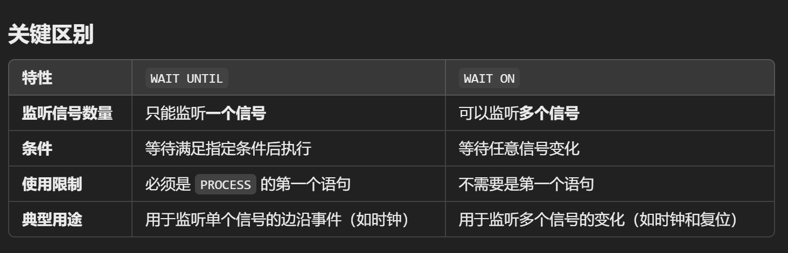

## Wait statement

当使用wait语句的时候，Process不能有sensitivity list，即process(a,b,c)

```vhdl
WAIT;
WAIT ON 信号表;
WAIT UNTIL 条件表达式;
WAIT FOR 时间表达式;
```


WAIT FOR只用于模拟，在waveform中呈现。


### Wait Until

**功能**：

- `WAIT UNTIL` 用于等待单个信号满足指定条件。

**限制**：

- 只能监听一个信号。
- 必须是 `PROCESS` 语句中的**第一个语句**，因此它没有敏感列表。

```vhdl
PROCESS
BEGIN
    WAIT UNTIL (clk'EVENT AND clk = '1');  -- 等待时钟上升沿
    IF (rst = '1') THEN
        output <= "00000000";  -- 同步复位
    ELSE
        output <= input;      -- 更新寄存器
    END IF;
END PROCESS;

```


### Wait On

```vhdl
PROCESS
BEGIN
    WAIT ON clk, rst;  -- 等待时钟或复位信号变化
    IF (rst = '1') THEN
        output <= "00000000";  -- 异步复位
    ELSIF (clk'EVENT AND clk = '1') THEN
        output <= input;      -- 更新寄存器
    END IF;
END PROCESS;

```




## Return

跳到子程序的END部分

语法：

```vhdl
RETURN; --Only used in PROCEDURE
RETURN 表达式; --Only used in Functions
```


## Null

在case语句中使用

example:

```vhdl
CASE opcode IS
	WHEN "001" =>tmp:=rega AND regb;
	WHEN "101" =>TMP:=rega OR regb;
	WHEN OTHERS => NULL; --do nothing
END CASE;
```


---

### 主要内容总结：

1. **顺序与并发语句**：
   - VHDL 包含两种主要语句：**并发语句（concurrent statements）**和**顺序语句（sequential statements）**。
   - **并发语句**示例：
     - 信号赋值（signal assignments）
     - 条件赋值（conditional assignments）
     - 选择赋值（selective assignments）
     - 生成语句（generate statements）
   - **顺序语句**示例：
     - `if-then-else`、`case`、`for` 循环、`while` 循环和无限循环。

2. **过程中的信号行为**：
   - 在 `process` 块中，信号在语句执行过程中**表现得像常量**。
   - 信号赋值的效果**只有在进程暂停（`suspend`）时**才会生效。
   - 这是由于 VHDL 的**事件驱动模型**，信号的更新基于事件触发而非实时赋值。

3. **生成语句（`generate` statements）**：
   - 用于生成多个并发语句，通常用于**组件实例化**。
   - 是一种高效描述硬件结构的方法，例如描述阵列结构、重复组件等。

4. **顺序语句的种类**：
   - VHDL 中的顺序语句包括：
     - `if-then-else`：条件判断语句。
     - `case` 语句：多路选择结构。
     - `for` 循环：固定次数循环，通常可综合。
     - `while` 循环：条件驱动的循环，但通常不可综合。
     - 无限循环（`loop`）：需要借助 `exit` 退出，通常也不可综合。

5. **综合性**：
   - 顺序语句并非天然描述硬件行为，但在遵循某些规则时可以实现综合（`synthesizable`）。
   - 例如：
     - `for` 循环会被展开成硬件副本。
     - 条件语句可映射为多路选择器（MUX）。
   - 某些不可预测行为（如无限循环、动态索引）无法综合。

---

### 重点概念：

1. **并发语句的硬件描述性**：
   - 并发语句更贴近硬件电路的行为，例如多路选择器、组合逻辑等。

2. **顺序语句与过程块**：
   - 顺序语句在 `process` 块中使用，通过事件驱动模型控制信号的更新。

3. **规则遵守的综合性**：
   - 硬件综合要求循环的迭代次数、条件判断的路径等是固定的，否则无法生成对应的硬件电路。

---

### 总结：
- VHDL 提供了丰富的语句支持硬件描述，其中并发语句和顺序语句各有特定的适用场景。
- 顺序语句需要在特定条件下才能被综合为硬件，重点在于固定性和可预测性。
- 生成语句是一种高效方法，用于描述重复的硬件结构。


## Attribute statement

### 什么是属性（Attribute）？

- 属性是附加到类型或对象上的一种元属性（meta property）。
- 它提供了对象或数据类型的额外信息，超出了该对象或数据本身所携带的值。

### 属性的类型：

1. **数据属性（Data Attributes）**：
   - 用于返回与数据向量相关的信息。
   - 通常返回的是一个值，例如向量的长度、范围或索引。

```vhdl
signal data_vector : std_logic_vector(7 downto 0);
variable length : integer;
length := data_vector'length;  -- 返回向量长度，结果为 8
--something like vector.len() in python or c++

```

2. **信号属性（Signal Attributes）**：

   - 用于监控信号的状态或行为。

   - 通常返回布尔值（TRUE 或 FALSE），或者表示信号的事件。

```vhdl
signal clk : std_logic;
if clk'event and clk = '1' then
    -- 检测到时钟上升沿
end if;

```

`clk'event`: Evaluates to `TRUE` if there has been an event (any change in the signal value, such as from `'0'` to `'1'` or `'1'` to `'0'`) on `clk` in the current simulation cycle.

`clk'event`即判断clk0到1或者1到0的事件，再加上后面and的clk='1'来固定为clk从0到1的情况。


语法：

```vhdl
object'attribute_name
```


### Signal attribute

1. `s'DELAYED(time)`:

生成一个延迟信号，该信号与原始信号具有相同的数据类型。

常用于仿真环境，模拟信号的传输延迟。

```vhdl
b <= transport a after 5 ns;       -- 明确指定延迟
b <= a'DELAYED(5 ns);             -- 使用属性生成延迟信号
```

2. `s'STABLE(time)`:

检测信号 `s` 在指定时间间隔 `time` 内是否保持不变。

如果信号在指定时间内没有发生变化，返回 `TRUE`；否则返回 `FALSE`。

```vhdl
b <= a'STABLE(10 ns);  -- 如果信号 a 在 10 ns 内未改变，b 被赋值为 TRUE

```

3. `s'QUITE(time)`:

类似于 `'STABLE`，用于检测信号在指定时间 `time` 内是否保持不变。

如果信号 `s` 在指定的时间间隔内没有发生任何变化，则返回 `TRUE`。

```vhdl
if data_bus'QUIET(10 ns) then
    -- 如果 data_bus 在过去 10 ns 内保持稳定，则执行某些操作
end if;

```

4. `s'EVENT`:

检测信号 `s` 是否发生事件（即信号值发生了变化）。

如果信号发生了任何变化，则返回 `TRUE`。

```VHDL
if clk'EVENT and clk = '1' then
    -- 检测到时钟的上升沿
end if;

```


5. `s'TRANSACTION`

用于创建一个新的 `BIT` 类型信号。

每当信号 `s` 上发生一个事务（transaction）时，新的 `BIT` 信号会翻转一次。


### 总结

| 属性               | 功能描述                                          | 返回值         | 应用场景                       |
| ------------------ | ------------------------------------------------- | -------------- | ------------------------------ |
| **`'QUIET`**       | 检测信号是否在指定时间内未发生变化                | `TRUE`/`FALSE` | 复杂信号的稳定性检测           |
| **`'EVENT`**       | 检测信号是否发生了事件（变化）                    | `TRUE`/`FALSE` | 检测信号的变化，例如边沿检测   |
| **`'TRANSACTION`** | 生成一个翻转的 `BIT` 信号，每当信号发生事务时翻转 | `BIT`          | 检测总线信号活动，统计事务次数 |

这些属性大多在仿真和调试中非常有用，但通常不直接用于综合硬件设计。


---

### 示例分析：

#### 1. **`IF (clk'EVENT AND clk = '1')`**
   - **说明**：
     - 使用 `clk'EVENT` 属性来检测 `clk` 信号是否发生了**事件**（即值发生了变化）。
     - 条件 `clk = '1'` 确保事件是**上升沿**。
   - **功能**：
     - 检测时钟信号的**上升沿**，常用于触发同步逻辑。
   - **完整写法**：
     ```vhdl
     IF (clk'EVENT AND clk = '1') THEN
         -- 在时钟上升沿执行操作
     END IF;
     ```

#### 2. **`IF (NOT clk'STABLE AND clk = '1')`**
   - **说明**：
     - 使用 `clk'STABLE` 属性来检查信号是否稳定。
     - 条件 `NOT clk'STABLE` 检查信号在最近发生了变化。
     - 再结合 `clk = '1'` 检测具体的状态。
   - **功能**：
     - 确定 `clk` 信号在最近发生了变化，并且当前值为 `'1'`。
   - **完整写法**：
     ```vhdl
     IF (NOT clk'STABLE AND clk = '1') THEN
         -- 在时钟发生变化且为1时执行操作
     END IF;
     ```

#### 3. **`WAIT UNTIL (clk'EVENT AND clk = '1')`**
   - **说明**：
     - 使用 `WAIT UNTIL` 等待特定的条件满足。
     - 这里条件是 `clk` 信号发生事件并且值为 `'1'`，即等待**时钟的上升沿**。
   - **功能**：
     - 暂停进程，直到 `clk` 信号的上升沿发生。
   - **完整写法**：
     ```vhdl
     WAIT UNTIL (clk'EVENT AND clk = '1');
     -- 在时钟上升沿发生后执行操作
     ```

#### 4. **`IF RISING_EDGE(clk)`**
   - **说明**：
     
     - 使用 `RISING_EDGE(clk)` 函数，检测 `clk` 信号是否发生了上升沿。
     - 这是一个内置的 VHDL 函数，等价于 `(clk'EVENT AND clk = '1')`。
   - **功能**：
     - 检测时钟信号的**上升沿**，简化了条件判断的语法。
   - **完整写法**：
     ```vhdl
     IF RISING_EDGE(clk) THEN
         -- 在时钟上升沿执行操作
     END IF;
     ```

---

### 总结

| 示例                           | 功能说明                       | 常见应用                 |
| ------------------------------ | ------------------------------ | ------------------------ |
| `clk'EVENT AND clk = '1'`      | 检测 `clk` 的上升沿            | 同步逻辑的触发           |
| `NOT clk'STABLE AND clk = '1'` | 检查信号是否不稳定并为高电平   | 检测信号变化后的特定状态 |
| `WAIT UNTIL clk'EVENT...`      | 等待特定信号事件发生           | 用于仿真或延迟逻辑       |
| `RISING_EDGE(clk)`             | 检测信号上升沿（更简洁的写法） | 标准的上升沿检测         |

**推荐**：
- 在现代 VHDL 设计中，优先使用 `RISING_EDGE` 和 `FALLING_EDGE` 函数，因为它们更简洁且易于理解。


### Data Attributes

---

### 1. **数组属性**

#### 属性列表：
- **`'LOW`**：
  - 返回数组的下界索引。
  - 示例：
    ```vhdl
    signal data : std_logic_vector(3 downto 0);
    lower_bound := data'LOW;  -- 返回 0
    ```

- **`'HIGH`**：
  - 返回数组的上界索引。
  - 示例：
    ```vhdl
    upper_bound := data'HIGH;  -- 返回 3
    ```

- **`'LEFT`**：
  - 返回数组的最左侧索引（定义范围的第一个值）。
  - 示例：
    ```vhdl
    left_index := data'LEFT;  -- 对于 (3 downto 0)，返回 3
    ```

- **`'RIGHT`**：
  - 返回数组的最右侧索引（定义范围的最后一个值）。
  - 示例：
    ```vhdl
    right_index := data'RIGHT;  -- 对于 (3 downto 0)，返回 0
    ```

- **`'LENGTH`**：
  - 返回数组的长度（元素数量）。
  - 示例：
    ```vhdl
    length := data'LENGTH;  -- 返回 4
    ```

- **`'RANGE`**：
  - 返回数组的范围。
  - 示例：
    ```vhdl
    range := data'RANGE;  -- 返回 3 downto 0
    
    SIGNAL vector: IN std_logic_vector(0 TO 7);
    FOR i IN vector'RANGE LOOP
        ...
    --等价于
    FOR i IN 0 TO 7 LOOP
        ...
    ```
  
- **`'REVERSE_RANGE`**：
  - 返回数组的反向范围。
  - 示例：
    ```vhdl
    reverse_range := data'REVERSE_RANGE;  -- 返回 0 to 3
    ```

---

### 2. **枚举类型属性**

当信号是枚举类型时（例如自定义类型或 `std_logic`），可以使用以下属性：

#### 属性列表：
- **`'VAL(pos)`**：
  
  - 返回指定位置的值。
  - 示例：
    ```vhdl
    type state_type is (IDLE, RUNNING, FINISHED);
    signal state : state_type;
    value := state'VAL(1);  -- 返回 RUNNING
    ```
  
- **`'POS(value)`**：
  - 返回指定值在枚举类型中的位置。
  - 示例：
    ```vhdl
    pos := state'POS(RUNNING);  -- 返回 1
    ```

- **`'LEFTOF(value)`**：
  - 返回指定值左侧的枚举值。
  - 示例：
    ```vhdl
    left_of := state'LEFTOF(RUNNING);  -- 返回 IDLE
    ```

- **`'VAL(row, column)`**：
  
  - 用于二维数组，返回指定行和列对应的值。

---

### 应用场景：

1. **数组属性**：
   - 动态获取数组的边界或长度，适用于需要处理动态范围的模块。
   - 示例：在可变长度的总线或寄存器处理中自动确定信号范围。

2. **枚举类型属性**：
   - 遍历状态机的所有状态，或基于状态位置进行操作。

---

### 总结：

- **数组属性**（如 `'LOW`、`'HIGH`、`'LENGTH`）用于动态查询数组的索引和范围。
- **枚举类型属性**（如 `'VAL`、`'POS`）提供了对枚举类型的灵活访问。
- 这些属性增强了 VHDL 的可重用性和模块化设计能力，减少了硬编码的需求。


注意'LOW、'HIGH和'LEFT、'RIGHT的区别，前者是直接返回最小或者最大索引，后者是返回最左侧或者最右侧索引，不一定最小最大。


## User Defined Attributes

attribute declaration:

```vhdl
ATTRIBUTE attribute_name: attribute_type
```

attribute specification:

```vhdl
ATTRIBUTE attribute_name OF target_name: class IS value;
```


example:

```vhdl
-- 属性声明
ATTRIBUTE number_of_inputs : INTEGER;

-- 属性指定
ATTRIBUTE number_of_inputs OF nand3 : SIGNAL IS 3;

-- 属性调用
inputs <= nand3'number_of_inputs;  -- 返回 3

```

state machine example:

```
TYPE state IS (S0,S1,S2,S3);
--default encoding is: S0=“00”, S1=“01”, S2=“10”, S3=“11”
ATTRIBUTE encoding OF state: TYPE is “11 10 00 01”
```


## BLOCK statement

### 1. **BLOCK 语句的功能**

- **分组功能**：
  - 将一组并发语句聚合到一个块中，形成逻辑上的分区。
  - 使得代码在逻辑上更清晰、模块化。

- **局部性**：
  - 支持局部声明，例如在块内部定义信号、常量或变量。
  - 这些局部定义只在 BLOCK 内部有效，不会影响外部代码。

- **可读性和可管理性**：
  - 对复杂的设计进行逻辑划分，增强代码的结构化和可维护性。

---

### 2. **语法结构**

```vhdl
block_label: BLOCK [(guard_expression)]
    -- 接口说明
    -- 属性说明
    -- 块声明部分 (局部信号、变量等)
BEGIN
    -- 并发语句
END BLOCK block_label;
```

- **`block_label`**：
  - BLOCK 的标识符，用于命名块。
  - 每个 BLOCK 应有唯一的标识符。

- **`guard_expression`（可选）**：
  - 用于保护表达式，指定 BLOCK 的激活条件。
  - 如果保护条件为 `FALSE`，BLOCK 内的语句将被禁止执行。

- **块声明部分**：
  - 定义块内使用的局部信号、变量、常量等。

- **并发语句**：
  - 块内的并发语句用于实现具体的逻辑功能。

---

### 3. **示例**

#### 示例 1：简单的 BLOCK 语句
```vhdl
example_block: BLOCK
    SIGNAL temp : std_logic_vector(3 downto 0);
BEGIN
    temp <= "1010";
    output <= temp;
END BLOCK example_block;
```
- 在 `example_block` 中定义了一个局部信号 `temp`，其范围仅限于该 BLOCK 内。

#### 示例 2：带保护表达式的 BLOCK
```vhdl
example_block: BLOCK (enable = '1')
    SIGNAL temp : std_logic_vector(3 downto 0);
BEGIN
    temp <= input + "0001";
    output <= temp;
END BLOCK example_block;
```
- 只有当 `enable = '1'` 时，BLOCK 内的语句才会被激活执行。

---

### 4. **BLOCK 的应用场景**

1. **模块化设计**：
   - 对设计进行逻辑分区，便于维护和调试。
   
2. **条件执行**：
   - 使用保护表达式，根据条件控制 BLOCK 的激活。

3. **局部作用域**：
   - 限定信号或变量的范围，避免命名冲突。

---

### 总结

- BLOCK 语句是 VHDL 中的一个结构化工具，用于组织并发语句。
- 它支持局部声明和条件控制（通过保护表达式）。
- 合理使用 BLOCK 语句可以提高代码的可读性和模块化程度。


```vhdl
ARCHITECTURE structure OF my_design IS
    SIGNAL a, b, c : std_logic;
BEGIN
    block1: BLOCK
        SIGNAL temp1 : std_logic; --如果用的就是architecture内部已经有的声明，这里就可以省略，如果有新的信号或者变量，就要声明
    BEGIN
        u1: AND_GATE PORT MAP (a, b, temp1);
        u2: OR_GATE  PORT MAP (temp1, c, output);
    END BLOCK block1;
END structure;

```


## Subprogram: Function, procedure

**包含顺序语句（Sequential Statements）**：

- 子程序内部的语句是按顺序执行的，与并发语句不同。
- 适用于实现算法、逻辑运算等需要依次执行的任务。

**返回执行结果（函数返回值）**：

- 函数必须返回一个值，而过程不需要返回值。

**用于库或模块化设计**：

- 子程序通常存储在库（Library）中，便于跨项目共享。
- 通过这种方式，可以将通用功能提取为独立模块，减少代码冗余。

**存储常用代码片段**：

- 子程序适合封装重复使用的逻辑或操作，例如数学运算、数据转换等。

**支持复用和共享**：

- 子程序可以在多个设计中调用，实现逻辑的复用和共享，增强代码的一致性和可靠性。


### Function

Cannot have the statements: WAIT, SIGNAL declarations and COMPONENT instantiations.

语法：

```vhdl
FUNCTION 函数名（参数表） RETURN 数据类型; --声明，只用在package中加，正常archi里面不用
FUNCTION 函数名（参数表） RETURN 数据类型 IS [说明]; --body
BEGIN 
	顺序语句;
END 函数名;

```


example:

```vhdl
entity func is
    port (
        a : in bit_vector (0 to 2); -- 输入信号
        m : out bit_vector (0 to 2) -- 输出信号
    );
end func;

architecture demo of func is
    
--函数定义
function sam (x, y, z : bit) return bit is
begin
    return (x and y) or z;
end sam;
    
--架构入口
begin
    process (a)
    begin
        m(0) <= sam(a(0), a(1), a(2)); -- 调用函数 sam
        m(1) <= sam(a(2), a(0), a(1)); -- 调用函数 sam
        m(2) <= sam(a(1), a(2), a(0)); -- 调用函数 sam
    end process;
    
    
end demo;

```

### 函数参数列表规则

1. **参数默认是输入类型**：
   - 函数的参数默认是输入（`IN`）模式，无需显式指定方向（`IN`、`OUT`、`INOUT` 等）。
   - 这与过程（`Procedure`）不同，过程可以显式定义参数方向。
2. **参数类型限制**：
   - 只允许使用 **常量（`CONSTANT`，默认）** 和 **信号（`SIGNAL`）** 作为函数参数。
   - 不允许使用变量（`VARIABLE`）作为参数。
3. **范围限制**：
   - 参数不能有范围约束（`range`）。
   - 例如，不能定义 `a : INTEGER range 0 to 15`，而只能写作 `a : INTEGER`。
4. **返回值限制**：
   - 函数必须**有且仅有一个返回值**。
   - 返回值的类型需要在函数声明中指定。


函数可以被加在package或者architecture内，前者需要在package declaration处添加函数声明，并在主体添加函数，后者只需要添加函数主体。


### Procedure

与函数相同，但是可以返回多个值

语法：

```vhdl
PROCEDURE 函数名（参数表）; --declaration
PROCEDURE 函数名（参数表） RETURN 数据类型 IS [说明]; --body
BEGIN 
	顺序语句;
END 函数名;

```

**过程参数需要指定模式（Mode）**：

- 与函数不同，过程的参数必须显式指定模式，常见模式有：

  - `IN`：表示输入参数。
  - `OUT`：表示输出参数。
  - `INOUT`：表示既可以作为输入，也可以作为输出。

- 注意：

  - 输入参数（`IN`）的默认类型为 `CONSTANT`。
- 输出参数（`OUT` 或 `INOUT`）的默认类型为 `VARIABLE`。

example:

```vhdl
PROCEDURE and2 (x, y : IN bit; SIGNAL output : OUT bit) IS
BEGIN
    IF x = '1' AND y = '1' THEN
        output <= '1';
    ELSE
        output <= '0';
    END IF;
END and2;

```

调用：

```vhdl
ARCHITECTURE behavior OF example IS
    SIGNAL a, b, result : bit;
BEGIN
    PROCESS (a, b)
    BEGIN
        and2(a, b, result); -- 调用过程 and2
    END PROCESS;
END behavior;

```

注意，没有return，但是具体的output已经在procedure定义的地方已经写了，调用的时候就是会跟据定义的那里的变量顺序来执行，前两个就是输入的参数，后面的就是返回的值。


在function和procedure中都不可以有组件实例化出现，只能有逻辑语句。

==function调用只是表达式中的一个部分，即它本身指代的还是返回值的类型，要与其它数据发生逻辑运算，但是procedure本身可以作为一个statement，隐式改变stru内部变量或者信号==

```vhdl
SIGNAL a, b, c : INTEGER;
SIGNAL result : INTEGER;

result <= a + b * func(c); -- 函数 func(c) 是表达式的一部分

```


## package

### **1. Package 的定义**

- **程序包** 是一个逻辑单元，用于**将多个声明、定义、函数、过程和组件等组织到一起**。
- 它允许多个设计文件共享这些声明和定义，从而提高代码的**复用性**和**模块化**。

---

### **2. Package 的结构**

#### **声明部分（Mandatory）**
```vhdl
PACKAGE 包名 IS
    -- 程序包中包含的声明
    -- 如类型声明、子程序声明（函数和过程）、常量、组件等
END 包名;
```
- 声明部分是 **必需的**，用于声明程序包的内容，如：
  - 类型定义（如 `type`）。
  - 子程序的声明（函数和过程的接口定义）。
  - 常量和信号的定义。
  - 组件声明。

#### **实现部分（Optional）**
```vhdl
PACKAGE BODY 包名 IS
    -- 程序包中声明的函数和过程的实现
    -- 其他需要详细描述的内容
END 包名;
```
- **实现部分是可选的**，仅在程序包中包含函数或过程时才需要。
- 主要用于：
  - 定义函数和过程的具体实现。
  - 具体逻辑只能写在实现部分，而不能直接写在声明部分。

---

### **3. Package 的语法和例子**

#### **完整的 Package 例子**

```vhdl
-- 声明部分
PACKAGE math_pkg IS
    CONSTANT pi : REAL := 3.14159;  -- 常量
    FUNCTION square (x : REAL) RETURN REAL;  -- 函数声明
END math_pkg;

-- 实现部分
PACKAGE BODY math_pkg IS
    FUNCTION square (x : REAL) RETURN REAL IS
    BEGIN
        RETURN x * x;  -- 计算平方
    END square;
END math_pkg;
```

- **声明部分（`math_pkg`）**：
  - 声明了一个常量 `pi` 和一个函数 `square`。
  - 函数的具体逻辑未在此部分实现，仅声明其接口。

- **实现部分（`PACKAGE BODY math_pkg`）**：
  - 提供了函数 `square` 的具体实现，即计算输入数值的平方。

---

### **4. 注意事项**

1. **声明部分是必需的，定义程序包的接口**：
   - 声明部分是程序包的对外接口，外部模块只能看到声明部分内容。

2. **实现部分是可选的，仅当包含函数或过程时才需要**：
   - 如果程序包中只包含常量、类型、组件等简单内容，则无需 `PACKAGE BODY`。

3. **子程序的实现必须在实现部分中**：
   - 函数和过程的逻辑实现只能写在 `PACKAGE BODY` 中。

4. **程序包可以被多个设计共享**：
   - 通过 `USE` 语句导入程序包即可使用。

---

### **5. 使用 Package 的好处**

1. **提高代码复用性**：
   - 将通用的逻辑（如数学运算、类型定义）封装到程序包中，便于多个模块共享。

2. **模块化设计**：
   - 将功能相关的内容集中在一起，逻辑清晰。

3. **易于维护**：
   - 修改程序包时，所有引用该包的设计都能自动应用修改。

4. **减少冗余**：
   - 避免在多个设计中重复定义相同的逻辑。

---

### **6. 导入和使用 Package**

#### 导入程序包
```vhdl
LIBRARY work;
USE work.math_pkg.all;  -- 导入 math_pkg 中的所有内容
```

#### 使用程序包中的内容
```vhdl
SIGNAL radius : REAL := 5.0;
SIGNAL area : REAL;

BEGIN
    area <= math_pkg.square(radius) * math_pkg.pi; -- 调用函数和常量
```

---

### **总结**

- Package 是 VHDL 中重要的模块化工具，用于封装可复用的声明和定义。
- 声明部分定义接口，必须存在；实现部分包含具体逻辑，仅在需要时编写。
- 使用 Package 能显著提高代码的复用性、可维护性和模块化水平。