## Distribute Laws

$X + YZ = (X +Y)(X + Z)$

$2X = X$

$X \cdot X = X$

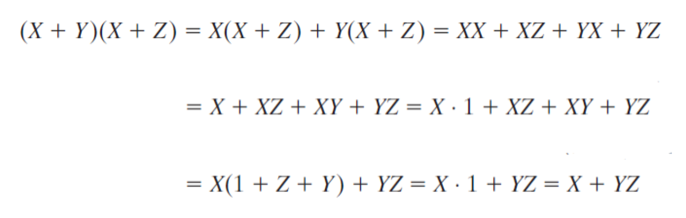

## Simplification Laws

$X + XY = X$

$X(X + Y) = X$

$Y + X\overline{Y} = X + Y$

## DeMorgan's Laws

$\overline{(X + Y + Z)} = \overline{X}\cdot\overline{Y}\cdot\overline{Z}$

$\overline{X \cdot Y \cdot Z} = \overline{X} + \overline{Y} + \overline{Z}$

## Multiplying out

$(X + Y)(\overline{X} + Z) = XZ +\overline{X}Y$

## Consesus Theorem

$XY +YZ +\overline{X}Z = XY +\overline{X}Z$

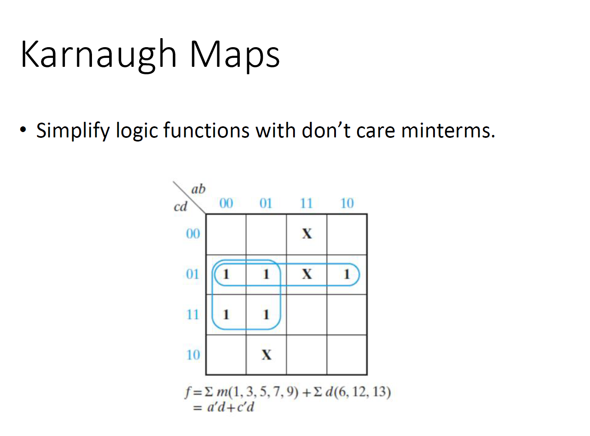

X在这里当成辅助项，自己单独不看成1，但是如果周围的1需要它连接形成最简形式，则可以看成1。

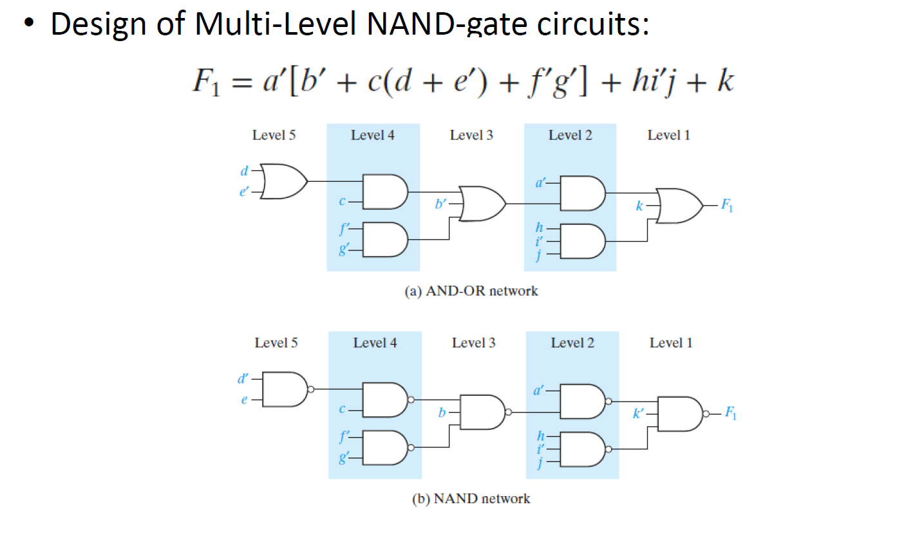

设计逻辑门组合，首先将表达式按照里外分层的方式画成AND-OR门组合的形式，然后替换成NAND时，注意：

原OR门替换NAND要将信号传入全部取反，其他原AND门直接将AND变成NAND即可。

==注意，相邻两个AND门不能直接都直接变成NAND，上述的情况只针对AND-OR-AND-OR交替的情况==

## ==**考试重点**==

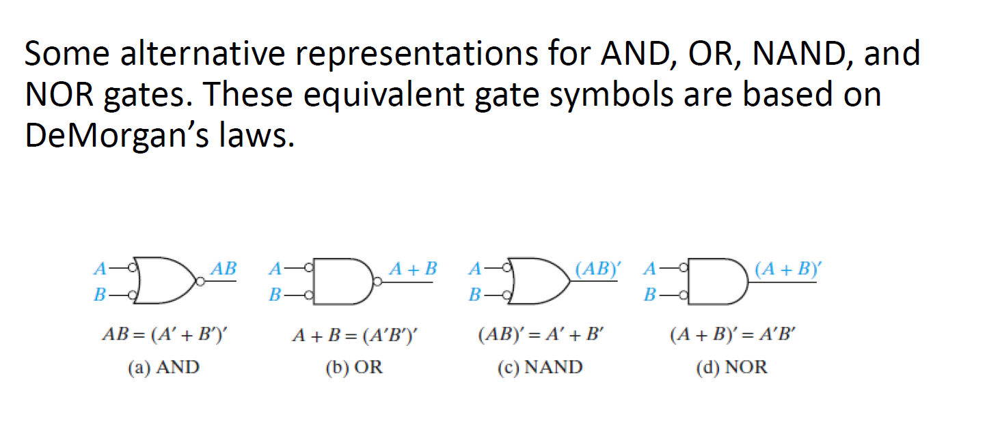

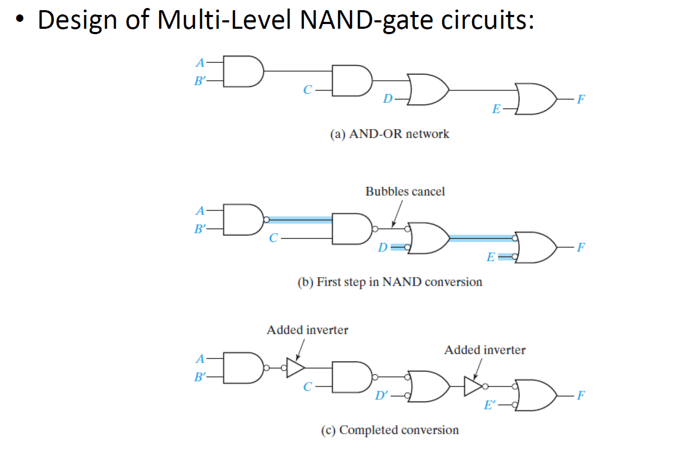

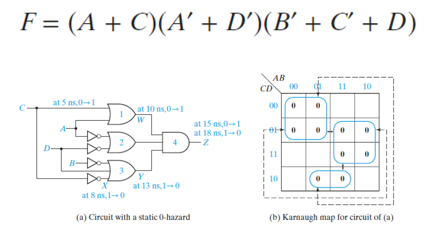

pos的卡诺图化简：首先找到令整体等于0的组合，具体来说，A和C都等于0时，整体等于0；A,D都等于1时，整体等于0；B,C等于1，D等于0时，整体等于0

在卡诺图上画出所有0，然后画圈化简，这里已经是最简形式，最后得到的依然是pos形式，但是要注意，因为圈的是0，最后单个信号都要取反。

### 组合逻辑电路中的危险

危险是在逻辑电路中，由于输入变化导致输出出现短暂错误的现象。静态1危险（Static 1-Hazard）是其中一种常见类型。

### 如何用卡诺图检测危险？

1. **写出电路的和项积（Sum-of-Products, SOP）表达式**：
   - 例如图中的逻辑表达式为：**F = AB + BC**。
2. **在卡诺图上标出每一项，并将其圈出**：
   - 图中用卡诺图标出了表达式中所有取值为1的位置，并圈出了每一项。
3. **检测是否存在未覆盖的相邻1**：
   - 如果两个相邻的“1”没有被同一个圈覆盖，则在这两个“1”之间的过渡过程中可能会发生静态1危险。

### 如何设计无危险的电路？

为了消除静态和动态危险，可以遵循以下步骤：

1. **找到输出的和项积表达式（Sum-of-Products, SOP）**：

   - 需要确保表达式中每一对相邻的“1”都被一个单项覆盖。
   - 图中给出的逻辑函数为：**F = AB' + BC + AC**，通过卡诺图可以看出，所有的相邻“1”都被覆盖。

2. **如果需要其他形式的电路，调整F的表达式**：

   - 可以通过因式分解、德摩根定律（DeMorgan's Laws）等方法将逻辑表达式转换为所需形式。
   - 在进行调整时，需要确保对每个变量（如x和x'）独立处理，避免引入新的危险。

   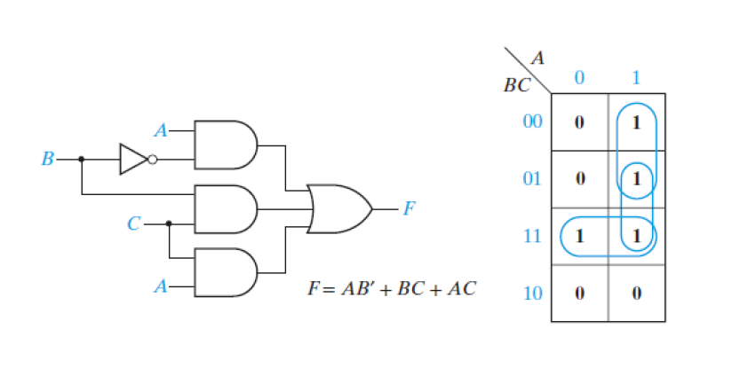

如图，在右侧相邻的两个1之间再圈一个，原本只有两个圈，现在多一个，以确保无危险。

对于POS的危险去除，也是类似的方法

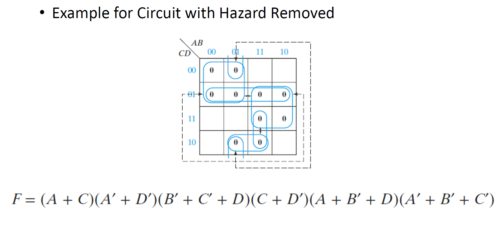

四个虚线组合就是添加的确保无危险逻辑添加。

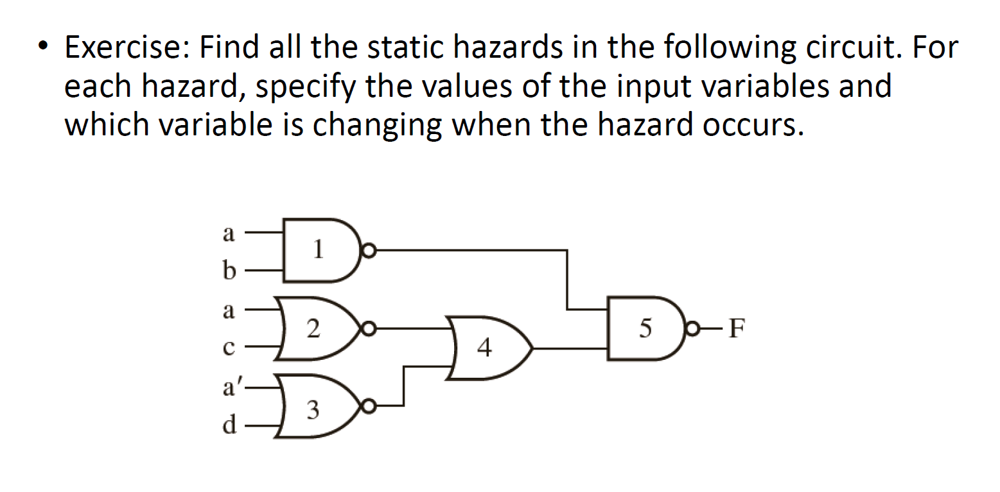

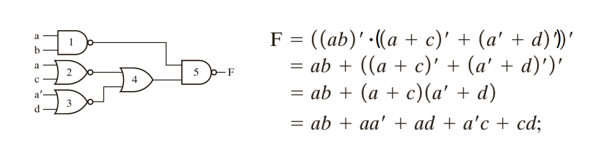

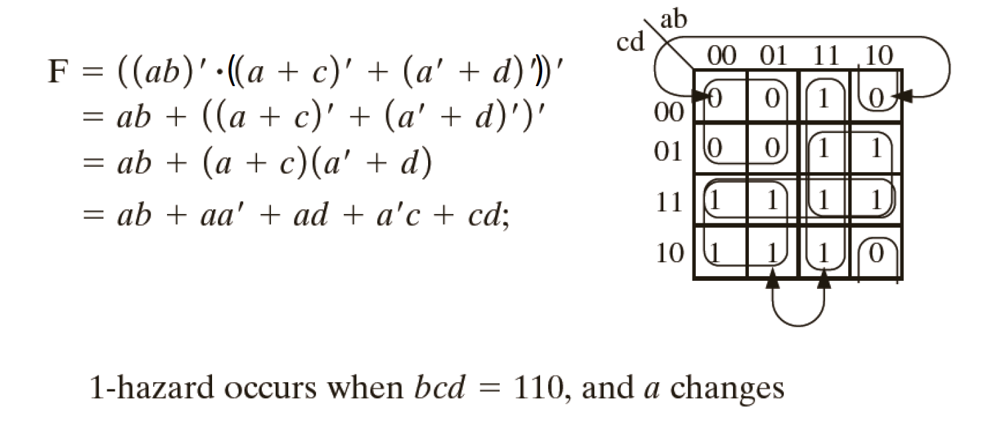

观察两组箭头，上面的就是0-hazard，下面的就是1-hazard，下面：

当b=1，c=1，d=0的时候，对应底下11组合，这时候只要a changes就会发生1-hazard

上面：

当bcd=000的时候，对应两个00组合，这个时候a changes也会发生hazard

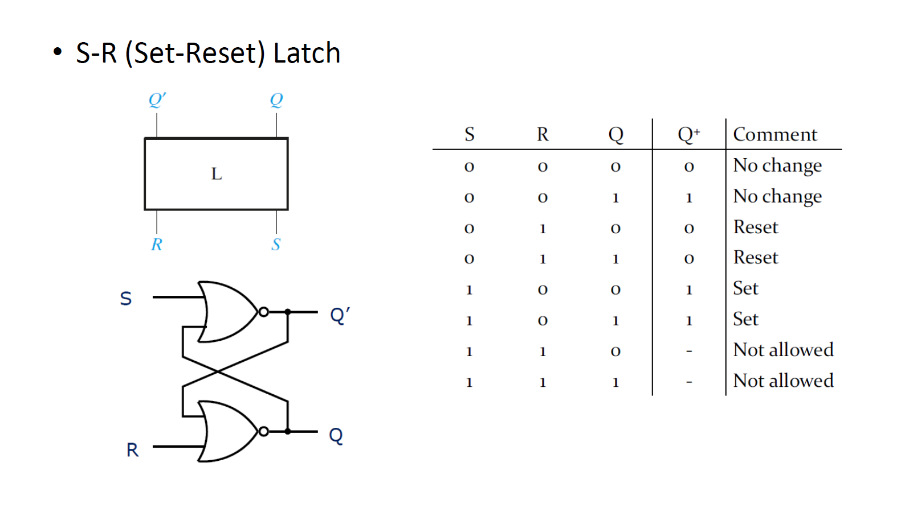

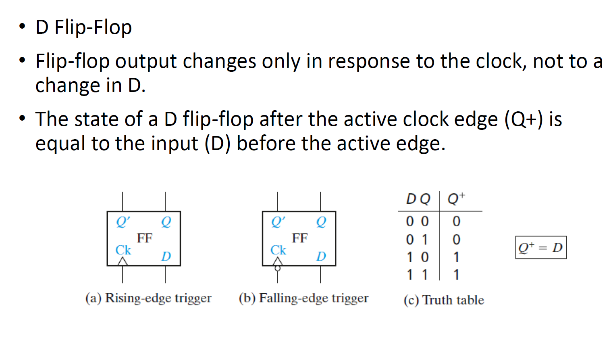

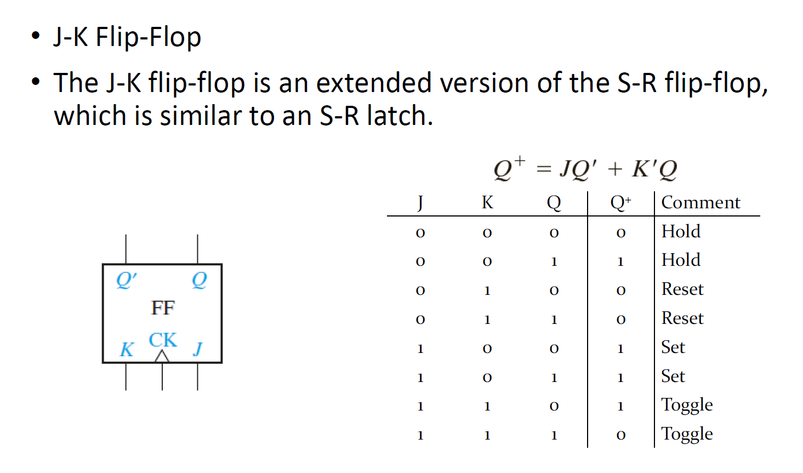

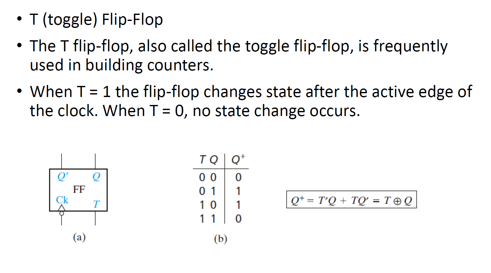