# testbench

VHDL 测试平台的用途

- VHDL 语言的设计初衷是为了测试。事实上，语言中的某些部分**仅用于测试**，并不打算用作实际硬件的实现。
- 我们需要区分以下两类代码：
  - **可综合（Synthesisable）VHDL**：用于描述数字硬件的代码，可以被转换为有效的电路。
  - **不可综合（Non-synthesisable）VHDL**：这类代码不能被转换为硬件电路，但非常适合用来编写测试平台。

------

### 举例说明

- 在测试平台中，我们通常使用**不可综合的 VHDL 代码**来生成刺激信号（stimulus signals）。这部分代码是专门为测试服务的，不需要实现为实际电路。
- 对于被测试的设备（Device Under Test, DUT）的实例化（Instantiation）来说，这和其他任何实例化过程相同，因此这是**可综合的代码**。

------

总结：
 测试平台中会结合可综合和不可综合的 VHDL 代码，分别用于描述硬件行为和生成测试信号。

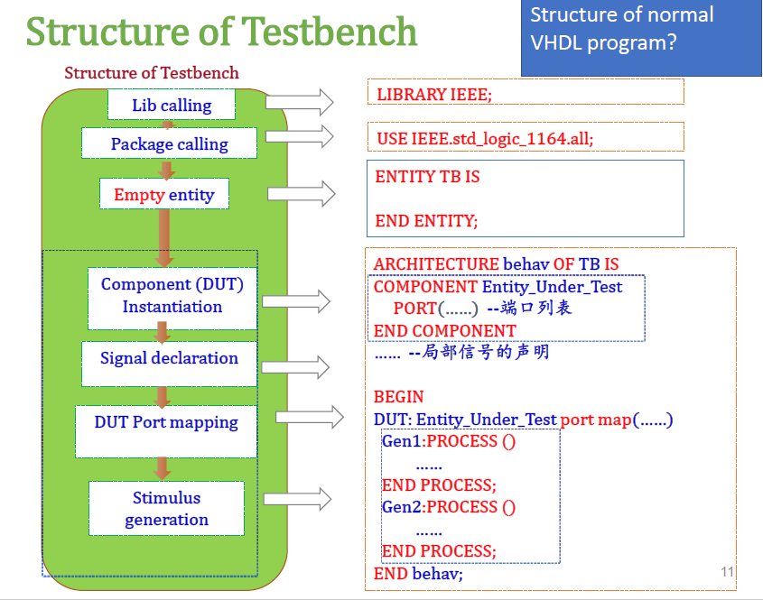

### **Testbench 的结构**

Testbench 的结构由以下几个部分组成：

1. **库调用（Library Calling）**：
   - Testbench 需要调用标准库（如 `IEEE`）。
   - 语句：`LIBRARY IEEE;` 和 `USE IEEE.std_logic_1164.ALL;`
2. **包调用（Package Calling）**：
   - 调用所需的包，这里主要是标准逻辑包。
3. **空实体声明（Empty Entity）**：
   - Testbench 的实体声明是空的，因为它只是用于测试，不需要外部接口。
   - 语句：`ENTITY TB IS END ENTITY;`
4. **组件（DUT）实例化（Component Instantiation）**：
   - 在架构体中对 **被测试设备（DUT，Device Under Test）** 进行实例化。
   - 语句：`COMPONENT Entity_Under_Test PORT (...) END COMPONENT;`
5. **信号声明（Signal Declaration）**：
   - 声明测试中使用的内部信号。
6. **DUT 端口映射（Port Mapping）**：
   - 将内部信号映射到 DUT 的端口。
   - 语句：`DUT: Entity_Under_Test port map (...);`
7. **刺激信号生成（Stimulus Generation）**：
   - 使用 `PROCESS` 块生成刺激信号（Stimulus Signals），用来测试 DUT 的行为。
   - 语句：`Gen1: PROCESS BEGIN ... END PROCESS;`

### **普通 VHDL 代码的结构**

普通 VHDL 程序的结构通常包括以下部分：

1. **库调用**：
   - 同 Testbench 一样，需要调用必要的库和包。
2. **实体声明（Entity Declaration）**：
   - 定义输入输出端口。
   - 语句如：`ENTITY my_circuit IS PORT (...); END ENTITY;`
3. **架构体（Architecture）**：
   - 实现实体的功能逻辑。
   - 包括组件实例化、信号声明、逻辑设计（如进程、组合逻辑等）。
   - 架构体内不会专门生成刺激信号，而是直接实现硬件功能。


### **无敏感列表的进程的特点**

1. **顺序执行的代码**：
   - 无敏感列表的进程允许编写 **顺序 VHDL 代码**，非常适合用来描述测试激励信号（如输入信号）。
   - 这些代码按顺序执行，与硬件的并行行为不同。
2. **无限循环**：
   - ==如果一个进程没有敏感列表，它会不断地重复执行（无限循环）。==
3. **使用 `wait` 控制执行**：
   - `wait` 语句可以暂停进程的执行一段时间。
   - 暂停后，进程会在暂停结束后继续执行暂停时的代码位置。

example: 生成复位信号

```vhdl
reset_stimulus : process
begin
    RESET <= '0';         -- 将 RESET 信号设置为低电平
    wait for 50 ns;       -- 暂停进程 50 纳秒
    RESET <= '1';         -- 将 RESET 信号设置为高电平
    wait for 50 ns;       -- 再暂停进程 50 纳秒
    RESET <= '0';         -- 复位信号再次设置为低电平
    wait;                 -- 无限期暂停（进程到此停止执行）
end process;
```

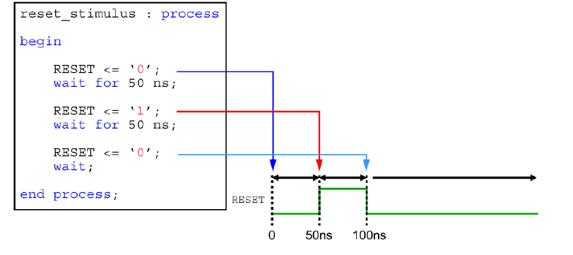

**信号变化与图的对应**

- **时间 0 ns**: `RESET` 被设置为 `'0'`（蓝色部分）。
- **时间 50 ns**: `RESET` 变为 `'1'`（红色部分）。
- **时间 100 ns**: `RESET` 再次变为 `'0'`（浅蓝部分）。
- **之后**: `wait;` 无限暂停，进程停止运行，`RESET` 信号保持 `'0'`（绿色部分）。


## DUT Component Instantiation

```vhdl
DUT : entity work.AOI
port map (
    A => A,
    B => B,
    C => C,
    D => D,
    F => F
);
```

**实例化（Instantiation）**：

- 实例化指的是在 Testbench 中创建 DUT 的一个实例。
- 通过实例化，我们可以将测试信号（Stimulus）传递给 DUT，并观察 DUT 的输出。

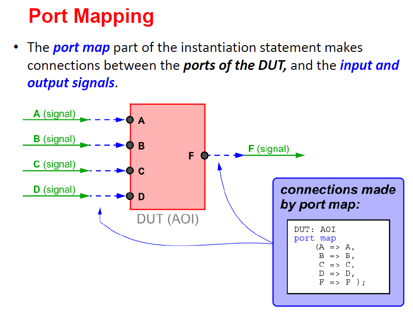

==通常来说，我们需要模拟的元件在这里叫做DUT，然后我们将产生的模拟信号接到DUT里面，再将DUT输出的信号接出来。==

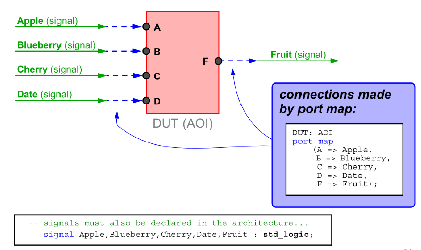


# Stimulus generation

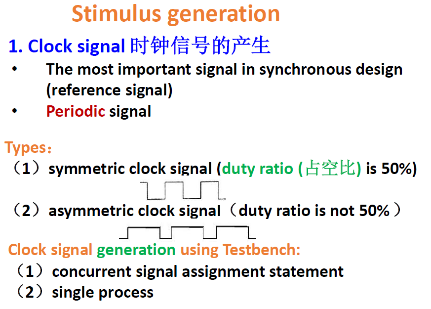

------

### **时钟信号的重要性**

1. **时钟信号的定义**：
   - 在同步设计中，时钟信号是最重要的信号，它作为参考信号（reference signal）。
   - 特点是**周期性（Periodic Signal）**，以固定频率和周期运行。
2. **作用**：
   - 时钟信号用于触发寄存器（如触发器）的行为，控制数字电路中的同步操作。

------

### **时钟信号的类型**

1. **对称时钟信号（Symmetric Clock Signal）**：
   - **占空比（Duty Ratio）**为 50%，即高电平时间和低电平时间相等。
   - 信号示例：正方形波形。
2. **非对称时钟信号（Asymmetric Clock Signal）**：
   - 占空比不为 50%，高电平时间和低电平时间不相等。
   - 信号示例：长时间高电平，短时间低电平的波形，或相反。

------

### ==**时钟信号的生成方法**==

在 Testbench 中可以通过以下两种方式生成时钟信号：

1. **并发信号赋值语句（Concurrent Signal Assignment Statement）**：

   - 在架构体中直接用并发语句定义时钟信号的变化。

   - 示例：

     ```vhdl
     CLK <= not CLK after 10 ns; -- 每 10 纳秒反转一次时钟信号
     ```

2. **单进程方式（Single Process）**：

   - 在一个进程中定义时钟信号的变化，便于模拟更复杂的波形。

   - 示例：

     ```vhdl
     process
     begin
         CLK <= '0';
         wait for 10 ns;  -- 低电平持续 10 纳秒
         CLK <= '1';
         wait for 10 ns;  -- 高电平持续 10 纳秒
     end process;
     ```

------

### **总结**

- 时钟信号是同步设计的核心，生成时钟信号是 Testbench 测试中的关键步骤。
- **对称时钟信号** 和 **非对称时钟信号** 适用于不同的测试需求。
- 在 Testbench 中，可以通过并发语句或进程语句灵活地生成所需的时钟信号。


example:

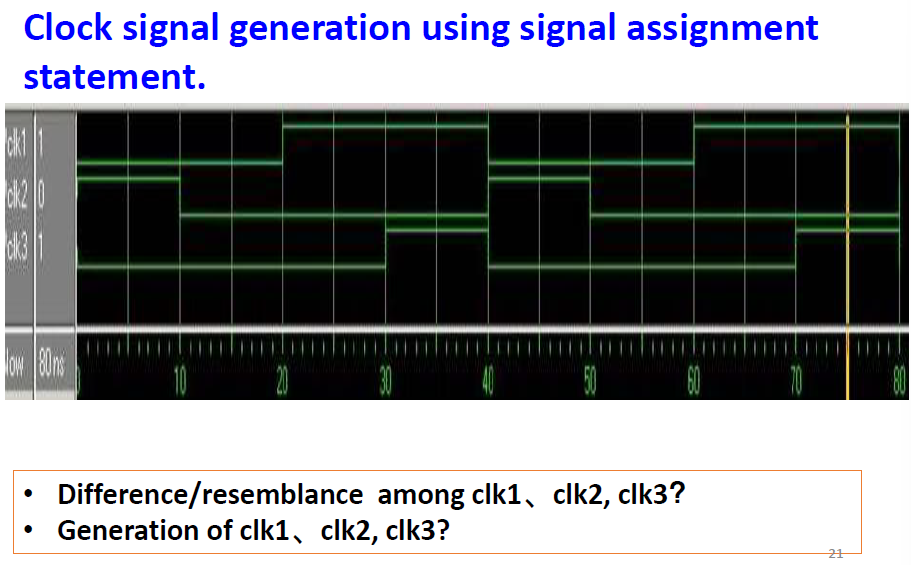

```vhdl
signal clk1: std_logic := '0';
signal clk2: std_logic;
signal clk3: std_logic;
constant clk_period : time := 40ns;

-- clk1
clk1_gen:process
--constant clk_period : time := 40ns; --如果用process的话，常量要写在process内部
begin
    clk1 <= '0';
    wait for 20ns;
    clk1 <= '1';
	wait for 20ns;
end process;
--或者用并发语句
clk1 <= not clk1 after 20ns;
        
--clk2
process
--constant clk_period : time := 40ns; --如果用process的话，常量要写在process内部
begin
    clk2 <= '1';
    wait for 10ns;
    clk2 <= '0';
	wait for 30ns;
end process;
        
--或者用并发语句
clk2 <= '0' after clk_period/4 when clk2='1' else
    	'1' after 3*clk_period/4 when clk2='0' else
        '1'; --initial value assignment of clk2，如果之前没有初始化的话这里就要初始化
        
--clk3
process
--constant clk_period : time := 40ns; --如果用process的话，常量要写在process内部
begin
    clk3 <= '0';
    wait for 30ns;
    clk3 <= '1';
	wait for 10ns;
end process;
--或者用并发语句        
clk3 <= '0' after clk_period/4 when clk3 = '1' else
    	'1' after 3*clk_period/4 when clk3 ='0' else
        '0'; --初始化
```


## 复位信号的生成方法Reset Signal

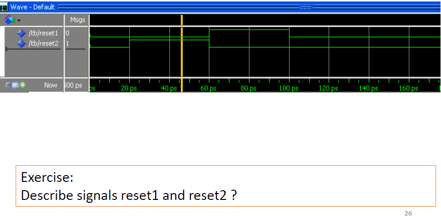

```vhdl
signal reset1 : std_logic;
signal reset2 : std_logic;
--并发语句实现
reset1 <='0','1' after 60ns, '0' after 100ns;--这里一定要着重注意，这里的时间变量是绝对的，相对于最开始的时刻的绝对时间差，而不是相对于上一个变化的时间差，也就是说，第一个状态0持续了60ns，第二个状态1持续了40ns，而不是100ns。

--顺序语句实现
reset2_gen: process
begin
    reset2 <= '0';
    wait for 20ns;
    reset2 <= '1';
	wait for 40ns; --这里的就是相对时间，即每次单独等待的时间
    reset2 <= '0';
	wait;
end process;
```


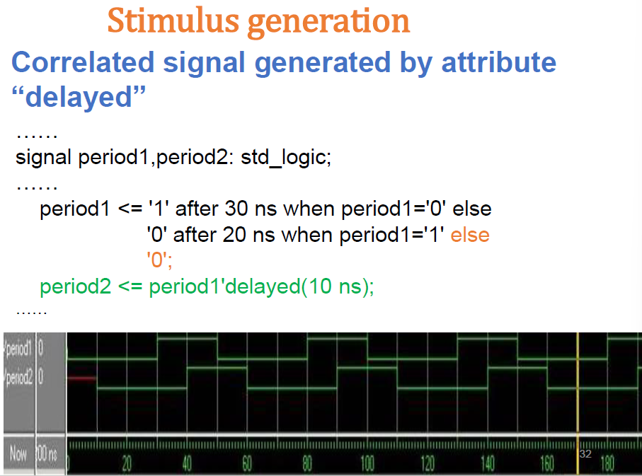

当两个信号是延迟关系的话，可以用信号的delayed属性来得到，但是注意在一开始的部分就会是未知X


## General stimulus

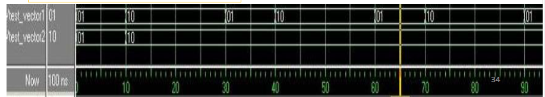

```vhdl
signal test_vector : std_logic_vector(1 downto 0);
signal test_vector : std_logic_vector(1 downto 0);
TB1:process
begin
    test_vector1 <= "01";
    wait for 10ns;
    test_vector1 <= "10";
	wait for 20ns;
end process;

TB2:process
begin
    test_vector2 <= "01";
    wait for 10ns;
    test_vector2 <= "10";
	wait;
end process;
```

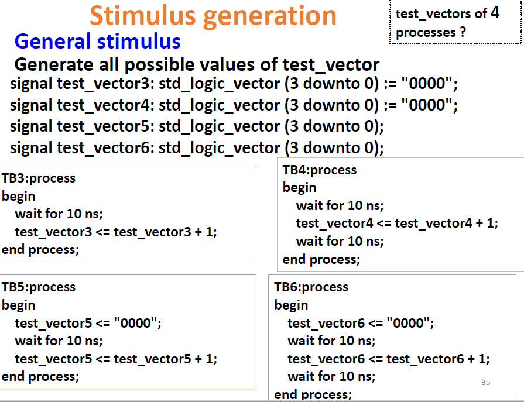

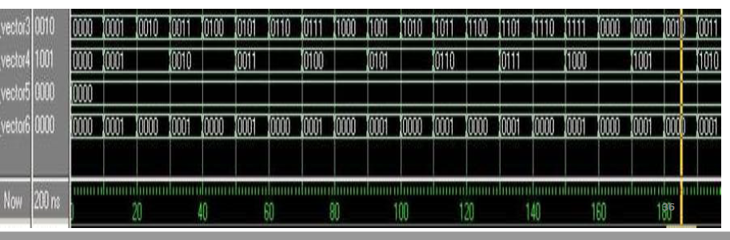

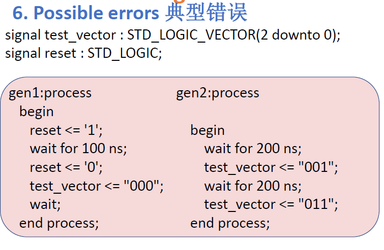

==不同process不可以对同一信号赋值，会造成冲突==

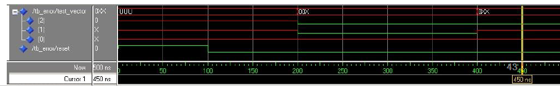